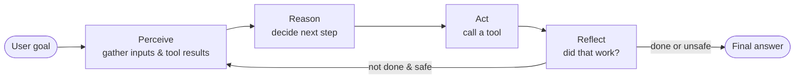

# Agent Loop Engineering Fundamentals

**Audience:** freshers comfortable with TypeScript basics.
**Time:** ~2 hours.
**Stack:** Node.js 20+, TypeScript, zero external LLM dependencies (we simulate the "brain").

> The goal is not to teach you an SDK. It is to teach you the **shape of an agent loop** so that when you later pick up LangChain, LangGraph, the OpenAI Agents SDK, or anything else, you already know what they are hiding.

---

## What you will build

A tiny **Data Analyst Agent** that answers questions about a CSV file:

```
> npm run capstone -- "what is the total revenue by region?"

[turn 1] load csv (data/sales.csv) -> 24 rows
[turn 2] groupBy(region, sum(revenue)) -> { North: 1440, South: 1550, East: 2830 }
[turn 3] final -> "revenue by region: {...}"

FINAL: revenue by region: {"North":1440,"South":1550,"East":2830}
```

No API key. No cloud. Everything runs on your laptop.

---

## The mental model

Every autonomous agent — from AutoGPT to a production copilot — is the same loop:



Four verbs. Everything else — memory, planners, multi-agent, RAG — is a specialization of one of these four boxes.

---

## Prerequisites

- **Node.js 22.6+** installed (`node --version`). Node 22.6+ can run `.ts` files natively via type-stripping — no `tsx`, no `ts-node`, no compile step.
- **VS Code** (or any editor)
- Comfortable with: `interface`, `type`, `async/await`, `fs.readFileSync`
- No ML background required

---

## One-time setup

**There is no `npm install` step.** This project has zero runtime dependencies. Just clone (or open the folder) and run:

```powershell
npm run m1
```

Which is equivalent to:

```powershell
node modules/01-setup-and-concepts/src/hello.ts
```

You should see:

```
Hello from the agent loop.
Node version: v22.x.x (or newer)
```

If that works, you're ready.

> Older Node? On Node 22.6–23.5 you may need to add `--experimental-strip-types`. On Node 23.6+ and Node 24 it works out of the box.

---

## Course map

1. [Module 01 — Setup & Agent Loop Concepts](modules/01-setup-and-concepts/README.md)
2. [Module 02 — Perception & Tools](modules/02-perception-and-tools/README.md)
3. [Module 03 — Reasoning (Mock LLM)](modules/03-reasoning/README.md)
4. [Module 04 — Action & The Loop](modules/04-action-and-loop/README.md)
5. [Module 05 — Reflection & Safety](modules/05-reflection-and-safety/README.md)
6. [Module 06 — Capstone: Data Analyst Agent](modules/06-capstone-data-analyst/README.md)

Work through them in order. Each module is self-contained: its own `src/` folder, its own README, its own diagram, and its own runnable entry point.

---

## Repository layout

```
Agent loop engg/
├── README.md                ← you are here
├── package.json
├── tsconfig.json
├── data/
│   └── sales.csv            ← the dataset every module uses
└── modules/
    ├── 01-setup-and-concepts/
    ├── 02-perception-and-tools/
    ├── 03-reasoning/
    ├── 04-action-and-loop/
    ├── 05-reflection-and-safety/
    └── 06-capstone-data-analyst/
```

---

## A note on the "simulated LLM"

We use a deterministic keyword-based function in place of a real language model. Why:

- **Reproducible.** Every learner sees the same trace.
- **Free.** No accounts, no keys, no rate limits.
- **Honest.** Once you understand the loop, swapping the mock for `openai.chat.completions.create(...)` is a 10-line change — and Module 06 shows you exactly where.

The loop, the tools, the reflection, the safety guards — everything else is real production-shaped code.
