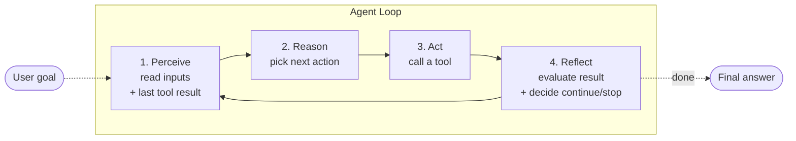

# Module 01 — Setup & Agent Loop Concepts

**Time:** ~15 minutes
**Goal:** get the repo running, and get the four-verb mental model into your head.

---

## Learning objectives

By the end of this module you can:

1. Run a TypeScript file with `tsx`.
2. Name the four phases of an agent loop.
3. Explain, in one sentence each, what an *agent* is vs a *chatbot* vs a *script*.

---

## 1. Install & smoke test

No install step. Node 22.6+ can run `.ts` files directly. From the repo root:

```powershell
npm run m1
```

Expected output:

```
Hello from the agent loop.
Node version: v22.x.x (or newer)
```

If you see this, the toolchain works. If not: check `node --version` is 22.6+.

---

## 2. The idea

A **script** does exactly what you tell it, in the order you tell it.
A **chatbot** replies to one message, then forgets everything and waits.
An **agent** is a loop: it looks at the world, decides what to do next, does it, checks the result, and repeats — **until the goal is done or it must stop**.

That loop has four phases:



| Phase | Question it answers | Where it lives in code |
|---|---|---|
| **Perceive** | *"What do I know right now?"* | reading state / last observation |
| **Reason** | *"What should I do next?"* | the LLM call (or, for us, `mockLlm()`) |
| **Act** | *"Do the thing."* | tool execution |
| **Reflect** | *"Did it work? Am I done? Am I stuck?"* | validation + loop-exit logic |

---

## 3. Why "engineering" the loop matters

Naïve loops fail in three predictable ways:

1. **Infinite loop.** The model keeps calling the same tool. → Fix: max iterations, cycle detection.
2. **Unsafe action.** The model tries `rm -rf /`. → Fix: tool allowlists, arg validation.
3. **Silent wrong answer.** The model hallucinates a number. → Fix: reflection + result schemas.

We fix all three in Modules 04 and 05.

---

## 4. Try it (learner prompt)

Open [src/hello.ts](src/hello.ts) and read it. It is 10 lines. Then answer, in your own words, in a comment at the bottom of the file:

> *"If I asked this program 'what is the total revenue in the CSV?', which of the four phases is missing?"*

**Prompt to try with your AI assistant:**

> "Explain the difference between a for-loop and an agent loop. Use the words *perception*, *reasoning*, *action*, *reflection*."

---

## 5. Recap

- An agent = **Perceive → Reason → Act → Reflect**, repeated.
- Every popular agent framework is a specialisation of this loop.
- The rest of the course fills each box with real code.

Next: **[Module 02 — Perception & Tools](../02-perception-and-tools/README.md)**.
