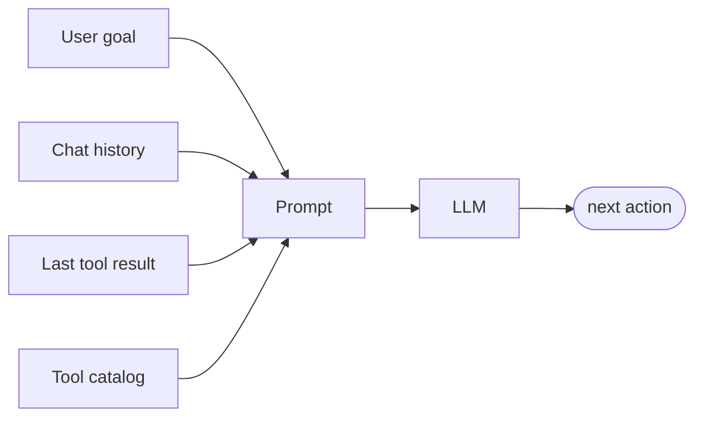
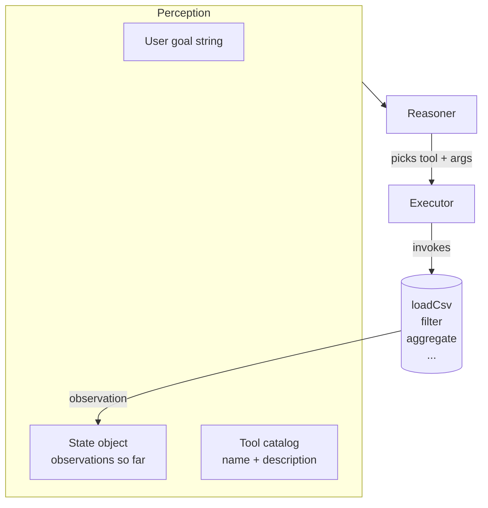

# Module 02 — Perception & Tools

**Time:** ~20 minutes
**Goal:** give the agent hands and eyes. Build a `Tool` interface and a CSV-loader tool.

---

## Learning objectives

1. Explain what "perception" means in an agent (hint: it's not just user input).
2. Define a `Tool` as a typed contract: `name + description + args schema + run()`.
3. Implement your first tool: `loadCsv`.

---

## 1. What is "perception"?

Everything the agent sees, every turn, is perception:

- the **user goal** ("total revenue by region?")
- the **last tool result** ("24 rows loaded")
- the **conversation so far** (memory)
- the **environment** (current time, available tools, file listing)

An LLM does not have arms or eyes. It only sees **text you paste into its prompt**.
So "giving the agent perception" = **assembling a good prompt from real-world state**.



The "brain" is stateless. **You** carry state around and re-serialise it each turn.

---

## 2. Tools = the agent's hands

A tool is any function the agent may call. In production it might be:

- `web.search`, `sql.query`, `github.createIssue`, `email.send`.

For us today: `loadCsv`, `filter`, `aggregate`, `groupBy`.

Every tool must expose the same **contract** so the loop can treat them uniformly:

```ts
interface Tool<A = any, R = any> {
  name: string;                      // stable id the LLM will emit
  description: string;               // one-line, LLM-facing
  argsSchema: string;                // human-readable arg doc
  run(args: A): Promise<R> | R;      // pure-ish; validated by loop
}
```

> Why a `description`? Because the reasoner (Module 03) must choose *which* tool to use. It picks by reading the description. Bad description = bad tool selection.

---

## 3. Build `loadCsv`

Open [src/tool.ts](src/tool.ts) and [src/tools/loadCsv.ts](src/tools/loadCsv.ts). Read them (~30 lines). Then run:

```powershell
npm run m2
```

Expected output:

```
Tool: loadCsv
Description: Load a CSV file into an array of row objects.
--- result ---
24 rows loaded. First row:
{ date: '2025-01-05', region: 'North', product: 'Widget', units: '12', revenue: '240' }
```

Notice: numbers are still **strings** ("12", "240"). CSV parsing is dumb. The `aggregate` tool in Module 06 does its own coercion. That's a real-world lesson: **tool outputs are not always clean** — this is what reflection catches later.

---

## 4. The wider picture



Two invariants to remember:

1. **All tool I/O must be JSON-serialisable.** The reasoner can only see text.
2. **The tool catalog is part of the prompt.** Add a tool without updating the reasoner's view of the catalog → the agent will never call it.

---

## 5. Try it (learner prompts)

1. Add a `pwd` field to the CSV row (fail — types will complain). Fix it in `types.ts`.
2. Add a second tool `head(n)` that returns the first *n* rows. Follow the `Tool` interface.
3. **Prompt for your AI assistant:**

   > "What is the risk of letting an LLM invoke `fs.readFileSync` directly with any path it wants? Design a safer `loadCsv` that only allows files under `./data/`."

   (Save the answer — Module 05 formalises this as a *guardrail*.)

---

## 6. Recap

- Perception = whatever text you assemble into the model's context each turn.
- A Tool is a **contract**: `{ name, description, argsSchema, run }`.
- Tool descriptions are load-bearing prompts. Write them well.
- Tool outputs are untrusted — future modules validate them.

Next: **[Module 03 — Reasoning (Mock LLM)](../03-reasoning/README.md)**.
