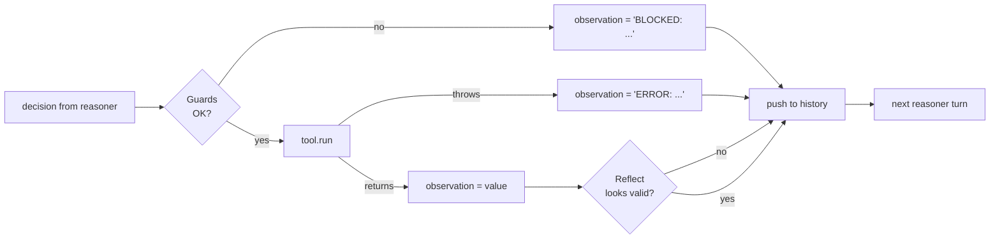

# Module 05 — Reflection & Safety

**Time:** ~20 minutes
**Goal:** turn our fragile loop into a robust one. Add guardrails that stop bad actions before they run, and reflection that catches bad results after.

---

## Learning objectives

1. Distinguish **safety guards** (pre-check, block) from **reflection** (post-check, retry).
2. Implement three guards: path allowlist, tool allowlist, arg validation.
3. Implement reflection: wrap tool calls, detect bad observations, feed the error back to the reasoner.

---

## 1. Safety vs Reflection



- **Guards** answer *"is this action allowed?"* — before you run it. Cheap, deterministic, code.
- **Reflection** answers *"was this result useful?"* — after the tool ran. Cheap heuristics, or in production, a second LLM call.

Both convert failure into a **normal observation** so the reasoner gets another turn. **The loop never crashes on a tool failure.**

---

## 2. Three guards we add today

| Guard | What it blocks |
|---|---|
| **Tool allowlist** | Reasoner tries a tool that isn't registered. |
| **Path allowlist** | Reasoner tries to read `../../etc/passwd`. Only files under `./data/` are allowed. |
| **Arg validator** | Reasoner sends `{}` when `loadCsv` needs `{ path: string }`. |

These are toy versions of what real agents do. Serious systems layer on: schemas (Zod / JSON Schema), sandboxes, network egress filters, human-in-the-loop for destructive actions.

> **OWASP LLM Top-10, item #6:** *Excessive Agency*. Every guard here is one line of defense against it.

---

## 3. Reflection today

We implement one simple reflector: `reflect(observation)` returns `{ ok, issue? }`.

- If the observation is `NaN` or `undefined` or `{ rows: [] }` — it's suspect.
- If it's an `Error` — obviously suspect.

When `ok === false`, we push a special step whose observation is `{ error: "..." }`, and the reasoner sees it next turn and picks a fallback.

Real production reflection is often a **second LLM call**:
> *"Given the goal and the last observation, is the answer complete? If not, what should we try instead?"*

Same slot, richer function.

---

## 4. The demos

Run:

```powershell
npm run m5
```

You will see **two** runs.

### Demo A — a guard blocks a bad path

The reasoner is nudged to try `data/../etc/passwd`. The path guard refuses:

```
[turn 1] action: loadCsv({"path":"data/../etc/passwd"})
         BLOCKED: path outside ./data/ is not allowed
[turn 2] thought: previous call blocked -- try the legitimate path
         action: loadCsv({"path":"data/sales.csv"})
         observation: { rows: 24, ... }
...
```

The loop keeps going. The reasoner saw the block, adapted, and finished the job.

### Demo B — reflection catches a NaN

The reasoner is asked to sum a non-numeric column (`product`). `aggregate` returns `NaN`. Reflection flags it. The reasoner falls back to a `count` op instead.

---

## 5. Code map

- [src/guards.ts](src/guards.ts) — path & tool allowlists, arg validation.
- [src/reflect.ts](src/reflect.ts) — one function, checks a handful of "suspicious" shapes.
- [src/loop.ts](src/loop.ts) — the loop from Module 04, plus a `try/catch`, plus guard & reflect hooks.
- [src/mockLlm.ts](src/mockLlm.ts) — reasoner extended to react to error observations.
- [src/run.ts](src/run.ts) — runs both demos back-to-back.

---

## 6. Try it (learner prompts)

1. Add an `env-var` guard: refuse any tool call whose args contain a string starting with `$`. Test it.
2. Change the max iterations to `2` in Demo A. What message does the user see now? Is that acceptable?
3. **Prompt for your AI assistant:**

   > "List three OWASP LLM-app risks that agent loops make worse. For each, give one guardrail from the code in this module that mitigates it, and one it does not."

---

## 7. Recap

- Guards run **before** the tool: they say *no*.
- Reflection runs **after** the tool: it says *not good enough, try again*.
- Both convert failure into a fresh observation. The loop keeps its shape.
- Real systems layer many guards; we build three; you now know the pattern.

Next: **[Module 06 — Capstone: Data Analyst](../06-capstone-data-analyst/README.md)**.
