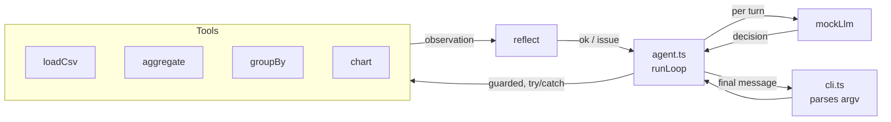

# Module 06 — Capstone: Data Analyst Agent

**Time:** ~15 minutes
**Goal:** put everything together into a small CLI that answers questions about `data/sales.csv` — with tools, reasoning, a real loop, guards, and reflection.

---

## What it does

```powershell
npm run capstone -- "how many rows are there?"
npm run capstone -- "what is the total revenue?"
npm run capstone -- "average units per sale?"
npm run capstone -- "chart revenue by region"
npm run capstone -- "chart units by product"
```

Or directly via `node` (no install needed on Node 22.6+):

```powershell
node modules/06-capstone-data-analyst/src/cli.ts "chart revenue by region"
```

Example output for `"chart revenue by region"`:

```
[turn 1] thought: No data yet -- load the CSV.
         action: loadCsv({"path":"data/sales.csv"})
         observation: { rows: 24, columns: [date, region, product, units, revenue] }

[turn 2] thought: Chart 'revenue' by 'region' -> groupBy first.
         action: groupBy({"groupColumn":"region","valueColumn":"revenue","op":"sum"})
         observation: {"North":1440,"South":1550,"East":2830}

[turn 3] thought: Grouped -- render chart.
         action: chart({"data":{...},"title":"revenue by region"})
         observation: "<chart text>"

[turn 4] action: final(...)

FINAL:
revenue by region
  East  | ############################## 2830
  South | ################               1550
  North | ###############                1440
```

Everything is deterministic; try running it twice and confirm identical output.

---

## Architecture



Each box maps back to a module:

| Box | Introduced in |
|---|---|
| `Reasoner` | Module 03 |
| `runLoop` | Module 04 |
| `Guards + Reflect` | Module 05 |
| `Tools` | Module 02 (+ new `chart` here) |

---

## What is new here

- A new **`chart`** tool that renders `Record<string, number>` as an ASCII bar chart (no external libs).
- A CLI that reads the question from `process.argv`.
- Question patterns:
  - `how many rows` → count
  - `total <col>` / `sum of <col>` → aggregate sum
  - `average <col>` / `avg <col>` / `mean <col>` → aggregate avg
  - `chart <X> by <Y>` / `plot <X> by <Y>` → groupBy + chart
  - `<X> by <Y>` (without chart) → groupBy only, JSON reply

Anything else politely says "I don't have a rule for that yet".

---

## Read the code (short files, in this order)

1. [src/tools.ts](src/tools.ts) — four tools.
2. [src/mockLlm.ts](src/mockLlm.ts) — pattern-matching reasoner.
3. [src/agent.ts](src/agent.ts) — the same guarded loop from Module 05, packaged.
4. [src/cli.ts](src/cli.ts) — 20 lines: parse argv, call the agent, print result.

---

## Swapping the mock for a real LLM (production checklist)

If you later wire this up to a real model, keep the loop and change only `mockLlm.ts`. The checklist:

1. **Prompt.** Build the system prompt from `renderCatalog(tools)` + goal + serialized history.
2. **JSON mode.** Force JSON output (OpenAI `response_format: json_object`, Anthropic tool-use, etc.).
3. **Schema-validate** the returned `Decision` — reject and re-prompt if malformed.
4. **Cost budget.** Track tokens; add a `maxTokens` stop condition alongside `maxIterations`.
5. **Redaction.** Never send secrets or PII in the prompt. Guards should also strip them from observations before they're fed back to the model.
6. **Tracing.** Persist every step (thought, action, observation) with a run-id. You already log them — now write them to a file / OpenTelemetry / your favourite store.

None of the other files in this project need to change.

---

## Try it (learner prompts)

1. Ask a question the agent can't answer. Where does it stop? Is the message user-friendly?
2. Add a new tool `filter({ column, value })` that keeps only rows where `column === value`, then a rule in `mockLlm` for `"total <col> for <region>"`. Test:
   ```
   npm run capstone -- "total revenue for East"
   ```
3. **Prompt for your AI assistant:**

   > "I want to replace `mockLlm` with a real OpenAI call. Show me the minimal diff, keeping the loop, guards, and reflect functions unchanged. Assume `OPENAI_API_KEY` is in `.env`."

4. Delete `data/sales.csv` and rerun. What message do you see? Is that safe behaviour?

---

## Course recap — the four verbs, one more time

- **Perceive** — assemble state into a prompt.
- **Reason** — one decision at a time, structured output.
- **Act** — guarded, error-trapped tool call.
- **Reflect** — validate the result; retry or stop.

Every future agent you build — or debug — is this loop.
