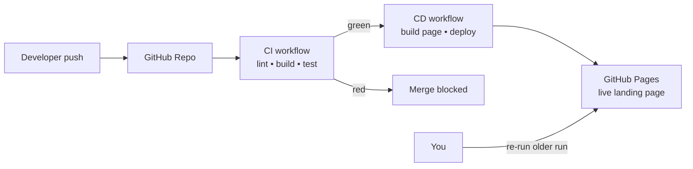

# GitHub Actions CI/CD — 2-Hour Hands-On Training

> **Audience:** Freshers already comfortable with TypeScript basics.
> **Duration:** 2 hours (120 min).
> **Stack:** Node.js 20 · TypeScript 5 · Express 4 · Vitest · GitHub Actions · GitHub Pages.
> **Outcome:** By the end you will have a green CI/CD pipeline you built yourself, generated partly with GitHub Copilot, with working secrets and a tested rollback.

---

## What you will build

A tiny **Hello Math API** (Express + TypeScript) with a fully automated pipeline:

You will not need a credit card or a cloud account. Everything runs on GitHub's free tier.

---

## Agenda (120 min)

| # | Module | Time | File |
|---|--------|-----:|------|
| 0 | Overview & goals | 5 min | [modules/00-overview.md](modules/00-overview.md) |
| 1 | CI/CD fundamentals | 10 min | [modules/01-cicd-fundamentals.md](modules/01-cicd-fundamentals.md) |
| 2 | GitHub Actions basics | 15 min | [modules/02-github-actions-basics.md](modules/02-github-actions-basics.md) |
| 3 | Build your first CI pipeline | 20 min | [modules/03-first-pipeline.md](modules/03-first-pipeline.md) |
| 4 | AI-assisted pipeline generation (Copilot) | 15 min | [modules/04-ai-assisted-generation.md](modules/04-ai-assisted-generation.md) |
| 5 | Secrets management | 15 min | [modules/05-secrets-management.md](modules/05-secrets-management.md) |
| 6 | CD — deploy to GitHub Pages | 20 min | [modules/06-deploy-to-pages.md](modules/06-deploy-to-pages.md) |
| 7 | Rollback strategies | 15 min | [modules/07-rollback-strategies.md](modules/07-rollback-strategies.md) |
| 8 | Wrap-up, cleanup, next steps | 5 min | [modules/08-wrap-up.md](modules/08-wrap-up.md) |

---

## Before you start

1. Complete every step in [SETUP.md](SETUP.md) **before** the session — installs take longer than you think.
2. Clone or fork this repo (you'll create your own repo in Module 3).
3. Reference sample app lives in [code/hello-api](code/hello-api).

---

## How to use this content

- Each module is self-contained: **concept → diagram → do-it-yourself steps → copy-paste prompt for Copilot → checkpoint**.
- Every **Prompt** block is a ready-to-paste instruction for GitHub Copilot Chat. Adapt the wording, don't just paste blindly.
- **Checkpoints** at the end of each module tell you the exact state your repo should be in.

Happy shipping!
