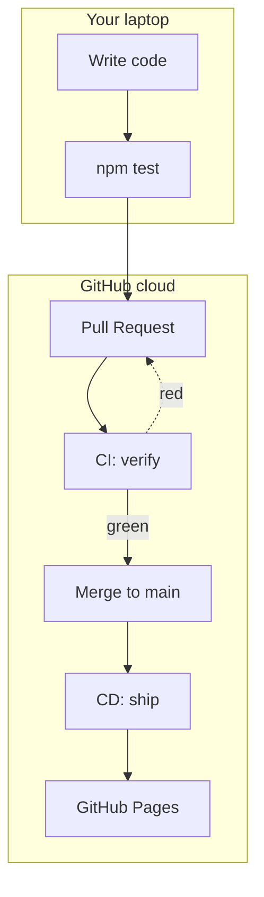

# Module 0 — Overview & Goals

**Time:** 5 min · **Type:** Talk-through

---

## Why this training exists

You already know how to write TypeScript. You may have even run `npm test` locally. The gap between "it works on my machine" and "it's running in production" is filled by a **CI/CD pipeline**. Today you build one — end to end — in two hours.

---

## Learning goals

By the end of this session you will be able to:

1. Explain **CI** vs **CD** in one sentence each.
2. Read and write a **GitHub Actions workflow YAML** file.
3. Use **GitHub Copilot Chat** to generate and refine a workflow, and *know when the AI is wrong*.
4. Store and consume **secrets** safely — and recognise three common leaks.
5. Deploy a build artifact to **GitHub Pages** automatically on every merge to `main`.
6. Perform a **rollback** in under 60 seconds when a bad deploy hits production.

---

## The mental model

Every arrow above is automated. Your job is to write the YAML that makes those arrows happen.

---

## Ground rules

- **Type every command.** Muscle memory matters.
- **Read the error, then Google, then ask Copilot.** In that order.
- **Never paste a real secret into chat** — including Copilot Chat. Module 5 covers why.

---

## Checkpoint

You should now have:
- [x] All tools from [SETUP.md](../SETUP.md) installed.
- [x] Copilot Chat opens in VS Code.
- [x] You know the six goals above.

Next → [01-cicd-fundamentals.md](01-cicd-fundamentals.md)
