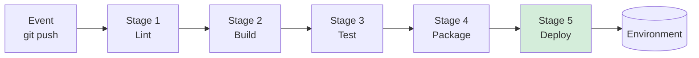

# Module 1 — CI/CD Fundamentals

**Time:** 10 min · **Type:** Concept

---

## The two words

| Term | Full form | One-line definition |
|------|-----------|--------------------|
| **CI** | Continuous Integration | Every code change is **automatically built and tested** the moment it's pushed. |
| **CD** | Continuous Delivery / Deployment | Every green build is **automatically packaged and shipped** to an environment. |

> **Delivery** = automatic up to *ready-to-release*, humans click "deploy".
> **Deployment** = fully automatic all the way to production. We'll do the second one.

---

## What a pipeline actually is

A **pipeline** is a directed sequence of automated steps that starts from a code event (push, PR, tag) and ends at a working artifact in an environment.

Each stage should be:
- **Fast** — if it takes 30 minutes, no one waits for it.
- **Deterministic** — same input, same output.
- **Fail-loud** — a red stage stops the pipeline immediately.

---

## Why bother?

| Without CI/CD | With CI/CD |
|----------------|-----------|
| "Works on my machine" | Works on a clean VM every time |
| Manual deploy at 5pm Friday 😱 | Push at 4:59pm, coffee at 5:00pm |
| Bugs found in prod | Bugs found in the PR |
| Rollback = call the senior | Rollback = 1 click |

---

## The CI/CD contract with the rest of the team

Once your pipeline is green, three things are guaranteed:
1. Code compiles.
2. Tests pass.
3. A deployable artifact exists.

That's it. **The pipeline is not a substitute for code review, monitoring, or good tests** — it just enforces the minimum bar.

---

## Common pipeline anti-patterns (spot them early)

| Anti-pattern | Why it hurts |
|--------------|--------------|
| Skipping tests when in a hurry (`--no-verify`) | You'll ship a bug within a week. |
| Storing secrets in the YAML file | Public repos leak instantly. |
| One giant 20-minute job | Hard to debug, hard to retry. |
| No branch protection | Anyone can push directly to `main`. |
| Deploying from a laptop | Not reproducible. |

---

## Quick quiz (30 sec, in your head)

1. Your CI runs tests but not lint. Is it still CI? *(Yes — but a weak one.)*
2. Your CD publishes a Docker image but doesn't run it anywhere. Delivery or Deployment? *(Delivery.)*
3. You commit `.env` with a real API key. What's the first thing you do? *(Rotate the key. Then remove file. History rewrite is second.)*

---

## Checkpoint

- [x] You can explain CI and CD in one sentence each.
- [x] You can list at least 3 stages a pipeline usually has.
- [x] You recognise 2 pipeline anti-patterns.

Next → [02-github-actions-basics.md](02-github-actions-basics.md)
