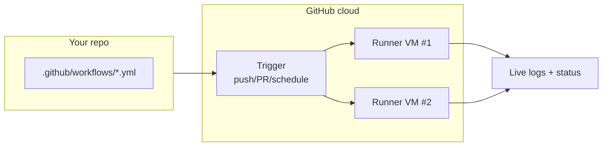
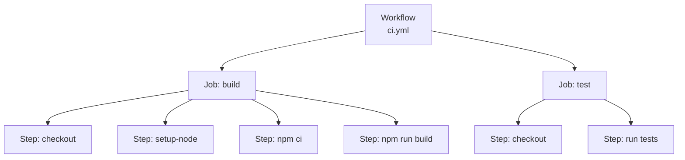
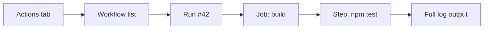

# Module 2 — GitHub Actions Basics

**Time:** 15 min · **Type:** Concept + tiny hands-on

---

## What GitHub Actions is

GitHub Actions is GitHub's built-in CI/CD engine. You describe your pipeline in **YAML files** under `.github/workflows/`, and GitHub runs them on **runners** (free Linux VMs for public repos, generous free minutes for private).



---

## The four building blocks



| Block | What it is | Analogy |
|-------|-----------|---------|
| **Workflow** | One YAML file | A recipe |
| **Job** | A group of steps that run on one runner | A cooking station |
| **Step** | A single shell command **or** a reusable **Action** | A single instruction |
| **Action** | Reusable step published by someone (`actions/checkout@v4`) | A pre-made sauce |

Jobs in a workflow **run in parallel by default**. Steps in a job run **sequentially**.

---

## Minimal workflow — read this carefully

```yaml
# .github/workflows/hello.yml
name: Hello CI                    # shown in the Actions tab

on:                                # WHEN to run
  push:
    branches: [main]
  pull_request:

jobs:
  say-hi:                          # job id (any name)
    runs-on: ubuntu-latest         # runner OS
    steps:
      - name: Checkout code        # human-readable label
        uses: actions/checkout@v4  # a reusable Action

      - name: Print greeting       # a plain shell step
        run: echo "Hello from $GITHUB_ACTOR on $GITHUB_REF"
```

Key syntax rules:

| Rule | Why |
|------|-----|
| Indentation = 2 spaces, no tabs | YAML is whitespace-sensitive |
| `uses:` runs a published Action, `run:` runs a shell command | Never both in the same step |
| Pin action versions (`@v4`, or better — a SHA) | Prevent supply-chain surprises |
| `${{ ... }}` = expression syntax | For contexts, secrets, outputs |

---

## Built-in context variables you'll use today

| Variable | Example value |
|----------|--------------|
| `github.actor` | `octocat` |
| `github.ref` | `refs/heads/main` |
| `github.sha` | `a1b2c3d...` |
| `github.event_name` | `push` |
| `github.run_number` | `42` |
| `runner.os` | `Linux` |

Access in YAML: `${{ github.sha }}` · Access in shell: `$GITHUB_SHA`.

---

## Tiny hands-on (2 min)

Don't create the sample app yet — just look at the reference workflow:

**Prompt for Copilot Chat:**
> Explain each line of the file below, and tell me what would happen if I removed `actions/checkout@v4`:
>
> *(paste the minimal workflow above)*

Read Copilot's answer critically. If it says something you don't understand, ask a follow-up. This is your first practice at treating AI output as a **draft, not gospel**.

---

## Where you'll see logs

Once a workflow runs:
1. Repo → **Actions** tab.
2. Click the workflow name → click the run → click a job → expand a step.
3. Failed steps are red with a downward chevron.

Screenshot flow (mental model):



---

## Checkpoint

- [x] You can name the 4 building blocks (Workflow → Job → Step → Action).
- [x] You know where `.github/workflows/` lives.
- [x] You can read a minimal workflow file line by line.

Next → [03-first-pipeline.md](03-first-pipeline.md) — you start typing.
