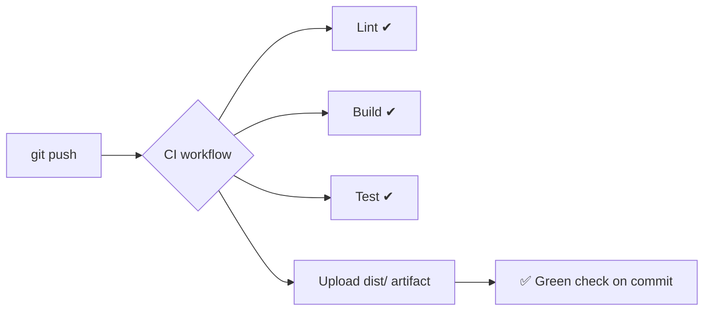

# Module 3 — Build Your First CI Pipeline

**Time:** 20 min · **Type:** Hands-on

You will now create your own repo, drop in the sample Express + TypeScript API, and add a CI workflow that lints, builds, and tests on every push.

---

## What "done" looks like



---

## Step 1 — Create a new repo (2 min)

Option A — GitHub CLI (recommended):
```powershell
mkdir hello-api-training
cd hello-api-training
gh repo create hello-api-training --public --source=. --remote=origin --confirm
```

Option B — via github.com: New → **Repository** → name `hello-api-training` → **Public** → *do not* initialize with README (we'll push our own).

---

## Step 2 — Copy the sample app (3 min)

From the training repo you already have, copy the contents of [training/code/hello-api](../code/hello-api) into your new `hello-api-training` folder. Structure should be:

```
hello-api-training/
├── .gitignore
├── .env.example
├── .eslintrc.cjs
├── package.json
├── tsconfig.json
├── README.md
├── scripts/
│   └── build-page.js
├── src/
│   ├── server.ts
│   └── math.ts
└── tests/
    └── math.test.ts
```

Then generate the lockfile locally:
```powershell
npm install
npm run build
npm test
```

You should see:
- `dist/` folder created
- Vitest prints `4 passed`

Commit this baseline:
```powershell
git add .
git commit -m "chore: initial hello-api scaffold"
git push -u origin main
```

---

## Step 3 — Write the CI workflow (10 min)

Create the file **manually first** (we'll ask Copilot to improve it in Module 4). This teaches you the anatomy.

Create `.github/workflows/ci.yml`:

```yaml
name: CI

on:
  push:
    branches: [main]
  pull_request:
    branches: [main]

concurrency:
  group: ci-${{ github.ref }}
  cancel-in-progress: true

jobs:
  build-and-test:
    name: Build & test
    runs-on: ubuntu-latest
    steps:
      - name: Checkout
        uses: actions/checkout@v4

      - name: Setup Node.js 20
        uses: actions/setup-node@v4
        with:
          node-version: '20'
          cache: 'npm'

      - name: Install dependencies
        run: npm ci

      - name: Lint
        run: npm run lint

      - name: Build
        run: npm run build

      - name: Test
        run: npm test

      - name: Upload build artifact
        uses: actions/upload-artifact@v4
        with:
          name: hello-api-dist-${{ github.sha }}
          path: dist
          retention-days: 7
```

### Line-by-line callouts

| Line(s) | Why it's there |
|---------|----------------|
| `on: push / pull_request` | Two triggers — protect `main` **and** validate PRs before merge. |
| `concurrency` | If you push twice quickly, the older run is cancelled — saves minutes. |
| `runs-on: ubuntu-latest` | Free, fast Linux runner. Windows/macOS runners are 2×/10× the minutes. |
| `actions/checkout@v4` | Pulls your code onto the runner. Nothing works without it. |
| `actions/setup-node@v4` with `cache: 'npm'` | Installs Node **and** caches `~/.npm` between runs — huge speedup. |
| `npm ci` (not `npm install`) | Deterministic install from `package-lock.json`. |
| `upload-artifact` | Keeps `dist/` downloadable for 7 days — handy for debugging. |

---

## Step 4 — Push and watch it run (3 min)

```powershell
git add .github/workflows/ci.yml
git commit -m "ci: add build + test workflow"
git push
```

Then:
1. Open your repo on github.com → **Actions** tab.
2. Click the run titled *"ci: add build + test workflow"*.
3. Watch the log stream in real time.

**Prompt for Copilot Chat** (if it goes red):
> My GitHub Actions CI job just failed on step `npm run lint`. The log ends with the following error. Explain the root cause and give me the exact fix, targeting an Express + TypeScript project on Node 20. Do not change unrelated code.
>
> ```
> <paste last ~20 lines of the log>
> ```

---

## Step 5 — Turn on branch protection (2 min)

CI is only useful if broken code can't reach `main`.

1. Repo → **Settings** → **Branches** → *Add branch ruleset*.
2. Name it `main`, target branch = `main`.
3. Enable **Require a pull request before merging**.
4. Enable **Require status checks to pass** → search & select **`Build & test`**.
5. Save.

From now on, direct pushes to `main` are blocked and you must open a PR.

---

## Common failures (fresher edition)

| Error | Cause | Fix |
|-------|-------|-----|
| `npm ci` fails with *"lock file version mismatch"* | You committed `package-lock.json` from an old npm version | Run `npm install` locally with Node 20, re-commit lockfile |
| `Cannot find module 'express'` | Missing `dependencies` block | Add `express` under `dependencies`, not `devDependencies` |
| `Error: Cannot find module '@types/express'` | `types/*` under `dependencies` on runtime step | Only needed at build time — keep in `devDependencies` |
| Lint fails on unused vars | Legit — remove them, or prefix with `_` |

---

## Checkpoint

- [x] Repo exists on GitHub with your code.
- [x] A green ✅ appears next to your latest commit.
- [x] Branch protection blocks direct pushes to `main`.
- [x] Build artifact is downloadable from the run summary.

Next → [04-ai-assisted-generation.md](04-ai-assisted-generation.md) — let Copilot do some of the typing.
