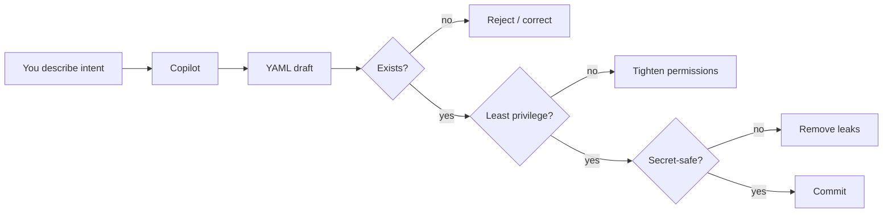

# Module 4 — AI-Assisted Pipeline Generation

**Time:** 15 min · **Type:** Hands-on with GitHub Copilot Chat

You wrote your first workflow by hand so you *understand* it. Now you'll use Copilot to move faster on the next iteration — but with a critical eye.

---

## The golden rule

> **Copilot is a very fast intern.** It writes plausible YAML, cites plausible action names, and occasionally invents both. Every AI-generated workflow needs 3 checks:
> 1. Does the action name/version actually exist? (Check the Marketplace.)
> 2. Do the permissions match what the job actually needs? (Least privilege.)
> 3. Would this leak a secret in a log?

---

## Exercise 1 — Generate a matrix build (5 min)

**Goal:** Extend your CI to run tests on Node 18, 20, and 22.

Open Copilot Chat in VS Code (`Ctrl+Alt+I`). Attach your `.github/workflows/ci.yml` file (drag it into the chat or use the paperclip icon).

**Prompt:**
> Modify the attached GitHub Actions workflow so the `build-and-test` job runs as a **matrix build** across Node.js versions `18`, `20`, and `22` on `ubuntu-latest`. Keep the caching, concurrency, and artifact upload. Only upload the artifact once (from the Node 20 leg), not three times. Use `actions/setup-node@v4` and `actions/upload-artifact@v4`. Return only the full updated file.

**Verify** the output:
- Does `strategy.matrix.node: [18, 20, 22]` appear?
- Is `if: matrix.node == 20` used to gate the upload step?
- Is `cache: 'npm'` still present under `setup-node`?
- Are action versions unchanged?

If any answer is "no", ask a follow-up rather than accepting the draft.

---

## Exercise 2 — Add a coverage gate (5 min)

**Prompt:**
> Add a new step to the same workflow that runs `npm test -- --coverage`, then fails the job if line coverage is below 80%. Use only Vitest and shell — do not add third-party actions. Keep it under 15 lines. Return the diff.

Read the diff carefully. Common Copilot mistakes on this exact prompt:
- Suggests `jest --coverage` instead of `vitest --coverage`.
- Invents a package `vitest-coverage-check` that doesn't exist.
- Uses `bc` (not always present on runners) instead of a Node one-liner.

If you spot one of those, push back:
> That package doesn't exist on npm. Rewrite the coverage check as a small inline Node script that reads `coverage/coverage-summary.json`.

---

## Exercise 3 — Explain, don't generate (2 min)

Use Copilot as a teacher, not just a typist.

**Prompt:**
> In the attached workflow, explain what would go wrong if I:
> 1. Removed the `concurrency` block.
> 2. Changed `npm ci` to `npm install`.
> 3. Removed the `cache: 'npm'` option.
> Answer in a table.

Read the answer, then close the chat and try to reproduce the explanation in your own words to your neighbour (or out loud). If you can't, you didn't really learn it.

---

## Prompt patterns that work

Steal these templates.

### Pattern A — Constraint stack
> Generate/modify **X**, using only **Y**, respecting these constraints: **1, 2, 3**. Return **only Z**.

### Pattern B — Show me the diff
> Show the change as a unified diff, not the whole file.

### Pattern C — Red-team it
> What's wrong with this workflow? List security issues, performance issues, and readability issues separately.

### Pattern D — Cite or refuse
> If an action doesn't exist on the Marketplace, say so and suggest a shell alternative instead of inventing one.

---

## What Copilot is bad at (as of 2026)

| Weakness | Symptom | Mitigation |
|----------|---------|-----------|
| Action version drift | Suggests `@v3` when `@v4` is current | Always eyeball `@vN` against the Marketplace page |
| Hallucinated marketplace actions | `foo-org/nonexistent-action@v1` | Open the URL — 404 means invented |
| Over-broad permissions | Adds `permissions: write-all` "just in case" | Ask "minimum permissions for this job only" |
| Copy-paste of anti-patterns | Uses `${{ secrets.TOKEN }}` in a `run: echo` | Never let a secret near an `echo` |

---

## Checkpoint

- [x] Your CI now runs on Node 18/20/22 with only one artifact upload.
- [x] Coverage step exists and fails when below 80%.
- [x] You wrote at least one **follow-up prompt** rejecting a Copilot suggestion.

Next → [05-secrets-management.md](05-secrets-management.md).
