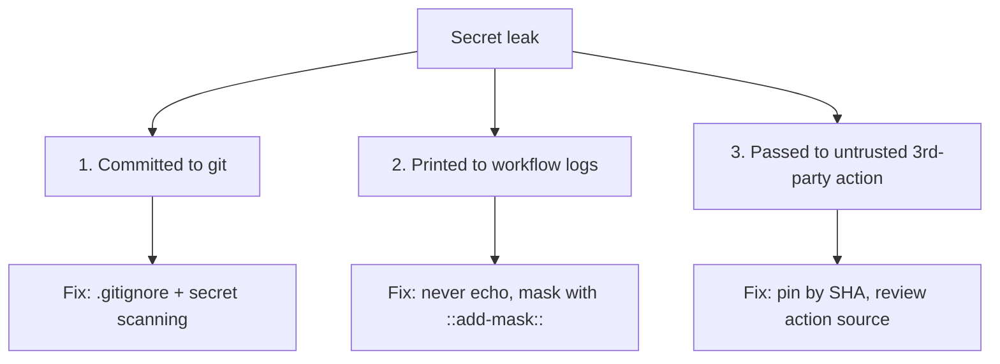
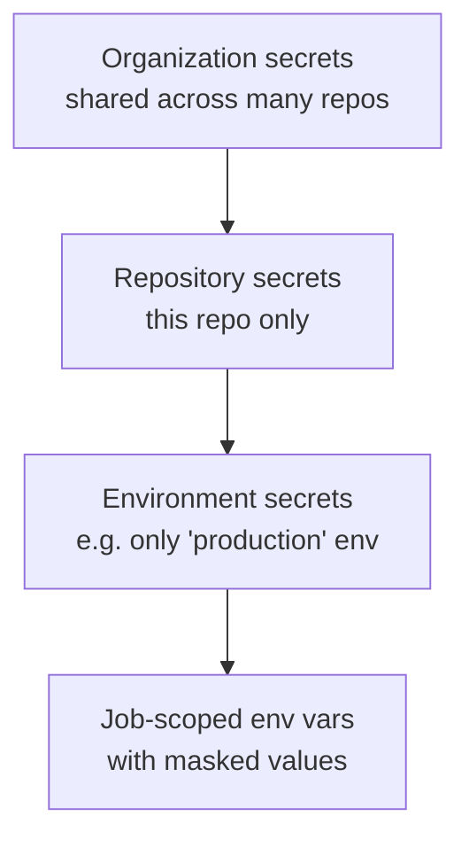
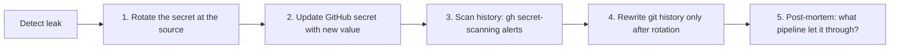

# Module 5 — Secrets Management

**Time:** 15 min · **Type:** Concept + hands-on

Secrets are the #1 way pipelines get compromised. This module makes sure you never make the three classic mistakes.

---

## What counts as a secret?

Anything an attacker could use to impersonate you or your infra:

- API keys (OpenAI, Stripe, SendGrid...)
- Database connection strings
- Cloud credentials (Azure Service Principal, AWS access key)
- Signing keys / private keys
- Personal Access Tokens (PATs)
- ...and sometimes even **URLs** (private webhook endpoints).

---

## The three ways secrets leak (memorise these)



| # | Bad | Good |
|---|-----|------|
| 1 | `API_KEY=sk-abc... ` committed in `.env` | `.env` in `.gitignore`, use `.env.example` |
| 2 | `run: echo "Deploying with $API_KEY"` | `run: ./deploy.sh` (secret consumed inside, not echoed) |
| 3 | `uses: random-user/deploy@main` | `uses: azure/webapps-deploy@v3` **pinned to SHA** |

---

## Where secrets live in GitHub

There are 4 scopes — pick the tightest:



| Scope | Use when | Example |
|-------|----------|---------|
| Organization | Same secret needed by many repos | Shared npm publish token |
| Repository | Only this repo needs it | Repo-specific deploy key |
| **Environment** ✅ | Different value for prod vs staging, or want approvals | `PROD_API_KEY` vs `STAGING_API_KEY` |
| Job env | Per-job override in workflow | Rarely — mostly for computed values |

Rule of thumb: **prefer Environment secrets** — they support required reviewers and per-env values.

---

## Hands-on 1 — Add a repository secret (3 min)

We'll add a harmless `GREETING` value so you get the workflow, then we'll pretend it's a real secret.

1. Repo → **Settings** → **Secrets and variables** → **Actions**.
2. Click **New repository secret**.
3. Name: `GREETING` · Value: `Namaste` (or anything).
4. Save.

Your CD workflow (`cd.yml`) already references it:
```yaml
env:
  GREETING: ${{ secrets.GREETING || 'Hello' }}
```

Push a commit and watch the deployed page show `Namaste, world!`.

**Prompt for Copilot Chat:**
> In my `cd.yml`, show me the exact syntax to also set an environment variable `LOG_LEVEL` from a repository secret named `LOG_LEVEL`, but only for the `build` job (not `deploy`). Return only the changed YAML block.

---

## Hands-on 2 — Create a `production` environment (5 min)

Environments give you approvals, wait timers, and per-env secrets.

1. Repo → **Settings** → **Environments** → **New environment** → name `production`.
2. Under **Deployment protection rules**, tick **Required reviewers** → add yourself.
3. Under **Environment secrets**, add `GREETING` with value `PRODUCTION-Hello`.

Update `cd.yml` so the `deploy` job uses it (already done in the sample — note this line):
```yaml
    environment:
      name: github-pages
```

> **Reading the docs:** `github-pages` is a **reserved** environment name used by `actions/deploy-pages`. For a truly custom env you'd write `environment: production` and manage the URL yourself. We'll leave the Pages one for now and reference `production` conceptually.

**Prompt for Copilot Chat:**
> Add a new job to `cd.yml` called `announce` that runs *after* `deploy`, uses the `production` environment (so it inherits the required reviewer), and just prints "Deploy of ${{ github.sha }} completed". Do not add any dependencies.

Read the diff. Watch for two things:
- `needs: deploy` is present.
- `environment: production` (not `github-pages`) is used.

---

## Hands-on 3 — Prove that secrets are masked (2 min)

Add a **temporary** debug step to your CI (we'll remove it):

```yaml
      - name: Try (and fail) to leak
        env:
          FAKE_SECRET: ${{ secrets.GREETING }}
        run: |
          echo "The value is $FAKE_SECRET"
          echo "Base64: $(echo -n $FAKE_SECRET | base64)"
```

Push and open the log. You'll see:
```
The value is ***
Base64: TmFtYXN0ZQ==     ← still leaked!
```

**Lesson:** GitHub masks literal secret strings in output but **cannot mask transformations** (base64, reversed, split, JSON-embedded). Never transform a secret in a step that produces log output.

**Then delete this step and push again.** Never leave leak-probes in real code.

---

## Checklist for every workflow you write

- [ ] No secret is passed to `run: echo` or `console.log`.
- [ ] `.env`, `*.pem`, `*.key`, `credentials.json` are in `.gitignore`.
- [ ] Third-party actions are pinned to a **SHA**, not just `@main`.
- [ ] `permissions:` block is present and minimal.
- [ ] Production secrets live in a **production environment** with required reviewers.
- [ ] You have GitHub **secret scanning** and **push protection** turned on (Settings → Code security).

---

## If you leak a secret — 5-minute playbook



**Step order matters.** Rewriting git history first is useless — the old commit is already in someone's clone.

---

## Checkpoint

- [x] `GREETING` secret exists at the repo level.
- [x] `production` environment exists with a required reviewer.
- [x] You saw first-hand that base64 defeats masking.
- [x] Leak-probe step deleted from your workflow.

Next → [06-deploy-to-pages.md](06-deploy-to-pages.md).
