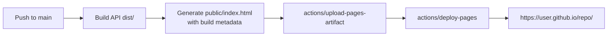

# Module 6 — CD: Deploy to GitHub Pages

**Time:** 20 min · **Type:** Hands-on

You have CI. Now add **CD**: on every push to `main`, build a landing page and publish it live on the internet at `https://<your-user>.github.io/hello-api-training/`.

---

## Why GitHub Pages (and its honest limitation)

Pages serves **static** files. It does **not** run Node.js — you cannot host a live Express server on it. Our approach mirrors what many real teams do:

- The **API code** (Express) is built + tested by CI and its `dist/` is uploaded as an artifact — this is what would ship to Azure/Render/Fly in a real project.
- A **landing page** (`public/index.html`) is generated and published to Pages so you get a real, visible URL to demo and to roll back.



If you later want a *real* API deployment target, swap the `deploy` job for `azure/webapps-deploy` or a container push. The rest of the pipeline is unchanged.

---

## Step 1 — Enable Pages on your repo (1 min)

1. Repo → **Settings** → **Pages**.
2. Under **Source**, select **GitHub Actions** (not "Deploy from a branch").
3. Save.

---

## Step 2 — Copy the CD workflow (3 min)

Copy [`.github/workflows/cd.yml`](../code/hello-api/.github/workflows/cd.yml) from the sample into your repo, but **strip the `working-directory: training/code/hello-api` lines** (your repo has files at the root, not inside `training/code/hello-api/`).

Full workflow after edits:

```yaml
name: CD - Deploy to GitHub Pages

on:
  push:
    branches: [main]
  workflow_dispatch:   # allows manual re-run for rollback

concurrency:
  group: pages
  cancel-in-progress: false

permissions:
  contents: read
  pages: write
  id-token: write

jobs:
  build:
    name: Build page
    runs-on: ubuntu-latest
    steps:
      - uses: actions/checkout@v4
      - uses: actions/setup-node@v4
        with:
          node-version: '20'
          cache: 'npm'
      - run: npm ci
      - run: npm run build
      - name: Generate landing page
        env:
          APP_VERSION: ${{ github.run_number }}
          GIT_SHA: ${{ github.sha }}
          BUILD_TIME: ${{ github.event.head_commit.timestamp }}
          GREETING: ${{ secrets.GREETING || 'Hello' }}
        run: npm run page:build
      - uses: actions/upload-pages-artifact@v3
        with:
          path: public

  deploy:
    name: Deploy to Pages
    needs: build
    runs-on: ubuntu-latest
    environment:
      name: github-pages
      url: ${{ steps.deployment.outputs.page_url }}
    steps:
      - id: deployment
        uses: actions/deploy-pages@v4
```

---

## Step 3 — Understand what each block does

| Block | Purpose |
|-------|---------|
| `on: push: branches: [main]` | Auto-deploy after merges to main |
| `on: workflow_dispatch` | Adds a **"Run workflow"** button in the Actions tab — used for rollback in Module 7 |
| `concurrency: group: pages, cancel-in-progress: false` | Only one deploy at a time; **never cancel** a running deploy |
| `permissions` | Least-privilege token: read code, write to Pages, request OIDC id-token |
| `build` job | Compiles TS, generates the HTML |
| `deploy` job | Publishes the artifact — a separate job so re-running `deploy` alone rolls back without rebuilding |
| `environment.name: github-pages` | Required by `deploy-pages` — creates the environment auto |
| `environment.url` | Makes the deployed URL clickable in the Actions UI |

---

## Step 4 — Ship it (2 min)

```powershell
git add .github/workflows/cd.yml
git commit -m "cd: deploy landing page to github pages"
git push
```

Open the **Actions** tab. You'll see two workflows queued (`CI` and `CD`). Wait for both to go green.

The `deploy` job's summary shows a URL — click it. You should see:
- "Hello, world!" (or "Namaste" if you set the secret earlier).
- Version = your GitHub run number.
- Commit = short SHA of your last commit.

Bookmark this URL. You'll roll it back in Module 7.

---

## Step 5 — Trigger a second deploy (2 min)

Make a small visible change: edit `scripts/build-page.js` and change `<h1>hello-api ...</h1>` to `<h1>hello-api v2 🚀</h1>`.

```powershell
git add scripts/build-page.js
git commit -m "feat(page): add v2 badge"
git push
```

Wait for green. Refresh your Pages URL — you should see "v2 🚀". Congratulations, you shipped.

---

## Step 6 — Add a status badge to the README (2 min)

Put this at the top of your repo README:

```markdown


```

Now anyone visiting your repo sees green/red at a glance.

---

## Troubleshooting

| Symptom | Fix |
|---------|-----|
| `Error: Resource not accessible by integration` | You forgot `permissions: pages: write, id-token: write` |
| 404 at the Pages URL for 1-2 minutes after first deploy | Normal — Pages needs to propagate. Wait, then hard-refresh. |
| `error: getting chunk signature: request has expired` | Deploy took too long; re-run the `deploy` job |
| Deploy job says "Waiting for pending approval" | You added a required reviewer to the environment — approve it in the Actions tab |

**Prompt for Copilot Chat when stuck:**
> My `actions/deploy-pages@v4` step failed with this exact error: `<paste>`. My workflow has these permissions: `<paste permissions block>`. Give me the smallest possible fix and explain why it works.

---

## Checkpoint

- [x] Pages is enabled with Source = GitHub Actions.
- [x] Your live URL responds with your landing page.
- [x] Two runs of CD are visible in the Actions tab (baseline + v2).
- [x] README shows CI and CD badges.

Next → [07-rollback-strategies.md](07-rollback-strategies.md) — deliberately break prod and fix it in 60 seconds.
