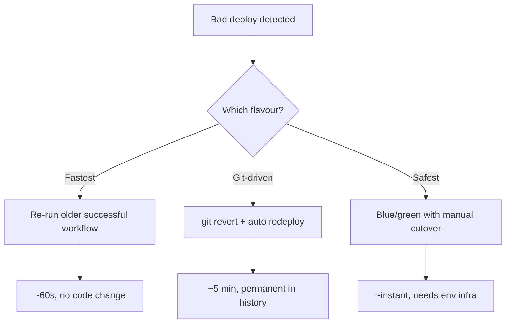
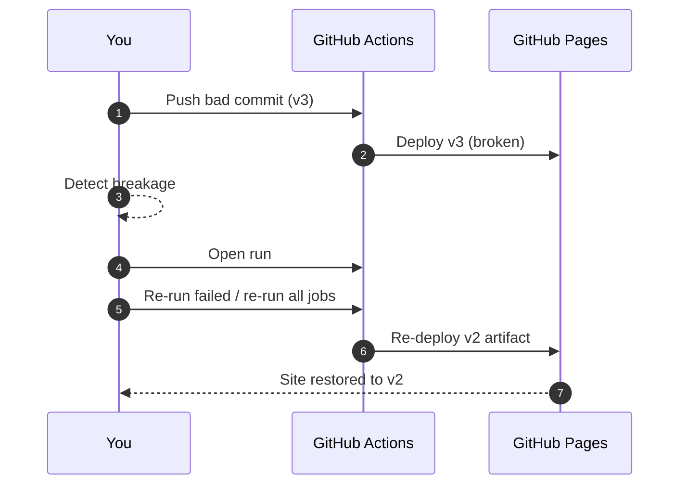
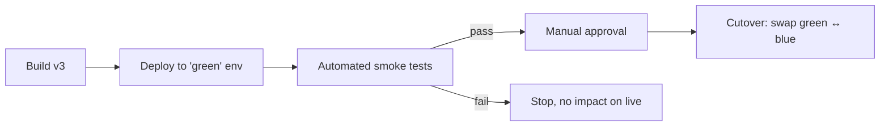

# Module 7 — Rollback Strategies

**Time:** 15 min · **Type:** Hands-on — you will break prod on purpose

The definition of "senior engineer" is not "never breaks prod." It's "gets prod back in under 5 minutes when it breaks."

---

## The three rollback flavours (know them all)



| Strategy | Time to restore | Pros | Cons |
|----------|----------------:|------|------|
| **A. Re-run last-good run** (our main demo) | ~60 s | No code change, undo-able | Env drift if code diverged a lot |
| B. `git revert` + auto CD | ~5 min | Permanent record in git history | Slower; wastes a build |
| C. Blue/green with manual promote | Instant | Zero-downtime, tested before cutover | Needs 2 environments |

Today we do **A** in full, and understand **B** and **C** conceptually.

---

## Strategy A — Re-run the last-good deploy (main demo)

### Why this works with our workflow

In [`cd.yml`](../code/hello-api/.github/workflows/cd.yml) we split the pipeline into two jobs:

- `build` → produces the artifact from **the current commit**.
- `deploy` → publishes **whatever artifact is attached to this run**.

Because `deploy` is a separate job, **re-running only the `deploy` job of an older run** re-publishes the artifact that older run produced — instantly rolling forward to that old version, without touching git.



### Step-by-step demo (10 min)

#### 1. Confirm your current "good" version

Open your Pages URL. Note the version + commit shown (say, run #5, SHA `abc1234`). This is your **known-good**.

#### 2. Ship a deliberately broken change

Edit `scripts/build-page.js` — replace the whole `html` template variable with:

```js
const html = `<!doctype html><html><head><title>OOPS</title></head><body><h1 style="color:red">SEV1: page templating broken</h1></body></html>`;
```

Push:
```powershell
git add scripts/build-page.js
git commit -m "feat: 'improve' landing page"
git push
```

Wait for CD to go green. Refresh your Pages URL — you should see the ugly red SEV1 page. **Prod is now broken.**

#### 3. Roll back in 60 seconds

1. Repo → **Actions** tab → **CD - Deploy to GitHub Pages** workflow.
2. Find the previous successful run (the one before the bad push).
3. Click into it → top-right **"Re-run all jobs"** button.
4. Wait ~45 s for the `deploy` job to complete.
5. Hard-refresh the Pages URL — **your last-good page is back**.

You did not touch git. You did not open a PR. You clicked one button.

#### 4. Now fix the code properly

The bad commit is still in `main`, so the next push would re-break prod. Fix it:

```powershell
git revert HEAD --no-edit
git push
```

CI runs. CD runs. Prod is now consistent with `main` **and** healthy.

**Prompt for Copilot Chat if the revert conflicts:**
> I ran `git revert HEAD` and got merge conflicts in `scripts/build-page.js`. Show me the safest resolution: I want to end up with **exactly the file contents from commit `<good SHA>`**. Give me the exact `git checkout` commands.

---

## Strategy B — `git revert` + auto CD (conceptual)

```powershell
git revert <bad-sha> --no-edit
git push origin main
```

Your normal CD pipeline picks it up and deploys the reverted state. Advantages:
- Permanent record: `git log` shows exactly when and by whom.
- Works even if artifact retention has expired.

Disadvantages:
- ~5 min end-to-end (full build).
- Assumes `main` is deployable — if CI is red, you're stuck.

Use B **after** doing A. A gets prod healthy; B makes the fix permanent.

---

## Strategy C — Blue/green with manual cutover (conceptual)



- Two environments: `blue` (live) and `green` (staging identical to prod).
- Every deploy goes to green first.
- A **required reviewer** approves the swap.
- Rollback = swap back (instant).

Overkill for a training project, standard for banks/hospitals. Look up the terms **canary deploy** and **feature flag** as the natural evolution of this idea.

---

## Post-incident checklist (don't skip)

Every rollback should end with:

1. **Timeline** written up (when did we notice, when did we roll back, who did what).
2. **Root cause**: not "the build was broken" but *why the pipeline let it through*.
3. **Pipeline fix**: add the missing test / lint rule / smoke check so this class of bug is caught next time.
4. **Blameless** language: "the process allowed X" not "Alice pushed X".

---

## Anti-patterns to avoid

| Anti-pattern | Why it's bad |
|--------------|--------------|
| Force-pushing `main` to erase the bad commit | Breaks everyone else's clone; audit trail is lost |
| Rolling back by editing files directly on the runner | Not reproducible, not in git |
| Skipping the post-mortem "because it was small" | You lose the compounding learning |
| Making rollback require senior approval at 3am | Slows recovery when speed matters most |

---

## Checkpoint

- [x] You deliberately broke prod, rolled back with one click, then permanently fixed it with `git revert`.
- [x] You can explain the trade-offs between strategies A, B, and C.
- [x] You know why `build` and `deploy` are separate jobs.

Next → [08-wrap-up.md](08-wrap-up.md).
