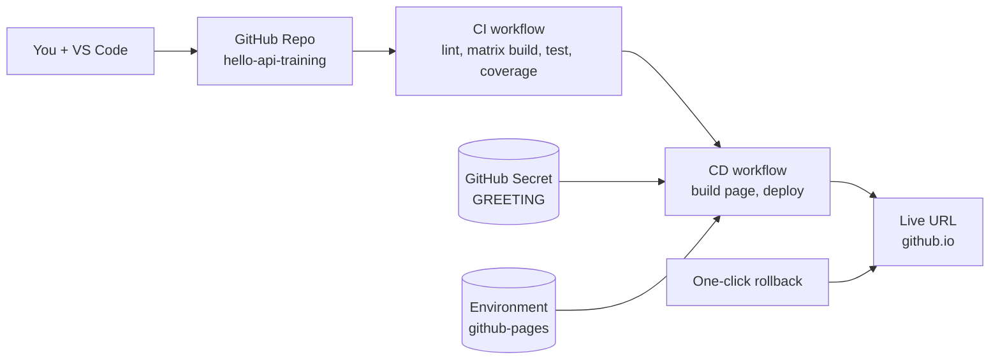

# Module 8 — Wrap-Up, Cleanup, and Next Steps

**Time:** 5 min

---

## What you built in 2 hours



You now have:
- A working repo with **CI (matrix + coverage) + CD** in green.
- A **live URL** on GitHub Pages that updates automatically.
- **Branch protection** blocking direct pushes to `main`.
- A **secret** injected at deploy time without leaks.
- A **production environment** with required reviewer.
- A **tested rollback** procedure you've done end-to-end.

---

## Cheat sheet — the 10 things worth remembering

1. `on:` decides *when*, `jobs:` decide *what*, `steps:` decide *how*.
2. Jobs run in parallel, steps run in sequence.
3. Always `npm ci`, never `npm install` in CI.
4. Cache `npm` via `actions/setup-node`.
5. Add `concurrency` to skip stale runs on the same branch.
6. `permissions:` should be **minimal**. `write-all` is a code smell.
7. Never `echo` a secret — masking doesn't survive transformations.
8. Pin third-party actions to a **SHA**, not `@main`.
9. Split `build` and `deploy` into separate jobs — enables re-run rollback.
10. First rollback, then fix. Not the other way around.

---

## Homework (optional, ~1 hour each)

Pick the one that looks most useful to you.

### H1 — Add automated smoke tests to CD
After `deploy`, add a `smoke` job that `curl`s the Pages URL and greps for the expected version. Fail the workflow (and thus mark the deploy as failed) if it doesn't match.

**Prompt starter:**
> Add a `smoke` job to my `cd.yml` that runs after `deploy`, waits up to 60 seconds for the Pages URL to respond 200, then `curl`s the URL and greps for the string `v${{ github.run_number }}`. Use only bash. Fail loudly.

### H2 — Publish to npm on git tag
Change your project so tagging `v0.2.0` publishes to npm.

**Prompt starter:**
> Create a new workflow `.github/workflows/release.yml` that triggers on `push: tags: ['v*']`, runs the same build+test, then publishes to npm using an `NPM_TOKEN` secret. Use `actions/setup-node@v4` with `registry-url`, and `npm publish --provenance --access public`. Return only the file.

### H3 — Real cloud deploy target
Swap the `deploy` job to publish the Express app itself to Azure Web Apps.

**Prompt starter:**
> Replace the `deploy` job in `cd.yml` with one that deploys my Express app (the `dist/` folder and `package.json`) to an Azure Web App named `hello-api-training` in resource group `training-rg`, using OpenID Connect (OIDC) for auth — no publish profile. List the Azure prerequisites separately.

### H4 — Container-based CD
Package the API as a Docker image and push to GitHub Container Registry.

**Prompt starter:**
> Generate a minimal multi-stage `Dockerfile` for my Node 20 + TypeScript Express app (source in `src/`, output in `dist/`, entrypoint `node dist/server.js`), and a workflow that builds and pushes to `ghcr.io/${{ github.repository }}` on every push to `main`. Use `docker/build-push-action@v5`.

---

## Cleanup (do this if you don't want to keep the repo)

```powershell
gh repo delete hello-api-training --confirm
```

Or via github.com: Settings → **Danger Zone** → *Delete this repository*.

---

## Further reading

| Topic | Link |
|-------|------|
| GitHub Actions docs | https://docs.github.com/actions |
| Workflow syntax reference | https://docs.github.com/actions/reference/workflows-and-actions/workflow-syntax |
| Security hardening guide | https://docs.github.com/actions/security-guides/security-hardening-for-github-actions |
| Marketplace (find actions) | https://github.com/marketplace?type=actions |
| Copilot in workflows guide | https://docs.github.com/copilot |
| SRE rollback patterns | *Google SRE Book*, ch. 8 (free online) |

---

## Feedback loop

If something in this training was confusing, missing, or plain wrong, file an issue in the training repo. Best contribution: a PR that fixes it — you already know how the pipeline works. 😉

Thanks for shipping with us today.
