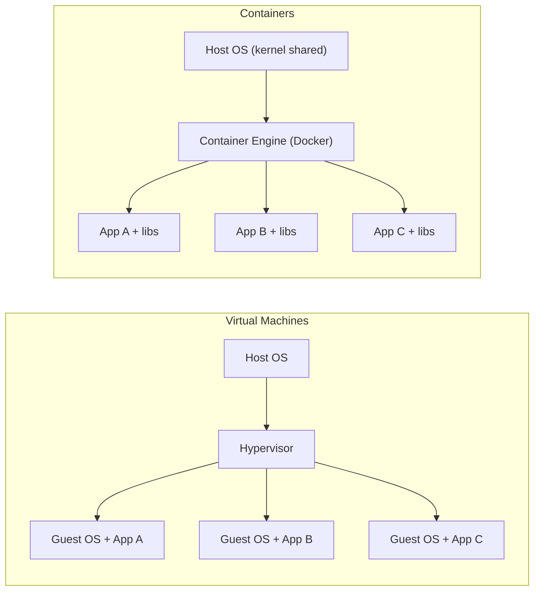
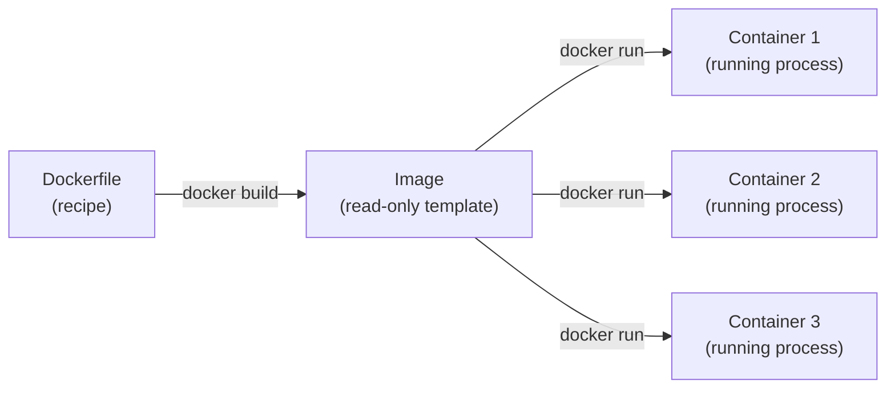

# Module 1 — Container fundamentals

**Duration:** 10 min &nbsp;•&nbsp; **Format:** concept + diagrams

## Learning goals

By the end of this module you can:

- Explain in one sentence what a container is.
- Say what problem containers solve for backend services.
- Distinguish a **container** from a **virtual machine**.
- Distinguish an **image** from a **container**.

---

## 1. The "works on my machine" problem

You built a Node.js API. It runs on your laptop. You send it to a teammate — it breaks. It runs in staging — it breaks differently. Why?

- Different Node versions
- Different OS libraries (glibc, OpenSSL...)
- Different environment variables
- Different file paths, permissions, timezones...

A **container** packages your app **plus** the exact filesystem and dependencies it needs, so it runs identically everywhere Docker runs.

## 2. Container vs Virtual Machine

Both isolate workloads, but at very different levels.

| | Virtual Machine | Container |
|---|---|---|
| Includes a full OS? | Yes (guest OS) | No — shares host kernel |
| Boot time | Seconds to minutes | Milliseconds |
| Size on disk | GBs | MBs |
| Isolation | Strong (hardware-level) | Process-level (namespaces + cgroups) |
| Density on one host | Tens | Hundreds to thousands |

**Rule of thumb:** VMs isolate **operating systems**. Containers isolate **processes**.

## 3. Image vs Container

This trips up everyone at first.

- An **image** is a read-only snapshot: filesystem + metadata (what command to run, env vars, exposed ports).
- A **container** is a running (or stopped) *instance* of an image, with a thin writable layer on top.
- You can start many containers from the same image, the same way you can spawn many processes from one binary.

## 4. Why backend engineers care

For a backend service, containers give you:

1. **Reproducibility** — build once, run anywhere Docker runs.
2. **Fast onboarding** — new devs run `docker run` instead of a 40-step README.
3. **Predictable deploys** — CI builds the image; prod runs the same image bit-for-bit.
4. **Horizontal scaling** — need 10 API instances? Start 10 containers. Kubernetes automates this (Module 6).
5. **Cleanup** — `docker rm` and the app leaves *no trace* on the host.

## Quick check

Answer these mentally before continuing:

1. Which command turns a Dockerfile into an image?
2. Which command turns an image into a running container?
3. Why is a container smaller than a VM?

Answers

1. `docker build`
2. `docker run`
3. It shares the host kernel instead of shipping its own OS.

---

## Copilot prompts to try

Open Copilot Chat (`Ctrl+Alt+I`) and ask:

> Explain the difference between a container and a virtual machine to a backend developer, in under 100 words, with one concrete example.

> Give me three real-world reasons a company would containerize a Node.js API. Keep each reason to one line.

Compare Copilot's answers to what you just read. Do you agree? Anything missing?

---

**Next:** [Module 2 — Docker basics](02-docker-basics.md)
