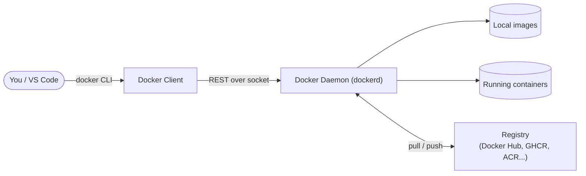
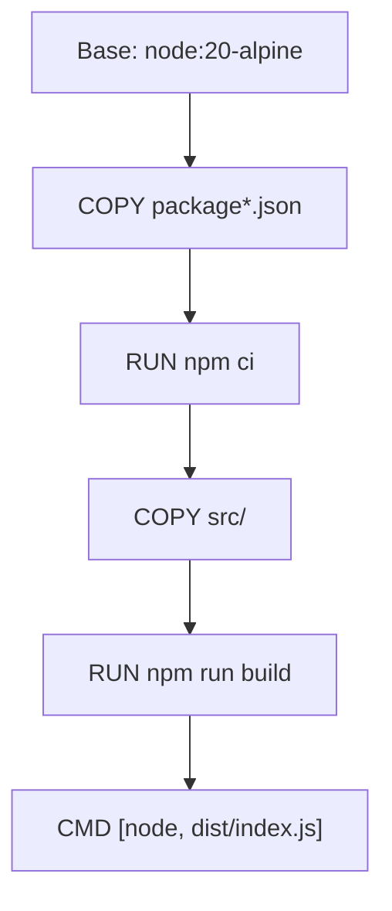

# Module 2 — Docker basics

**Duration:** 15 min &nbsp;•&nbsp; **Format:** concept + CLI demo

## Learning goals

- Understand Docker's client/daemon architecture and what a **registry** is.
- Read a Docker image reference (`node:20-alpine`).
- Run the ten commands you'll use 90% of the time.

---

## 1. How Docker is wired up



- **Client**: the `docker` command you type.
- **Daemon**: a background process that actually builds images and runs containers. On Docker Desktop it runs inside a tiny Linux VM.
- **Registry**: a place to store and share images. Docker Hub is the default; companies usually run private ones (Azure Container Registry, GHCR, ECR...).

## 2. Anatomy of an image reference

```
                registry           repository    tag
                    │                   │         │
                    ▼                   ▼         ▼
        ghcr.io/my-org / todo-api : 1.2.3
```

- No registry specified → **Docker Hub** (`docker.io/library/…`).
- No tag → `:latest` (dangerous in production — it's a moving target).
- Best practice: pin an explicit tag or, better, a digest (`node:20-alpine@sha256:…`).

Common Node base images and their approximate sizes:

| Image | Size | Notes |
|---|---|---|
| `node:20` | ~1.1 GB | Debian-based, includes lots of build tools. |
| `node:20-slim` | ~240 MB | Debian, minimal. Good default. |
| `node:20-alpine` | ~180 MB | musl libc — great size, occasional native-module quirks. |
| `gcr.io/distroless/nodejs20-debian12` | ~150 MB | No shell, no package manager. Runtime only. |

## 3. Image layers (why order matters)

Every instruction in a Dockerfile creates a **layer**. Layers are cached. Change a layer and every layer below it is rebuilt.



If you change one line in `src/`, layers L3–L5 rebuild but L0–L2 are reused from cache. That's why we always copy `package*.json` and install *before* copying source.

## 4. The 10 commands you actually use

```bash
# --- images ---
docker pull node:20-alpine              # download an image
docker images                           # list local images
docker rmi todo-api:v1                  # remove an image

# --- build & run ---
docker build -t todo-api:v1 .           # build from Dockerfile in `.`
docker run --rm -p 3000:3000 todo-api:v1  # run, auto-clean on stop
docker run -d --name todo -p 3000:3000 todo-api:v1  # detached / named

# --- inspect ---
docker ps                               # running containers
docker ps -a                            # all containers (incl. stopped)
docker logs -f todo                     # tail logs
docker exec -it todo sh                 # shell into a running container

# --- cleanup ---
docker stop todo && docker rm todo      # stop + remove one
docker system prune -f                  # remove dangling stuff
```

### Flag cheatsheet

| Flag | Meaning |
|---|---|
| `-t name:tag` | Tag the built image. |
| `-p HOST:CONTAINER` | Publish a container port to your machine. |
| `-d` | Detached (background). |
| `--rm` | Remove container automatically when it exits. |
| `-e KEY=VALUE` | Set an env var inside the container. |
| `-v HOST:CONTAINER` | Bind-mount a directory (dev workflow). |
| `--name` | Give the container a friendly name. |

## 5. Live micro-demo (2 min)

Run these in your terminal now, as a warm-up:

```bash
docker run --rm hello-world
docker run --rm -it node:20-alpine node -e "console.log('hi from', process.version)"
docker images | Select-String node          # PowerShell
# docker images | grep node                 # bash
```

The second command downloads `node:20-alpine` if not cached, runs one line of Node, and disappears. That's the container mindset: cheap, disposable processes.

---

## Copilot prompts to try

> Given the image `ghcr.io/acme/api:1.2.3`, explain each part of that reference. What's the registry, what's the repo, what's the tag?

> Write a `docker run` command that starts my `todo-api:latest` image detached, on port 3000, named "todo", with the env var `NODE_ENV=production`.

Verify Copilot's command matches the flag cheatsheet above.

---

**Next:** [Module 3 — Your first Dockerfile](03-dockerfile-nodejs-ts.md)
