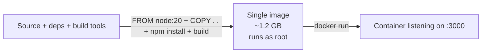

# Module 3 — Your first Dockerfile (Node + TypeScript)

**Duration:** 25 min &nbsp;•&nbsp; **Format:** hands-on

## Learning goals

- Run the sample API on your laptop with `npm`.
- Write a **naive but working** Dockerfile from scratch.
- Build it, run it, hit it with `curl`.
- Understand *why* this Dockerfile is bad — the pain motivates Modules 4 & 5.

---

## Step 1 — Open the project (2 min)

```bash
cd project
npm install
npm run dev
```

You should see:

```
todo-api listening on http://0.0.0.0:3000
```

In another terminal:

```bash
curl http://localhost:3000/health
curl http://localhost:3000/todos
```

Stop the dev server with `Ctrl+C`. **You have working code. Now let's containerize it.**

## Step 2 — Meet the Dockerfile (3 min)

A `Dockerfile` is a plain-text recipe. Docker reads it top-to-bottom and produces an image. Cheat sheet of the instructions you'll use today:

| Instruction | Purpose |
|---|---|
| `FROM` | Base image to start from. Every Dockerfile begins with this. |
| `WORKDIR` | Set working directory inside the image (like `cd`). Creates it if missing. |
| `COPY` | Copy files from your build context into the image. |
| `RUN` | Execute a shell command **at build time**. Result is baked into a layer. |
| `ENV` | Set an environment variable in the image. |
| `EXPOSE` | Document which port the container listens on (metadata only). |
| `USER` | Switch the user for subsequent instructions and at runtime. |
| `CMD` | Default command when the container starts. |
| `ENTRYPOINT` | Like `CMD` but harder to override — used with `CMD` for wrapper scripts. |

**Critical mental model:** `RUN` runs during **build**. `CMD`/`ENTRYPOINT` runs when you `docker run`.

## Step 3 — Write the naive Dockerfile (10 min)

Create `project/Dockerfile.v1-basic` (already exists in the repo as reference — try writing yours first, then compare).

Requirements you're solving for:

1. Start from a Node.js 20 base image.
2. Copy the code into the image.
3. Install dependencies.
4. Compile TypeScript to JavaScript (`npm run build` → `dist/`).
5. Expose port 3000.
6. Run `node dist/index.js` on start.

### Your turn — try it now

Open a new file in VS Code called `Dockerfile.mine` and write it. Then compare with the reference:

```dockerfile
FROM node:20

WORKDIR /app

COPY . .

RUN npm install
RUN npm run build

EXPOSE 3000

CMD ["node", "dist/index.js"]
```

That's it. **Nine lines** to ship any Node app in a container. This one *works*, and it's *bad* — we'll see why in a moment.

## Step 4 — Build and run it (5 min)

```bash
cd project
docker build -f Dockerfile.v1-basic -t todo-api:v1 .
```

The trailing `.` is important — it's the **build context** (the folder Docker uploads to its daemon). While it builds, notice the layer-by-layer output.

Once built:

```bash
docker images todo-api
```

Look at the **SIZE** column. It's around **1.2 GB**. For an API that would run as one JavaScript file. Hold that thought.

Run it:

```bash
docker run --rm -p 3000:3000 todo-api:v1
```

In another terminal:

```bash
curl http://localhost:3000/health
curl -X POST http://localhost:3000/todos -H "content-type: application/json" -d "{\"title\":\"first todo from Docker!\"}"
curl http://localhost:3000/todos
```

Stop with `Ctrl+C`. **You just shipped a containerized backend service.** Take the moment.

## Step 5 — What's wrong with v1? (5 min)

Discuss with your neighbour or note down:

1. **Size** — 1.2 GB for a 20-line Express app. Base image `node:20` includes half of Debian.
2. **DevDependencies leak** — `typescript`, `ts-node-dev`, `@types/*` all shipped to production. They're only needed to *build*, not to *run*.
3. **Layer cache is wasted** — `COPY . .` before `npm install` means any code change re-downloads all node_modules.
4. **Runs as root** — the process inside the container is UID 0. If it's compromised, damage is worse.
5. **No `.dockerignore`** — `node_modules/`, `.git/`, `.env` files can all get COPY'd into the image.

That's the punch line: **the naive Dockerfile ships too much, too slowly, too insecurely.** Modules 4 and 5 fix each of these problems.

## Recap



---

## Copilot prompts to try

Open Copilot Chat and try these one by one. Compare Copilot's output to what you just wrote.

> Write a minimal Dockerfile for a Node.js 20 project that has a `package.json`, TypeScript source under `src/`, and a build script `npm run build` that emits to `dist/`. It should listen on port 3000.

> Given this Dockerfile, list every problem you can find in bullet points. [paste your Dockerfile.v1-basic]

> Show me the `docker build` and `docker run` commands to build and run my Dockerfile as `todo-api:v1` on port 3000.

---

**Next:** [Module 4 — Multi-stage builds](04-multistage-builds.md) — where we cut the image size by ~85%.
