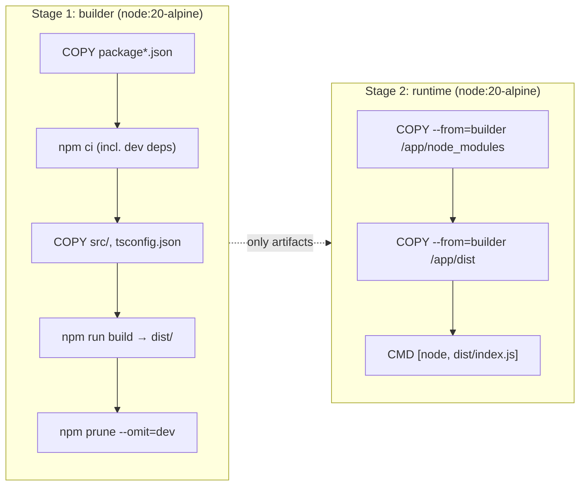

# Module 4 — Multi-stage builds

**Duration:** 20 min &nbsp;•&nbsp; **Format:** hands-on

## Learning goals

- Explain **why** you need multiple build stages for a compiled language (yes, TypeScript counts).
- Write a two-stage Dockerfile: `builder` → `runtime`.
- Cut the image from ~1.2 GB (v1) to ~180 MB (v2).
- Use `COPY --from=<stage>` correctly.

---

## 1. The core idea (3 min)

For a TypeScript service you need **two different environments**:

| Build time | Run time |
|---|---|
| Full Node + npm | Node only |
| devDependencies (typescript, ts-node, @types/*) | No devDependencies |
| Source in `src/` | Compiled JS in `dist/` |
| `tsc`, linters, test runners | Nothing but the app |

A **multi-stage build** lets you use one image for the first job and a totally different, minimal image for the second — then copy just the artifacts you need across.



The final image is stage 2 only. Stage 1 is discarded after the build — its 500 MB of devDependencies never ship.

## 2. Write it (10 min)

Try it yourself first, then compare with `project/Dockerfile.v2-multistage`.

Requirements:

- **Stage 1** named `builder`, based on `node:20-alpine`. Install all deps, build, prune to prod deps.
- **Stage 2** named `runtime`, also `node:20-alpine`. Copy `node_modules` and `dist/` from the builder stage. Set `NODE_ENV=production`. Default command runs the app.

<details><summary>Reference solution</summary>

```dockerfile
# ---------- Stage 1: builder ----------
FROM node:20-alpine AS builder
WORKDIR /app

COPY package*.json ./
RUN npm ci

COPY tsconfig.json ./
COPY src ./src
RUN npm run build

RUN npm prune --omit=dev

# ---------- Stage 2: runtime ----------
FROM node:20-alpine AS runtime
WORKDIR /app
ENV NODE_ENV=production

COPY --from=builder /app/node_modules ./node_modules
COPY --from=builder /app/dist ./dist
COPY package.json ./

EXPOSE 3000
CMD ["node", "dist/index.js"]
```

</details>

### Two subtle but crucial choices

- **`npm ci` not `npm install`.** `ci` uses the lockfile exactly, fails if it's out of sync, and is faster. Always use it in CI/Docker.
- **`npm prune --omit=dev`** after the build. This shrinks `node_modules` to production-only packages *before* we copy them into stage 2.

## 3. Build and compare (5 min)

```bash
cd project
docker build -f Dockerfile.v2-multistage -t todo-api:v2 .
docker images todo-api
```

Expected:

```
REPOSITORY   TAG   IMAGE ID       CREATED         SIZE
todo-api     v2    xxxxxxxxxxxx   1 minute ago    ~180 MB
todo-api     v1    xxxxxxxxxxxx   10 minutes ago  ~1.2 GB
```

Roughly **85% smaller** with no behaviour change.

Run to confirm it still works:

```bash
docker run --rm -p 3000:3000 todo-api:v2
# in another terminal:
curl http://localhost:3000/health
```

## 4. Layer caching quiz (2 min)

Here's the same v2 Dockerfile. Which of these edits invalidates the `RUN npm ci` layer?

- (a) Editing `src/routes/todos.ts`
- (b) Editing `README.md`
- (c) Editing `package.json`
- (d) Editing `tsconfig.json`

<details><summary>Answer</summary>

Only **(c)**. `package.json` (and `package-lock.json`) are copied *before* `npm ci`, so changing them busts the cache. `src/` and `tsconfig.json` are copied *after* — editing them is cheap. `README.md` is on `.dockerignore` (Module 5) and isn't sent to the daemon at all.

</details>

---

## Copilot prompts to try

> Refactor this single-stage Dockerfile into a multi-stage build with a `builder` and a `runtime` stage. The final image should not contain TypeScript or any devDependency. Use `node:20-alpine` for both stages. [paste Dockerfile.v1-basic]

> Explain what `npm ci` does and why it's preferred over `npm install` inside a Dockerfile.

> Explain the difference between `COPY` and `COPY --from=<stage>` in a multi-stage Dockerfile.

---

**Next:** [Module 5 — Container optimization](05-optimization.md)
