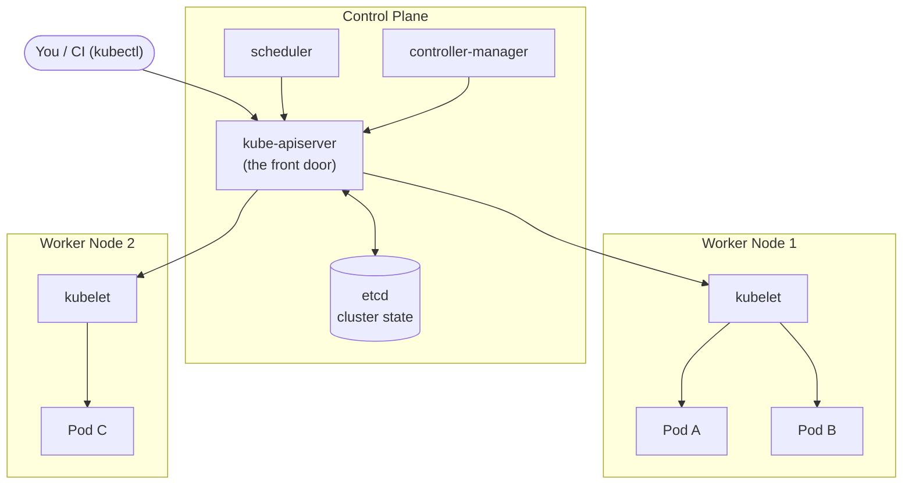
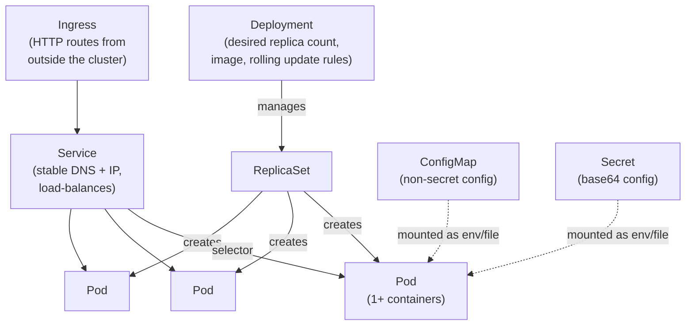

# Module 6 — Kubernetes concepts

**Duration:** 20 min &nbsp;•&nbsp; **Format:** concept + diagrams (no hands-on)

> This module is **concepts only**. Running Kubernetes locally deserves its own session. Today's goal: you can read a Kubernetes YAML and know what it does, and you understand what problem K8s solves that plain Docker doesn't.

## Learning goals

- Explain the difference between running containers with `docker run` vs. orchestrating them with Kubernetes.
- Recognize the core objects: **Pod, Deployment, Service, ConfigMap, Secret, Ingress**.
- Read a simple Deployment + Service YAML for our `todo-api`.

---

## 1. Why not just `docker run` in prod? (3 min)

Imagine our `todo-api` in production:

- We need **3 instances** for redundancy across machines.
- If one crashes, something must **restart it automatically**.
- If load doubles, we want **more instances**.
- We need a **single stable address** so clients don't care which instance answers.
- Rolling out a new version should be **zero-downtime**.
- Secrets and config shouldn't live inside the image.

`docker run` on one machine gives you none of that. Kubernetes gives you all of it, on a fleet of machines.

## 2. The Kubernetes cluster from 10,000 ft (3 min)



- **Control plane**: the brain. Stores desired state, schedules work, watches actual state.
- **Nodes**: worker machines that actually run your containers.
- **kubectl**: the CLI you use to declare what you want. You say "I want 3 replicas of todo-api". Kubernetes makes it so.

**Declarative, not imperative.** You describe the end state in YAML. Kubernetes figures out how to get there and *keep* things there.

## 3. The five objects you'll use most (7 min)



### Pod

- The **smallest deployable unit** in K8s. Usually 1 container, sometimes a tight group.
- Has its own IP inside the cluster. Ephemeral — dies and gets replaced.
- **Never create Pods directly in production.** Use a Deployment.

### Deployment

- Says: "I want N pods running this image, and here's how to update them without downtime."
- Handles **rollouts** and **rollbacks** for free (`kubectl rollout undo`).

### Service

- A stable virtual IP + DNS name (`todo-api.default.svc.cluster.local`) that load-balances across all pods matching a label selector.
- Pods come and go; the Service address doesn't change.

### ConfigMap & Secret

- ConfigMaps hold non-secret config (feature flags, log level, external URLs).
- Secrets hold sensitive data (API keys, passwords). Base64-encoded, not encrypted by default — use a real secret store (Azure Key Vault, sealed-secrets, etc.) in production.
- Both can be mounted as env vars or files in the Pod.

### Ingress

- Rules for how external HTTP(S) traffic reaches Services (host / path routing, TLS termination).
- Requires an Ingress controller (nginx, Traefik, cloud provider LB).

## 4. Our `todo-api` as YAML (5 min)

Just so you've seen it. **Don't apply this** — no cluster today.

```yaml
# deployment.yaml
apiVersion: apps/v1
kind: Deployment
metadata:
  name: todo-api
  labels:
    app: todo-api
spec:
  replicas: 3                          # ← we want 3 pods
  selector:
    matchLabels:
      app: todo-api
  template:
    metadata:
      labels:
        app: todo-api
    spec:
      containers:
        - name: todo-api
          image: ghcr.io/acme/todo-api:1.0.0   # ← the image we built!
          ports:
            - containerPort: 3000
          env:
            - name: NODE_ENV
              value: production
          readinessProbe:
            httpGet:
              path: /health
              port: 3000
            initialDelaySeconds: 3
          livenessProbe:
            httpGet:
              path: /health
              port: 3000
            initialDelaySeconds: 15
          resources:
            requests: { cpu: "100m", memory: "128Mi" }
            limits:   { cpu: "500m", memory: "256Mi" }
---
# service.yaml
apiVersion: v1
kind: Service
metadata:
  name: todo-api
spec:
  selector:
    app: todo-api                      # ← matches the Deployment's pod labels
  ports:
    - port: 80
      targetPort: 3000
  type: ClusterIP                      # ← reachable inside the cluster only
```

Read that top-to-bottom. Notice:

- The Deployment references our **image** — everything we did in modules 3–5 pays off here.
- The probes hit the `/health` endpoint we implemented in `src/server.ts`. **This is why we bothered writing it.**
- Resource requests/limits tell K8s how to schedule and cap the pod.
- `containerPort: 3000` matches our `EXPOSE 3000`.

## 5. What K8s buys you, at a glance (2 min)

| Feature | Docker only | Kubernetes |
|---|---|---|
| Restart on crash | `--restart=always` on one host | Yes, across many hosts |
| Run on many machines | Manual | Native |
| Rolling updates | Manual | `kubectl rollout` |
| Self-healing (reschedule if host dies) | ❌ | ✅ |
| Service discovery / load balancing | ❌ | ✅ |
| Autoscaling | ❌ | ✅ (HPA) |
| Secrets & config mgmt | env-file | Secret / ConfigMap |

**When to reach for it:** more than one machine, more than one service, real production. For a hobby project on a single VM, plain Docker (or Docker Compose) is often enough.

---

## Copilot prompts to try

> In under 100 words, explain the relationship between Pods, Deployments, and Services in Kubernetes to a beginner.

> Generate a Kubernetes Deployment and Service YAML for a Node.js app running on port 3000, using the image `ghcr.io/acme/todo-api:1.0.0`, with 3 replicas, a `/health` readiness probe, and resource requests of 100m CPU and 128Mi memory.

> When should I use Kubernetes vs. just running Docker containers on a single VM? Give me 3 signs I've outgrown plain Docker.

---

**Next:** [Module 7 — Wrap-up & cheatsheet](07-wrap-up-cheatsheet.md)
