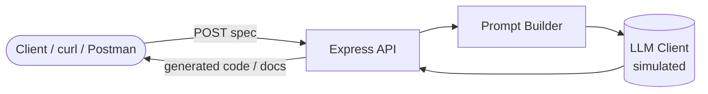

# Workshop: AI-Powered Backend Engineering with TypeScript & Node.js

A hands-on, **2-hour** workshop where you build a small but complete **AI Code & Documentation Generator API** using **TypeScript + Node.js + Express**.

You will learn:

- What "AI-powered backend engineering" actually means, and how an LLM fits into a normal backend.
- **Prompt engineering for developers** — how to write prompts that produce reliable, parseable output.
- **Code and documentation generation workflows** — turning a small spec into TypeScript code and Markdown docs.

> 💡 **No API key or paid model needed.** We use a **simulated LLM** that behaves like a real one (same request/response shape). At the end you'll see exactly how to swap in a real provider (OpenAI, Azure OpenAI, GitHub Models, Ollama) by changing **one file**.

---

## Who is this for?

Freshers who are **comfortable reading TypeScript** but new to backend + AI. You do **not** need prior AI/ML knowledge.

---

## What you'll build

A REST API with three endpoints:

| Method | Route            | What it does                                                        |
| ------ | ---------------- | ------------------------------------------------------------------- |
| `GET`  | `/health`        | Health check                                                        |
| `POST` | `/generate/code` | Takes a function **spec** → returns generated **TypeScript** code   |
| `POST` | `/generate/docs` | Takes **code** → returns **JSDoc + Markdown** documentation         |



---

## Agenda (2 hours)

| # | Module | Time | File |
| - | ------ | ---- | ---- |
| 0 | Setup & prerequisites | 10 min | [docs/00-setup.md](docs/00-setup.md) |
| 1 | AI-powered backend concepts | 15 min | [docs/01-ai-backend-concepts.md](docs/01-ai-backend-concepts.md) |
| 2 | Prompt engineering for developers | 20 min | [docs/02-prompt-engineering.md](docs/02-prompt-engineering.md) |
| 3 | Scaffold the Express + TS project | 15 min | [docs/03-project-scaffold.md](docs/03-project-scaffold.md) |
| 4 | Build the (simulated) LLM client | 15 min | [docs/04-simulated-llm-client.md](docs/04-simulated-llm-client.md) |
| 5 | Code generation endpoint | 25 min | [docs/05-code-generation-endpoint.md](docs/05-code-generation-endpoint.md) |
| 6 | Documentation generation workflow | 15 min | [docs/06-documentation-generation.md](docs/06-documentation-generation.md) |
| 7 | Testing, errors & going to a real LLM | 15 min | [docs/07-testing-and-next-steps.md](docs/07-testing-and-next-steps.md) |

---

## How this repo is organized

```
.
├── README.md                 ← you are here
├── docs/                     ← the workshop modules (read in order)
│   ├── 00-setup.md
│   ├── 01-ai-backend-concepts.md
│   ├── 02-prompt-engineering.md
│   ├── 03-project-scaffold.md
│   ├── 04-simulated-llm-client.md
│   ├── 05-code-generation-endpoint.md
│   ├── 06-documentation-generation.md
│   └── 07-testing-and-next-steps.md
└── project/                  ← the finished, runnable reference code
    ├── src/
    ├── test/
    ├── package.json
    └── tsconfig.json
```

There are **two ways** to take this workshop:

1. **Build-along (recommended):** Start from an empty folder and follow the docs step by step. Each step gives you the exact code *and* a **prompt** you can paste into GitHub Copilot / your AI assistant to generate it yourself.
2. **Explore the reference:** Just run the finished code in [project/](project/) and read along.

---

## Two kinds of "prompts" in this workshop

Because this is a prompt-engineering workshop, the word *prompt* appears in two roles. Don't mix them up:

1. **🧑‍💻 Prompts to your AI assistant** (Copilot/Chat) — help *you* write the app faster. Shown in boxes like this:
   > **🧑‍💻 Prompt to your AI assistant**
   > "Create an Express route ..."
2. **🤖 Prompts inside the app** — the text your *app code* sends to the LLM to generate code/docs. These live in `src/prompts/`.

---

## Quick start (if you just want to run it)

```bash
cd project
npm install
npm run dev
# in another terminal:
curl http://localhost:3000/health
```

Then head to [docs/00-setup.md](docs/00-setup.md) to begin.
