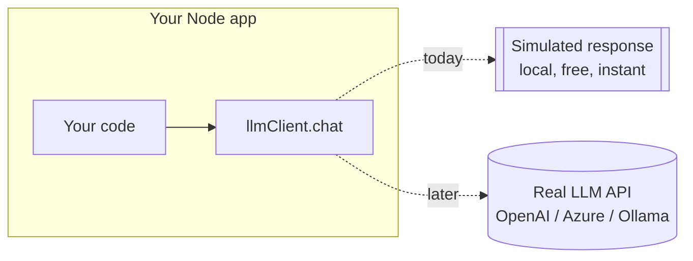

# Module 0 — Setup & Prerequisites

⏱️ **10 minutes**

Goal: make sure your machine can run a TypeScript + Node.js project before we start building.

---

## 0.1 What you need installed

| Tool | Version | Check command | Where to get it |
| ---- | ------- | ------------- | --------------- |
| **Node.js** | 20 or newer (LTS) | `node -v` | https://nodejs.org |
| **npm** | comes with Node | `npm -v` | (bundled) |
| **VS Code** | latest | — | https://code.visualstudio.com |
| **curl** or Postman | any | `curl --version` | (bundled on Win/mac/Linux) |

> ✅ **Check:** Open a terminal and run:
> ```bash
> node -v
> npm -v
> ```
> You should see something like `v20.x.x` and `10.x.x`. If Node is older than 20, install the latest LTS.

---

## 0.2 Recommended VS Code extensions

- **GitHub Copilot** / **Copilot Chat** — so you can try the "🧑‍💻 Prompt to your AI assistant" boxes.
- **ESLint** (optional) — inline linting.

> ℹ️ You can complete the whole workshop **without** Copilot. The prompts are optional accelerators; every step also gives you the full code.

---

## 0.3 About the "AI model" we use

We are **not** calling a paid model. Instead, this workshop ships a **simulated LLM client** — a small TypeScript module that:

- accepts the **same request shape** a real chat model uses (a list of `messages` with `role` + `content`),
- returns a **realistic response** based on templates,
- is **deterministic** (same input → same output), which makes it perfect for teaching and testing.



**Why simulate?**

- No cost, no API keys, no rate limits during learning.
- Works fully offline.
- You focus on the *engineering* and *prompt design*, not billing.
- Swapping to a real model later is a **one-file change** (covered in Module 7).

---

## 0.4 Project folder conventions

Throughout the workshop we work inside a folder called `project/`. If you are **building along from scratch**, create it now:

```bash
mkdir project
cd project
```

If you want to **peek at / run the finished version**, it already exists in this repo at [../project/](../project/).

---

## 0.5 Prerequisite knowledge (quick self-check)

You should be able to answer "yes" to most of these. If not, that's okay — we explain as we go.

- [ ] I can read a TypeScript function with typed parameters.
- [ ] I know what `async`/`await` roughly does.
- [ ] I've used a terminal to run a command.
- [ ] I know what an HTTP request (GET/POST, JSON body) is — at a basic level.

---

✅ **You're ready.** Continue to → [Module 1 — AI-powered backend concepts](01-ai-backend-concepts.md)
