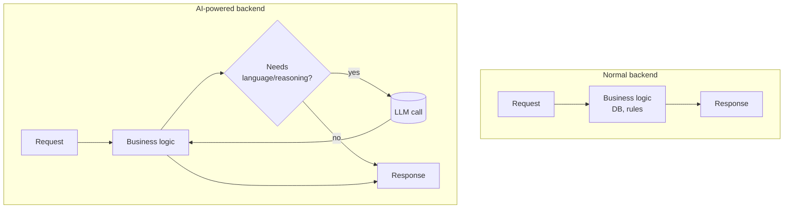
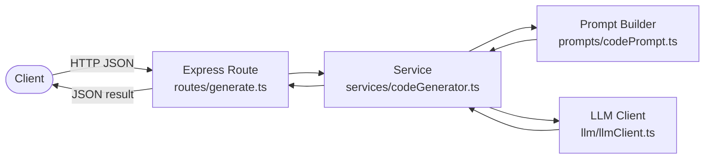

# Module 1 — AI-Powered Backend Engineering: The Concepts

⏱️ **15 minutes**

Goal: understand *where* an LLM fits inside a normal backend, and the vocabulary we'll use for the rest of the workshop.

---

## 1.1 A normal backend vs. an AI-powered backend

A **normal backend** takes a request, runs deterministic logic (if/else, database queries), and returns a response.

An **AI-powered backend** does the same — but for one part of the work, it delegates to a **Large Language Model (LLM)**: a model that turns text *in* into text *out*.



**Key mindset shift:** the LLM is just **another dependency** — like a database or a payment API. You send it a request, you get a response, you handle errors and timeouts. It is *not* magic and it is *not* the whole app.

---

## 1.2 What an LLM call actually looks like

Almost all modern chat LLMs use the same request shape: a list of **messages**, each with a **role** and **content**.

```jsonc
{
  "model": "some-model",
  "messages": [
    { "role": "system", "content": "You are a senior TypeScript engineer." },
    { "role": "user",   "content": "Write a function that adds two numbers." }
  ],
  "temperature": 0.2
}
```

| Role | Meaning |
| ---- | ------- |
| `system` | Sets behavior/rules for the whole conversation ("who the AI is"). |
| `user` | The actual task/question. |
| `assistant` | The model's reply (also used to give examples). |

And the response (simplified):

```jsonc
{
  "choices": [
    { "message": { "role": "assistant", "content": "function add(a, b) { ... }" } }
  ]
}
```

> 🧠 **Remember this shape.** Our simulated client uses exactly this shape, so your code doesn't care whether the response came from a simulation or a real API.

---

## 1.3 Where LLMs are great (and where they aren't)

| ✅ Great for | ⚠️ Be careful with |
| ----------- | ------------------ |
| Generating boilerplate code | Exact math / precise counting |
| Writing/formatting documentation | Anything needing 100% correctness with no review |
| Summarizing & rephrasing | Real-time data it wasn't given |
| Transforming structured → text | Secrets / sensitive data in prompts |

Two properties you must design around:

1. **Non-determinism** — the same prompt can give different answers (controllable with `temperature`).
2. **Hallucination** — it can produce confident but wrong output. **Always validate.**

---

## 1.4 The architecture we'll build



Notice the **separation of concerns** — this is the real lesson of "AI-powered backend engineering":

| Layer | Responsibility | Why separate it |
| ----- | -------------- | --------------- |
| **Route** | Parse/validate HTTP, return JSON | Keep HTTP details out of AI logic |
| **Service** | Orchestrate the workflow | Reusable, testable business logic |
| **Prompt builder** | Turn inputs into a great prompt | Prompt = code; version & test it |
| **LLM client** | Talk to the model | Swap simulation ↔ real in one place |

> 🎯 The most common beginner mistake is stuffing the prompt string, the HTTP handling, and the model call all into one giant route function. We deliberately split them.

---

## 1.5 Glossary (cheat sheet)

- **LLM** — Large Language Model. Text in → text out.
- **Prompt** — the input text you send the model.
- **System prompt** — instructions that define the AI's role/rules.
- **Token** — a chunk of text (~¾ of a word). Models are billed & limited by tokens.
- **Temperature** — 0 = focused/deterministic, 1 = creative/varied. For code, use low (0–0.3).
- **Context window** — max tokens the model can "see" at once.
- **Hallucination** — confidently wrong output.

---

✅ Continue to → [Module 2 — Prompt engineering for developers](02-prompt-engineering.md)
