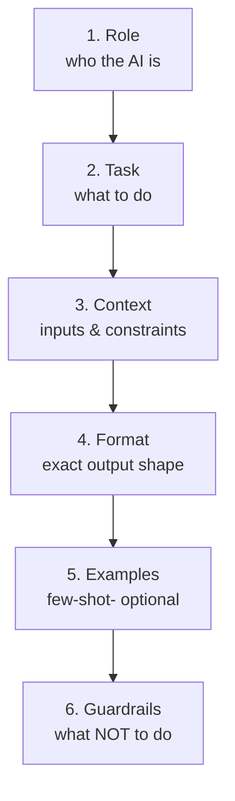
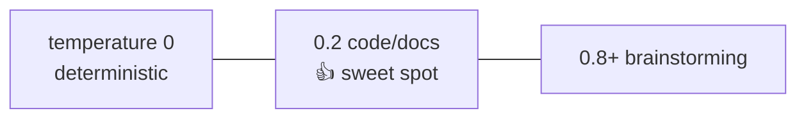

# Module 2 — Prompt Engineering for Developers

⏱️ **20 minutes**

Goal: learn to write prompts that produce **reliable, parseable** output — the skill that makes AI usable inside a backend.

> This module is about the **🤖 prompts your app sends to the LLM**. (The **🧑‍💻 prompts to your Copilot** show up later when we build.)

---

## 2.1 The core problem

For a **chatbot**, a slightly different answer each time is fine.

For a **backend**, you need output your code can **parse and trust**. If your API promises "return TypeScript code", you can't have the model reply *"Sure! Here's some code 😊 ..."* with extra chatter.

**Prompt engineering = designing the prompt so the output is predictable enough to program against.**

---

## 2.2 Anatomy of a good developer prompt

Think of a prompt as having up to **6 parts**:



| Part | Example |
| ---- | ------- |
| **Role** | "You are a senior TypeScript engineer." |
| **Task** | "Write a single function that matches the spec below." |
| **Context** | The function name, parameters, and description. |
| **Format** | "Return ONLY valid TypeScript. No markdown fences, no prose." |
| **Examples** | A sample spec → sample output (teaches by demonstration). |
| **Guardrails** | "Do not include explanations. Do not invent extra parameters." |

---

## 2.3 Before / after

### ❌ Weak prompt

```
Write a function that validates an email.
```

Problems: no language stated, no signature, no output format → you'll get random shapes, comments, markdown fences, sometimes Python.

### ✅ Strong prompt

```
You are a senior TypeScript engineer.

Task: Implement ONE function from this spec.
- name: isValidEmail
- parameters: email (string)
- returns: boolean
- description: returns true if the string is a basic valid email

Rules:
- Return ONLY TypeScript source code.
- No markdown code fences, no explanation.
- Include a JSDoc comment above the function.
- Do not add parameters that aren't in the spec.
```

Now the output is consistent and your code can safely use it.

---

## 2.4 Five techniques you'll use today

### 1. Assign a role (system prompt)
Setting *"You are a senior TypeScript engineer"* measurably improves code quality and consistency.

### 2. Be explicit about output format
The single highest-impact rule for backends:
> "Return ONLY X. No markdown, no prose, no apologies."

### 3. Few-shot examples
Show 1–2 input→output pairs. The model imitates the pattern. Great when you need a **specific structure**.

### 4. Constrain with guardrails
Tell it what **not** to do: *"Do not invent extra parameters", "Do not access the network", "If input is unclear, return a TODO comment."*

### 5. Control temperature
For **code/docs generation**, use **low temperature (0–0.3)** so output is stable and repeatable.



---

## 2.5 Output formatting: the golden rule for backends

Pick **one** of these and enforce it in the prompt:

| Strategy | When | How to parse |
| -------- | ---- | ------------ |
| **Raw code only** | You want just source code | Use string as-is (strip stray fences defensively) |
| **JSON** | You need multiple fields (code + notes) | `JSON.parse`, wrapped in try/catch |
| **Delimited sections** | Simple multi-part text | Split on a marker like `---DOCS---` |

> 🛡️ **Always parse defensively.** Even with a perfect prompt, wrap parsing in `try/catch` and have a fallback. LLMs occasionally ignore instructions. We'll do exactly this in Module 5.

---

## 2.6 Prompt = code

Treat prompts like source code:

- **Keep them in files** (`src/prompts/`), not inline strings scattered everywhere.
- **Version them** — small wording changes alter output.
- **Test them** — feed known inputs, assert on the output shape.
- **Review them** in PRs like any other logic.

This is the mindset that separates a toy demo from a real AI-powered backend.

---

## 2.7 Quick exercise (2 min, on paper)

Rewrite this weak prompt into a strong one for a backend that generates docs:

> Weak: *"Document this function."*

<details>
<summary>Show a strong version</summary>

```
You are a technical writer for a TypeScript codebase.

Task: Write documentation for the function below.
Output format (exactly, in this order):
1. A JSDoc block to place above the function.
2. A "## Usage" Markdown section with one code example.

Rules:
- Base everything ONLY on the provided code. Do not invent behavior.
- No apologies or extra commentary.

Function:
<CODE GOES HERE>
```
</details>

---

✅ Continue to → [Module 3 — Scaffold the project](03-project-scaffold.md)
