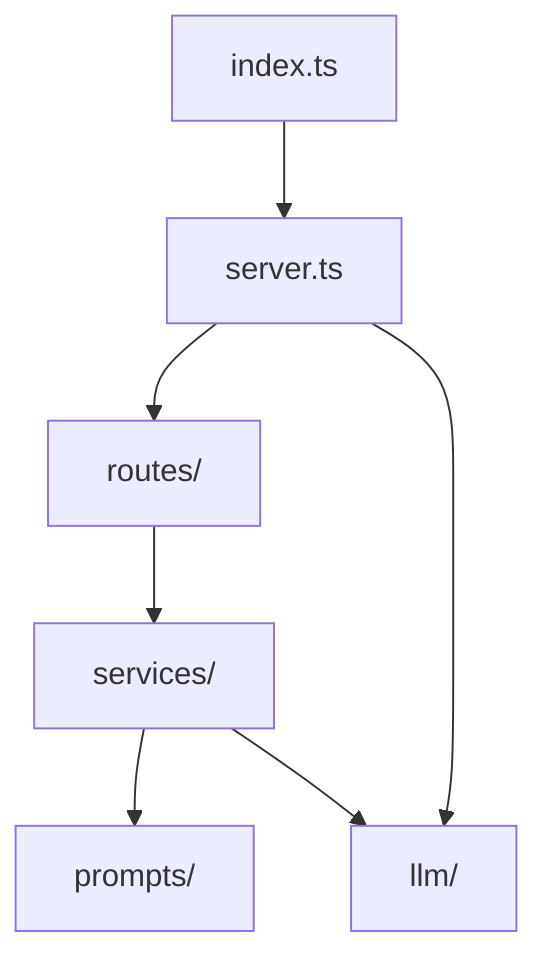

# Module 3 — Scaffold the Express + TypeScript Project

⏱️ **15 minutes**

Goal: create a clean, runnable Node + TypeScript + Express project.

> 📁 We work inside `project/`. If you're building from scratch, do it in your own empty folder and compare against [../project/](../project/).

---

## 3.1 Initialize the project

```bash
mkdir project && cd project
npm init -y
```

Then install dependencies:

```bash
# runtime
npm install express

# dev tooling: TypeScript + types + tsx (runs TS directly, no build step)
npm install -D typescript @types/node @types/express tsx
```

> ℹ️ **`tsx`** runs TypeScript files directly (great for dev). No separate compile step needed while learning.

---

## 3.2 Configure TypeScript

Create [tsconfig.json](../project/tsconfig.json):

```json
{
  "compilerOptions": {
    "target": "ES2022",
    "module": "ESNext",
    "moduleResolution": "Bundler",
    "rootDir": "src",
    "outDir": "dist",
    "strict": true,
    "esModuleInterop": true,
    "skipLibCheck": true,
    "forceConsistentCasingInFileNames": true,
    "resolveJsonModule": true
  },
  "include": ["src/**/*.ts"],
  "exclude": ["node_modules", "dist", "test"]
}
```

Key choices explained:

| Setting | Why |
| ------- | --- |
| `"strict": true` | Catches bugs at compile time — essential habit. |
| `"module": "ESNext"` | Use modern `import`/`export`. |
| `moduleResolution: "Bundler"` | Lets `tsx` resolve imports cleanly. |

---

## 3.3 Set `"type": "module"` and add scripts

Edit [package.json](../project/package.json) — add `"type": "module"` and these scripts:

```json
{
  "type": "module",
  "scripts": {
    "dev": "tsx watch src/index.ts",
    "start": "tsx src/index.ts",
    "build": "tsc",
    "test": "node --import tsx --test test/**/*.test.ts"
  }
}
```

> 🧑‍💻 **Prompt to your AI assistant**
> "Set up a minimal Node.js + TypeScript project using ESM (`\"type\": \"module\"`), Express, and `tsx`. Give me `package.json` scripts for dev (watch), start, build, and test using Node's built-in test runner."

---

## 3.4 Create the folder structure

```
src/
├── index.ts        entry point
├── server.ts       builds the Express app
├── config.ts       reads env vars
├── llm/            LLM client (Module 4)
├── prompts/        prompt builders (Module 5 & 6)
├── services/       orchestration (Module 5 & 6)
└── routes/         HTTP endpoints (Module 5)
```



---

## 3.5 A first "hello" server (sanity check)

Create `src/index.ts`:

```ts
import express from "express";

const app = express();
app.use(express.json());

app.get("/health", (_req, res) => {
  res.json({ status: "ok" });
});

app.listen(3000, () => {
  console.log("🚀 http://localhost:3000");
});
```

Run it:

```bash
npm run dev
```

In another terminal:

```bash
curl http://localhost:3000/health
# {"status":"ok"}
```

> ✅ **Checkpoint:** If you see `{"status":"ok"}`, your toolchain works. We'll now grow this into the real app. In the reference project this logic is split into [src/index.ts](../project/src/index.ts), [src/server.ts](../project/src/server.ts) and [src/routes/health.ts](../project/src/routes/health.ts) — we separate "start the server" from "build the app" so it's testable.

---

✅ Continue to → [Module 4 — Build the simulated LLM client](04-simulated-llm-client.md)
