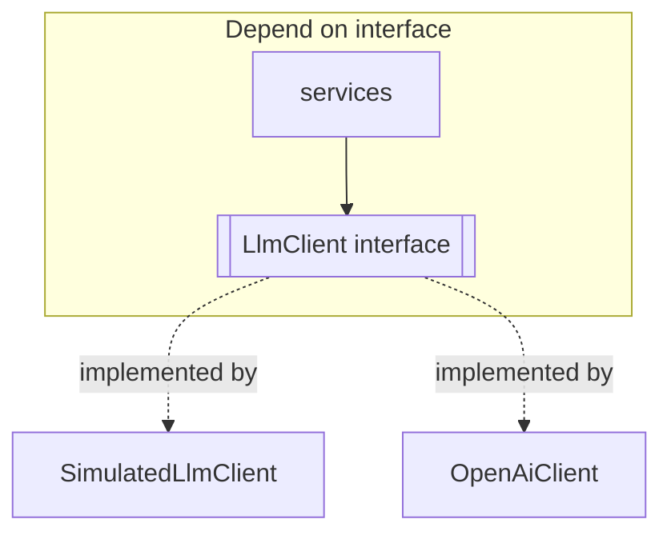

# Module 4 — Build the (Simulated) LLM Client

⏱️ **15 minutes**

Goal: create the piece that "talks to the model" — behind an interface so it can be swapped later.

---

## 4.1 Why an interface first?

The whole app should depend on **what an LLM does** (send messages → get text), not on **which** LLM. So we define a TypeScript interface, and everything else programs against it.



This is **dependency inversion** — the single most valuable design idea for AI backends, because model providers change often.

---

## 4.2 Define the types

Create [src/llm/types.ts](../project/src/llm/types.ts):

```ts
export type Role = "system" | "user" | "assistant";

export interface ChatMessage {
  role: Role;
  content: string;
}

export interface ChatOptions {
  temperature?: number;
}

export interface ChatResult {
  content: string;
  provider: string;
}

export interface LlmClient {
  chat(messages: ChatMessage[], options?: ChatOptions): Promise<ChatResult>;
}
```

Notice this is **exactly** the message shape from Module 1 — `role` + `content`.

---

## 4.3 Build the simulated client

The simulated client pretends to be a model: it reads the prompt, figures out whether it's a **code** or **docs** task, and returns realistic output. See the full file at [src/llm/SimulatedLlmClient.ts](../project/src/llm/SimulatedLlmClient.ts).

The core skeleton:

```ts
export class SimulatedLlmClient implements LlmClient {
  async chat(messages: ChatMessage[]): Promise<ChatResult> {
    await delay(120); // pretend it's a network call

    const prompt = [...messages].reverse()
      .find((m) => m.role === "user")?.content ?? "";

    let content: string;
    if (/TASK:\s*DOCS/i.test(prompt)) content = simulateDocs(prompt);
    else if (/TASK:\s*CODE/i.test(prompt)) content = simulateCode(prompt);
    else content = "// Unrecognized task.";

    return { content, provider: "simulated" };
  }
}
```

> 🔍 **How does it "understand" the prompt?** It looks for a `TASK: CODE` / `TASK: DOCS` marker and pulls out fields like `- name:` and `- returns:` with small regexes. A real model does this with learned reasoning; our simulation makes the logic visible so you can see the input→output mapping.

> 🧑‍💻 **Prompt to your AI assistant**
> "Create a `SimulatedLlmClient` implementing this `LlmClient` interface. It should inspect the last user message; if it contains `TASK: CODE`, parse `- name:`, `- parameters:`, `- returns:`, `- description:` fields and return a TypeScript function with a JSDoc block and a `// TODO` body based on the return type. Keep it deterministic."

---

## 4.4 A factory to choose the client

Create [src/llm/index.ts](../project/src/llm/index.ts):

```ts
import { config } from "../config.js";
import { OpenAiClient } from "./OpenAiClient.js";
import { SimulatedLlmClient } from "./SimulatedLlmClient.js";
import type { LlmClient } from "./types.js";

export function createLlmClient(): LlmClient {
  if (config.llmProvider === "openai") {
    return new OpenAiClient(config.openai);
  }
  return new SimulatedLlmClient();
}
```

> 🎯 This is the **only** place that knows which provider is active. That's the payoff of the interface: swapping models touches one file.

---

## 4.5 Config

Create [src/config.ts](../project/src/config.ts) to read env vars with safe defaults (defaults to `simulated`, so it runs with zero setup):

```ts
export const config = {
  port: Number(process.env.PORT ?? 3000),
  llmProvider: process.env.LLM_PROVIDER === "openai" ? "openai" : "simulated",
  openai: {
    apiKey: process.env.OPENAI_API_KEY ?? "",
    baseUrl: process.env.OPENAI_BASE_URL ?? "https://api.openai.com/v1",
    model: process.env.OPENAI_MODEL ?? "gpt-4o-mini",
  },
} as const;
```

> ✅ **Checkpoint:** You now have an `LlmClient` you can call from anywhere with `createLlmClient().chat(messages)`.

---

✅ Continue to → [Module 5 — Code generation endpoint](05-code-generation-endpoint.md)
