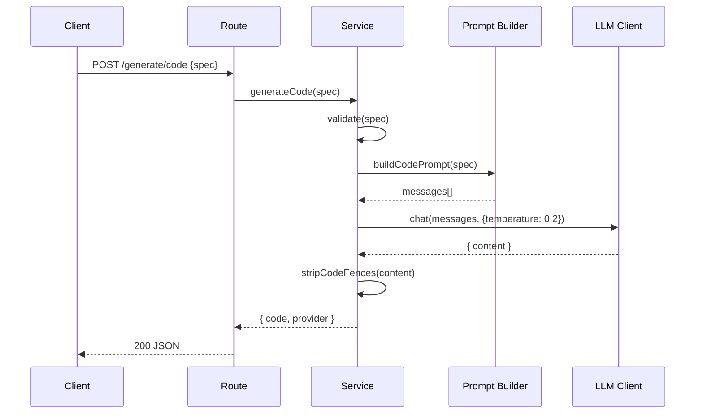

# Module 5 — The Code Generation Endpoint

⏱️ **25 minutes**

Goal: wire the full workflow — **HTTP request → prompt → LLM → cleaned code → JSON response** — applying the prompt-engineering rules from Module 2.



---

## 5.1 The prompt builder (the star of the show)

This is where prompt engineering lives. Create [src/prompts/codePrompt.ts](../project/src/prompts/codePrompt.ts):

```ts
import type { ChatMessage } from "../llm/types.js";

export interface CodeSpec {
  name: string;
  parameters?: string;
  returns: string;
  description: string;
}

const SYSTEM_PROMPT =
  "You are a senior TypeScript engineer who writes clean, minimal, " +
  "production-quality code.";

export function buildCodePrompt(spec: CodeSpec): ChatMessage[] {
  const userPrompt = [
    "TASK: CODE",
    "Implement exactly ONE TypeScript function that satisfies this spec.",
    "",
    "Spec:",
    `- name: ${spec.name}`,
    `- parameters: ${spec.parameters?.trim() || "none"}`,
    `- returns: ${spec.returns}`,
    `- description: ${spec.description}`,
    "",
    "Output format:",
    "- Return ONLY TypeScript source code.",
    "- No markdown code fences, no explanations, no apologies.",
    "- Include a JSDoc comment above the function.",
    "",
    "Guardrails:",
    "- Do NOT add parameters that are not in the spec.",
    "- Do NOT access the network or filesystem.",
    "- If the behavior is ambiguous, leave a `// TODO:` comment in the body.",
  ].join("\n");

  return [
    { role: "system", content: SYSTEM_PROMPT },
    { role: "user", content: userPrompt },
  ];
}
```

Map it back to Module 2's anatomy:

| Prompt part | Where |
| ----------- | ----- |
| **Role** | `SYSTEM_PROMPT` |
| **Task** | "Implement exactly ONE ... function" |
| **Context** | the `Spec:` block |
| **Format** | the `Output format:` block |
| **Guardrails** | the `Guardrails:` block |

> 🧑‍💻 **Prompt to your AI assistant**
> "Write a `buildCodePrompt(spec)` function that returns a `ChatMessage[]` with a system role and a user message. The user message must include a `TASK: CODE` marker, the spec fields, an explicit 'return ONLY TypeScript, no markdown fences' output rule, and guardrails against inventing parameters."

---

## 5.2 Defensive output cleaning

Never trust raw model output. Create [src/services/sanitize.ts](../project/src/services/sanitize.ts):

```ts
export function stripCodeFences(text: string): string {
  const trimmed = text.trim();
  const fenced = trimmed.match(/^```[a-zA-Z]*\n([\s\S]*?)\n?```$/);
  return (fenced ? fenced[1] : trimmed).trim();
}
```

> 🛡️ Even though our prompt says "no fences", real models sometimes add them. This guarantees the response is clean regardless.

---

## 5.3 The service (orchestration + validation)

Create [src/services/codeGenerator.ts](../project/src/services/codeGenerator.ts):

```ts
import type { LlmClient } from "../llm/types.js";
import { buildCodePrompt, type CodeSpec } from "../prompts/codePrompt.js";
import { stripCodeFences } from "./sanitize.js";

export class ValidationError extends Error {}

export async function generateCode(llm: LlmClient, spec: CodeSpec) {
  validateSpec(spec);
  const messages = buildCodePrompt(spec);
  const { content, provider } = await llm.chat(messages, { temperature: 0.2 });
  return { code: stripCodeFences(content), provider };
}

function validateSpec(spec: CodeSpec): void {
  if (!spec?.name?.trim()) throw new ValidationError("`name` is required.");
  if (!/^[a-zA-Z_][a-zA-Z0-9_]*$/.test(spec.name))
    throw new ValidationError("`name` must be a valid identifier.");
  if (!spec.returns?.trim()) throw new ValidationError("`returns` is required.");
  if (!spec.description?.trim())
    throw new ValidationError("`description` is required.");
}
```

> ⚠️ **Validate at the boundary.** User input is untrusted. We check it *before* building a prompt — never send junk to the model. (See the full version in the repo for stricter checks.)

---

## 5.4 The route (thin HTTP layer)

Create [src/routes/generate.ts](../project/src/routes/generate.ts):

```ts
import { Router } from "express";
import type { LlmClient } from "../llm/types.js";
import { generateCode, ValidationError } from "../services/codeGenerator.js";

export function createGenerateRouter(llm: LlmClient): Router {
  const router = Router();

  router.post("/generate/code", async (req, res) => {
    try {
      const result = await generateCode(llm, req.body);
      res.json(result);
    } catch (err) {
      if (err instanceof ValidationError) {
        res.status(400).json({ error: err.message });
      } else {
        console.error(err);
        res.status(500).json({ error: "Internal server error." });
      }
    }
  });

  return router;
}
```

Wire it up in [src/server.ts](../project/src/server.ts):

```ts
import express from "express";
import { createLlmClient } from "./llm/index.js";
import { createGenerateRouter } from "./routes/generate.js";
import { healthRouter } from "./routes/health.js";

export function createApp() {
  const app = express();
  app.use(express.json());
  const llm = createLlmClient();
  app.use(healthRouter);
  app.use(createGenerateRouter(llm));
  return app;
}
```

---

## 5.5 Try it

```bash
npm run dev
```

```bash
curl -X POST http://localhost:3000/generate/code \
  -H "Content-Type: application/json" \
  -d '{
    "name": "isValidEmail",
    "parameters": "email: string",
    "returns": "boolean",
    "description": "returns true if the string looks like a valid email"
  }'
```

Expected (shape):

```json
{
  "code": "/**\n * returns true if the string looks like a valid email\n * @param email - string\n * @returns boolean\n */\nexport function isValidEmail(email: string): boolean {\n  // TODO: implement — returns true if the string looks like a valid email\n  return false;\n}\n",
  "provider": "simulated"
}
```

> ✅ **Checkpoint:** You built a full AI-powered endpoint. Try changing `returns` to `number` and watch the generated body change.

> 🧪 **Error test:** send `{"name":"123bad","returns":"void","description":"x"}` → you should get `400` with a helpful message.

---

✅ Continue to → [Module 6 — Documentation generation](06-documentation-generation.md)
