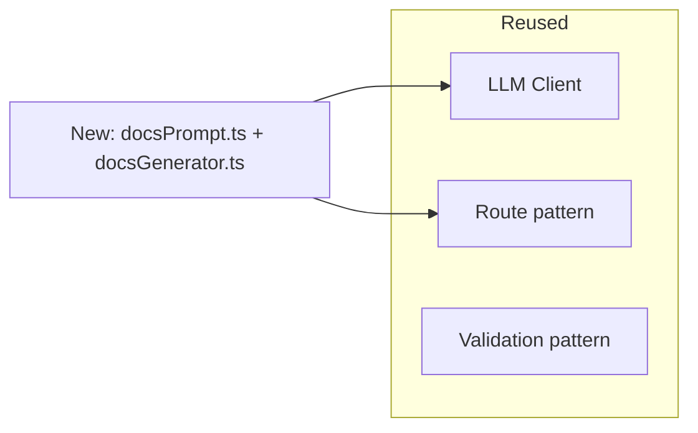

# Module 6 — Documentation Generation Workflow

⏱️ **15 minutes**

Goal: reuse everything you built to add a **second** AI workflow — turning code into docs — and see how cheap new AI features become once the architecture is right.

---

## 6.1 The insight: same pipeline, different prompt

Adding a whole new AI capability is mostly a **new prompt** + a thin service. The LLM client, routing pattern, validation approach, and error handling are all reused.



> 🎯 This is the real ROI of clean AI backend design: the **2nd, 3rd, 10th** feature is fast because the plumbing already exists.

---

## 6.2 The docs prompt

Create [src/prompts/docsPrompt.ts](../project/src/prompts/docsPrompt.ts):

```ts
import type { ChatMessage } from "../llm/types.js";

const SYSTEM_PROMPT =
  "You are a meticulous technical writer for a TypeScript codebase. " +
  "You document only what the code actually does — you never invent behavior.";

export function buildDocsPrompt(code: string): ChatMessage[] {
  const userPrompt = [
    "TASK: DOCS",
    "Write documentation for the TypeScript function below.",
    "",
    "Output format (exactly, in this order):",
    "1. A JSDoc block suitable to place directly above the function.",
    '2. A "## Usage" Markdown section containing ONE runnable code example.',
    "",
    "Guardrails:",
    "- Base everything ONLY on the provided code.",
    "- Do NOT invent parameters, return values, or side effects.",
    "- No extra commentary before or after the two sections.",
    "",
    "Code:",
    "```ts",
    code.trim(),
    "```",
  ].join("\n");

  return [
    { role: "system", content: SYSTEM_PROMPT },
    { role: "user", content: userPrompt },
  ];
}
```

Notice the **anti-hallucination guardrail**: *"document only what the code actually does — you never invent behavior."* For docs, this is the single most important rule.

> 🧑‍💻 **Prompt to your AI assistant**
> "Write `buildDocsPrompt(code)` returning `ChatMessage[]`. System role = technical writer that never invents behavior. User message has a `TASK: DOCS` marker, demands exactly a JSDoc block followed by a `## Usage` Markdown section, and includes the code in a fenced block."

---

## 6.3 The docs service

Create [src/services/docsGenerator.ts](../project/src/services/docsGenerator.ts):

```ts
import type { LlmClient } from "../llm/types.js";
import { buildDocsPrompt } from "../prompts/docsPrompt.js";
import { ValidationError } from "./codeGenerator.js";

export async function generateDocs(llm: LlmClient, code: string) {
  if (typeof code !== "string" || code.trim().length === 0) {
    throw new ValidationError("`code` is required and must be a non-empty string.");
  }
  if (code.length > 5000) {
    throw new ValidationError("`code` is too large (max 5000 characters).");
  }
  const messages = buildDocsPrompt(code);
  const { content, provider } = await llm.chat(messages, { temperature: 0.2 });
  return { documentation: content.trim(), provider };
}
```

> ⚠️ The `code.length > 5000` guard is a **cost/safety boundary** — with a real model, unbounded input means unbounded tokens (= unbounded cost) and possible context-window overflow.

---

## 6.4 Add the route

Extend [src/routes/generate.ts](../project/src/routes/generate.ts):

```ts
import { generateDocs } from "../services/docsGenerator.js";

router.post("/generate/docs", async (req, res) => {
  try {
    const result = await generateDocs(llm, req.body?.code);
    res.json(result);
  } catch (err) {
    handleError(res, err); // same helper used by /generate/code
  }
});
```

---

## 6.5 Try the round trip

Generate code, then feed it back to get docs:

```bash
curl -X POST http://localhost:3000/generate/docs \
  -H "Content-Type: application/json" \
  -d '{ "code": "export function add(a: number, b: number): number { return a + b; }" }'
```

Expected (shape):

```json
{
  "documentation": "/**\n * add — summary of what this function does.\n * @param a - the a value (number).\n * @param b - the b value (number).\n * @returns number\n */\n\n## Usage\n\n```ts\nimport { add } from \"./add.js\";\n\nconst result = add(42, 42);\nconsole.log(result);\n```\n",
  "provider": "simulated"
}
```

> ✅ **Checkpoint:** You now have **two** AI workflows sharing one clean pipeline. This "code → docs" round trip is a real, useful developer tool.

---

✅ Continue to → [Module 7 — Testing, errors & going to a real LLM](07-testing-and-next-steps.md)
