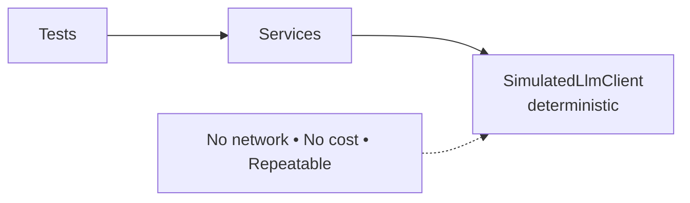
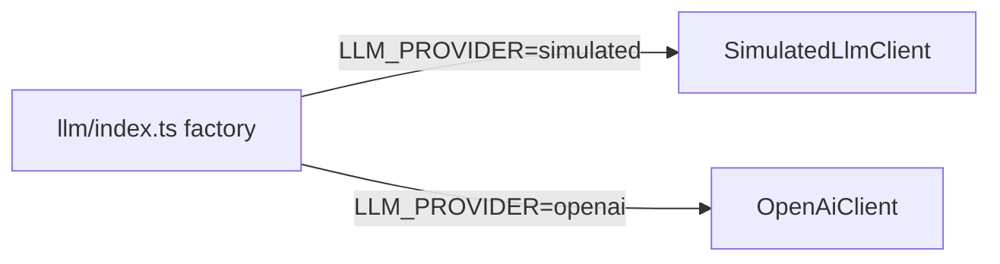

# Module 7 — Testing, Error Handling & Going to a Real LLM

⏱️ **15 minutes**

Goal: make the app trustworthy (tests + errors) and learn how to swap the simulated model for a real one.

---

## 7.1 Why testing AI backends is tricky (and how the simulation helps)

Real LLMs are **non-deterministic** and **cost money** — bad for automated tests. Because we programmed against the `LlmClient` **interface**, our tests use the **deterministic simulated client**. We can assert on exact output shapes.



> 🔑 Even with a real model in production, you can keep the simulated client for tests — or write tests that assert on **structure** (e.g. "output contains a JSDoc block"), not exact wording.

---

## 7.2 Write tests

Create [test/generate.test.ts](../project/test/generate.test.ts) using Node's built-in test runner (no extra dependencies):

```ts
import assert from "node:assert/strict";
import { test } from "node:test";
import { SimulatedLlmClient } from "../src/llm/SimulatedLlmClient.js";
import { generateCode, ValidationError } from "../src/services/codeGenerator.js";
import { generateDocs } from "../src/services/docsGenerator.js";

const llm = new SimulatedLlmClient();

test("generateCode returns a matching function", async () => {
  const r = await generateCode(llm, {
    name: "isValidEmail",
    parameters: "email: string",
    returns: "boolean",
    description: "checks email",
  });
  assert.match(r.code, /export function isValidEmail\(email: string\): boolean/);
});

test("generateCode rejects bad names", async () => {
  await assert.rejects(
    () => generateCode(llm, { name: "1bad", returns: "void", description: "x" }),
    ValidationError,
  );
});

test("generateDocs produces JSDoc + Usage", async () => {
  const r = await generateDocs(
    llm,
    "export function add(a: number, b: number): number { return a + b; }",
  );
  assert.match(r.documentation, /## Usage/);
});
```

Run:

```bash
npm test
```

> 🧑‍💻 **Prompt to your AI assistant**
> "Write tests using Node's built-in `node:test` and `node:assert/strict` for `generateCode` and `generateDocs`. Cover: happy path (assert output shape with regex), invalid function name throws `ValidationError`, and empty code throws."

---

## 7.3 Error-handling checklist

A production AI backend must handle:

| Failure | Our handling |
| ------- | ------------ |
| Invalid user input | `ValidationError` → HTTP **400** with a message |
| Unexpected bug | caught → logged → HTTP **500** (generic message, no internals leaked) |
| LLM timeout / network error (real provider) | thrown by client → becomes **500** (add retries/timeouts for production) |
| Oversized input | length guard → **400** |

> 🛡️ **Security notes:**
> - Never echo raw internal errors to the client (info leak).
> - Treat all request bodies as untrusted; validate before use.
> - When you add a real key, keep it in `.env` (git-ignored) — never in code.
> - Be wary of **prompt injection**: if you ever put user text into a prompt, it may try to override your instructions. Keep system rules strict and don't let model output trigger real actions unchecked.

---

## 7.4 Swap in a real LLM (one file)

Everything already programs against `LlmClient`, so going live is minimal:



Steps:

1. `cp .env.example .env`
2. Set:
   ```env
   LLM_PROVIDER=openai
   OPENAI_API_KEY=sk-your-key
   OPENAI_MODEL=gpt-4o-mini
   ```
3. Restart `npm run dev`.

The real client ([src/llm/OpenAiClient.ts](../project/src/llm/OpenAiClient.ts)) implements the **same interface** with `fetch`. It works with any OpenAI-compatible endpoint:

| Provider | `OPENAI_BASE_URL` | Notes |
| -------- | ----------------- | ----- |
| OpenAI | `https://api.openai.com/v1` | needs paid key |
| GitHub Models | `https://models.inference.ai.azure.com` | free tier, use GitHub token |
| Ollama (local) | `http://localhost:11434/v1` | no key, run models locally |
| Azure OpenAI | your resource URL | slightly different auth header |

> 🎯 **Nothing else in the app changes.** Routes, services, prompts, and tests stay identical. That's the whole point of the architecture.

---

## 7.5 What you learned

- 🧱 An AI backend is a **normal backend** with an LLM as **one dependency**.
- ✍️ **Prompt engineering** = designing prompts (role, task, context, format, guardrails) so output is **parseable and trustworthy**.
- 🔌 Program against an **interface**, not a provider — swapping models is one file.
- 🛡️ **Validate input** and **parse output defensively** — never trust either blindly.
- ♻️ Good structure makes the **next** AI feature cheap (code gen → docs gen reused everything).

---

## 7.6 Stretch goals (if you have time)

1. Add `POST /generate/tests` — a prompt that generates unit tests for given code. (Copy the docs workflow!)
2. Add a `language` field to `CodeSpec` to generate Python too.
3. Add a simple **rate limiter** middleware.
4. Return generated code as a downloadable `.ts` file.
5. Add a few-shot example to `buildCodePrompt` and observe the change.

> 🧑‍💻 **Prompt to your AI assistant**
> "Following the existing pattern in `src/prompts` and `src/services`, add a `POST /generate/tests` endpoint that takes `code` and returns generated `node:test` unit tests. Reuse the `LlmClient`, validation, and error-handling patterns."

---

🎉 **Done!** You built an AI-powered backend, practiced prompt engineering, and shipped two code/doc generation workflows — all in TypeScript, with no API costs.

Back to → [Workshop home](../README.md)
