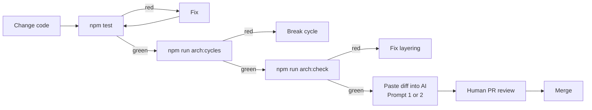

# v6 — Tests + Automated Architecture Review

**Same code as v5, plus tests, `madge`, `dependency-cruiser`, and AI review prompts.
This is what a production-ready fresher project looks like.**

## Run

```powershell
npm install
npm test           # unit + integration + e2e (should all pass)
npm run arch:cycles   # madge — should print "No circular dependency found!"
npm run arch:check    # depcruise — should exit 0
npm run dev
```

## What's new vs v5

| Aspect | v5 | v6 |
|---|---|---|
| Tests | None | Unit + integration + e2e |
| Circular deps guard | None | `madge --circular` |
| Layer-violation guard | None | `dependency-cruiser` with rules |
| Coverage report | None | Vitest V8 coverage |
| `buildApp` isolation | Shared container | **Child container per call** — tests don't interfere |
| Dev workflow | Read code | Read code + green tests + green rules |

## File additions

```
.dependency-cruiser.js
vitest.config.ts
tests/
├── fakes/
│   ├── InMemoryBookRepository.ts
│   └── InMemoryOrderRepository.ts
├── OrderService.spec.ts        (unit)
├── CatalogService.spec.ts      (unit)
├── SqliteBookRepository.int.spec.ts  (integration, :memory:)
└── orders.e2e.spec.ts          (E2E via supertest)
```

## The whole review workflow



## Try breaking it on purpose

1. In `src/domain/Book.ts`, add `import Database from 'better-sqlite3';`.
2. Run `npm run arch:check`. Expect an `error domain-is-pure`.
3. Paste that output into your AI with **Prompt 5** (see [../../prompts/](../../prompts/)). It will explain the violation.
4. Revert. Green again.

## What we can now say with confidence

- ✅ Business rules are covered by fast unit tests.
- ✅ The SQL adapter is exercised against real SQLite (in-memory).
- ✅ The HTTP wiring is smoke-tested end-to-end.
- ✅ No circular dependencies exist.
- ✅ No layer violation can be committed without failing CI.
- ✅ An AI review has a *bounded, verifiable* job (facts from tools + your standards).

## Comparison — full journey v1 → v6

| Metric | v1 | v6 |
|---|---|---|
| Files | 1 | ~20 |
| LOC | ~90 | ~600 |
| Time to test the loyalty rule | Boot Express + DB (~seconds) | Vitest unit test (~milliseconds) |
| Time to swap DB | Rewrite everything | New adapter + one wiring line |
| Time to add a delivery mechanism (CLI, gRPC) | Rewrite everything | New `presentation/` folder |
| Confidence to refactor | None | Tests + arch gates guarantee it |
| Onboarding time | Days | Minutes (`main.ts` reads like a diagram) |

## Where to go next

- Do the [capstone project](../../capstone/README.md).
- Move to feature-first folder layout (see Module 3).
- Add a real DI container per env (`main.dev.ts`, `main.prod.ts`).
- Add a `PostgresBookRepository` and register it in `main.prod.ts` — prove Module 3's promise.
