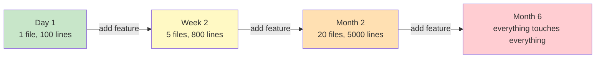

# Module 1 — Introduction to Software Architecture

> **Goal:** By the end, you can explain (a) what "architecture" means for a small app, (b) why we pay for it upfront, and (c) how to *spot* a badly-architected file in 30 seconds.

**Time:** 45 minutes read + 20 minutes activity.

---

## 1.1 What is "architecture" in a tiny web app?

Architecture is **the set of decisions that are hard to change later**.

Examples of architectural decisions in a Node.js API:

- Where does business logic live? (in the HTTP route? in a class? in the database?)
- Who talks to the database? (everyone? one class per table?)
- How do we replace SQLite with Postgres? (rewrite? config change?)
- How do we test a rule without spinning up a server?

Non-architectural decisions (easy to change):

- Tabs vs spaces.
- Variable names.
- Whether to use `Array.map` or a `for` loop.

> **Rule of thumb:** if a decision requires opening 20 files to reverse, it was architectural.

---

## 1.2 The cost-of-change curve

The single most important picture in this training:

In a **badly-architected** project, every new feature costs *more* than the last. In a **well-architected** one, cost stays roughly flat — you add code in a *new* place instead of tangling it into the existing pile.

That flat curve is the *only* thing architecture is trying to buy you. Everything else — patterns, folders, DI containers — is a means to that end.

---

## 1.3 Four qualities good architecture buys

| Quality | What it means | How to feel it |
|---|---|---|
| **Testability** | You can test a rule without a database or HTTP server | Unit tests run in < 100ms |
| **Replaceability** | You can swap SQLite → Postgres → Mongo without touching business rules | The rule file has zero `SELECT` in it |
| **Understandability** | A new hire can find where a rule lives in < 5 minutes | Folder names read like a table of contents |
| **Independent evolution** | Two teams work on two features without stepping on each other | Merge conflicts are rare |

---

## 1.4 How to spot a badly-architected file in 30 seconds

Open a file. Ask:

1. **Does it import both `express` and a database driver?** → mixing HTTP with persistence.
2. **Is there a `SELECT` string next to a business rule (`if (order.total > 1000) …`)?** → mixing persistence with domain.
3. **Are there `res.status(400)` calls deep inside a helper function?** → domain knows about HTTP.
4. **Is the file longer than ~300 lines?** → probably doing more than one job.
5. **Does changing one route force you to re-read three others?** → hidden coupling.

Any two of those = architectural smell. All five = the [v1 case study](../case-study/v1-messy-monolith/) you'll see next.

---

## 1.5 Vocabulary you must know

| Term | Plain-English meaning |
|---|---|
| **Coupling** | How much module A knows about module B. Less = better. |
| **Cohesion** | How focused a module is on one job. More = better. |
| **Layer** | A horizontal slice of the codebase (e.g. "database stuff", "HTTP stuff"). |
| **Concern** | A category of responsibility (validation, persistence, notification, …). |
| **Separation of concerns** | Keep each concern in one place. |
| **Dependency** | If A calls B, A *depends on* B. Draw an arrow A → B. |
| **Coupling direction** | Which way the arrows point. A well-architected app has arrows all pointing the same way. |

---

## 1.6 Activity — "Smell hunt" (20 minutes)

Open [case-study/v1-messy-monolith/src/index.ts](../case-study/v1-messy-monolith/src/index.ts) *without reading anything else*.

Write down, in your own words:

1. **Three** separate concerns you see mixed in the same function.
2. **One** change you would fear making (e.g. "switching databases", "adding a discount rule for repeat customers"). Explain in 2 sentences *why* you would fear it.
3. **One** test you can imagine writing right now, and why it would be painful.

Keep this note. At the end of Module 3, you will re-read it and laugh.

---

## 1.7 Key takeaways

- Architecture = decisions that are expensive to reverse.
- Its job is to keep the cost-of-change curve *flat*.
- The four qualities are: testability, replaceability, understandability, independent evolution.
- You can spot bad architecture without knowing patterns — just look for **mixed concerns**.

Next: [Module 2 — Traditional vs Clean, side by side](02-traditional-vs-clean.md).
