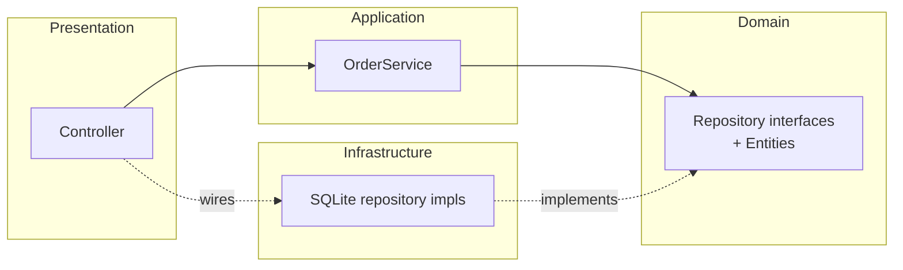

# Module 2 — Traditional vs Clean, Side by Side

> **Goal:** See the *same* feature ("place an order") written two ways, so the rest of the training has a concrete before/after in your head.

**Time:** 60 minutes.

---

## 2.1 The feature we're comparing

> A customer places an order for one book.
> Rules:
> - The book must exist and be in stock.
> - If the customer has bought ≥ 3 books before, they get a 10% loyalty discount.
> - Save the order and decrement stock.
> - Return `201 Created` with the order id.

Simple, right? Let's see what happens.

---

## 2.2 The traditional / "spaghetti" version

```ts
// src/routes/orders.ts  — the ONLY file
import express from 'express';
import Database from 'better-sqlite3';

const app = express();
app.use(express.json());
const db = new Database('bookstore.db');

app.post('/orders', (req, res) => {
  const { customerId, bookId } = req.body;

  // 1. validate
  if (!customerId || !bookId) return res.status(400).json({ error: 'missing fields' });

  // 2. load book (SQL in the route)
  const book = db.prepare('SELECT * FROM books WHERE id = ?').get(bookId) as any;
  if (!book) return res.status(404).json({ error: 'book not found' });
  if (book.stock < 1) return res.status(409).json({ error: 'out of stock' });

  // 3. loyalty rule (business logic in the route)
  const previousCount = (db.prepare(
    'SELECT COUNT(*) AS c FROM orders WHERE customer_id = ?'
  ).get(customerId) as any).c;
  const discount = previousCount >= 3 ? 0.1 : 0;
  const total = book.price * (1 - discount);

  // 4. persist (more SQL in the route)
  const info = db.prepare(
    'INSERT INTO orders (customer_id, book_id, total) VALUES (?, ?, ?)'
  ).run(customerId, bookId, total);
  db.prepare('UPDATE books SET stock = stock - 1 WHERE id = ?').run(bookId);

  // 5. respond
  res.status(201).json({ id: info.lastInsertRowid, total });
});

app.listen(3000);
```

### What's wrong?

| Smell | Why it hurts |
|---|---|
| SQL and HTTP live together | Can't test loyalty rule without a DB *and* an HTTP mock. |
| Business rule (`previousCount >= 3`) buried in the route | Search for "loyalty" — you'll miss it. |
| `res.status(409)` inside the route means the *rule* dictates HTTP | Moving to gRPC = rewrite. |
| No types beyond `any` | Refactor = pray. |
| Swap SQLite → Postgres = rewrite this file | And every other route file. |

---

## 2.3 The clean version — same feature

Now the same feature split across **four small files**. Don't panic — each file is short and does *one* thing.

```ts
// src/domain/Book.ts
export interface Book {
  id: number;
  title: string;
  price: number;
  stock: number;
}

// src/domain/Order.ts
export interface Order {
  id?: number;
  customerId: number;
  bookId: number;
  total: number;
}
```

```ts
// src/domain/ports/BookRepository.ts
import { Book } from '../Book';
export interface BookRepository {
  findById(id: number): Book | null;
  decrementStock(id: number): void;
}

// src/domain/ports/OrderRepository.ts
import { Order } from '../Order';
export interface OrderRepository {
  countByCustomer(customerId: number): number;
  save(order: Order): Order;
}
```

```ts
// src/application/OrderService.ts
import { BookRepository } from '../domain/ports/BookRepository';
import { OrderRepository } from '../domain/ports/OrderRepository';
import { Order } from '../domain/Order';

export class BookNotFoundError extends Error {}
export class OutOfStockError extends Error {}

export class OrderService {
  constructor(
    private readonly books: BookRepository,
    private readonly orders: OrderRepository,
  ) {}

  place(customerId: number, bookId: number): Order {
    const book = this.books.findById(bookId);
    if (!book) throw new BookNotFoundError(`book ${bookId}`);
    if (book.stock < 1) throw new OutOfStockError(`book ${bookId}`);

    const previous = this.orders.countByCustomer(customerId);
    const discount = previous >= 3 ? 0.1 : 0;
    const total = book.price * (1 - discount);

    const saved = this.orders.save({ customerId, bookId, total });
    this.books.decrementStock(bookId);
    return saved;
  }
}
```

```ts
// src/presentation/orderController.ts
import { Request, Response } from 'express';
import { OrderService, BookNotFoundError, OutOfStockError } from '../application/OrderService';

export const makeOrderController = (svc: OrderService) => ({
  create(req: Request, res: Response) {
    const { customerId, bookId } = req.body;
    if (!customerId || !bookId) return res.status(400).json({ error: 'missing fields' });
    try {
      const order = svc.place(customerId, bookId);
      return res.status(201).json(order);
    } catch (e) {
      if (e instanceof BookNotFoundError) return res.status(404).json({ error: e.message });
      if (e instanceof OutOfStockError)   return res.status(409).json({ error: e.message });
      throw e;
    }
  },
});
```

*(The SQLite implementation of the two repositories lives in `src/infrastructure/` — you'll write it in Module 4.)*

---

## 2.4 Direct comparison

| Aspect | Traditional | Clean |
|---|---|---|
| Files touched to add "VIP customers get 20% off" | 1 (but scary — regex-diving in a 300-line file) | 1 (`OrderService.ts`, and only the rule) |
| Test the loyalty rule | Boot Express + SQLite + seed data | New `OrderService(fakeBooks, fakeOrders)` in 3 lines |
| Swap SQLite → Postgres | Rewrite every route | Write a new `PostgresBookRepository`, wire once |
| Move HTTP → gRPC | Rewrite every route | New `orderGrpcHandler.ts`, service unchanged |
| Onboard a new dev | "Read this 300-line file, good luck" | "Domain describes *what*, application does *how*, infra does *where*" |
| Lines of code | ~40 | ~80 (yes, more!) |
| Cost of next feature | Grows | Stays flat |

**The clean version has more code and more files.** That is not a bug — it's a *bet*. You pay extra today so the 20th feature is as cheap as the 2nd.

---

## 2.5 The dependency picture

The single mental model to internalize:



Notice the arrows:

- **Controller → Service → Domain interfaces.** Business rules never point *outward*.
- **Infrastructure → Domain interfaces** (implements). It also flows inward.
- Nothing in *domain* imports Express, SQLite, or `req/res`.

This is called the **Dependency Rule**, and it is the *only* rule of Clean Architecture. Everything else is decoration.

---

## 2.6 Activity — trace an imaginary change (30 minutes)

Take these three requirements. For **each**, write down (a) which files change in the traditional version, (b) which files change in the clean version, (c) which test files you'd write.

1. "Give free shipping to orders over ₹1000."
2. "Send an email when an order is placed."
3. "Move from SQLite to PostgreSQL."

Discuss with a partner. There is no single right answer — the point is to *feel* which side stays cheap.

---

## 2.7 Key takeaways

- Same feature, two shapes. Clean has **more code, less coupling**.
- The trade is *upfront cost* for *long-term flatness*.
- The **Dependency Rule** (arrows point inward) is the whole game.
- More files ≠ more complexity when each file does *one* thing.

Next: [Module 3 — Clean Architecture fundamentals](03-clean-architecture-fundamentals.md).
