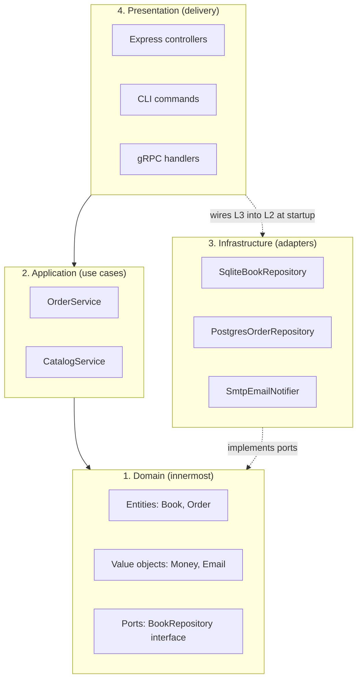
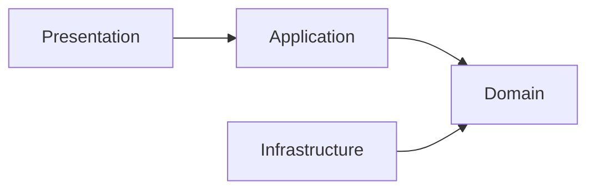
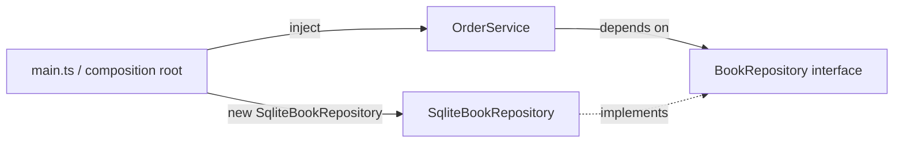
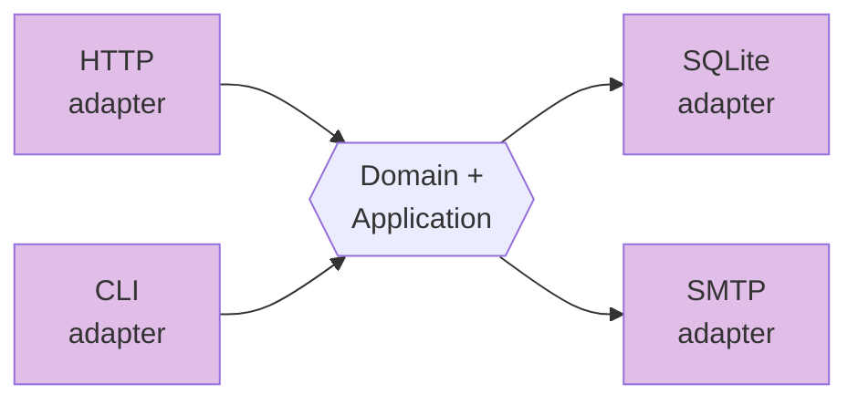

# Module 3 — Clean Architecture Fundamentals

> **Goal:** Learn the four layers, the Dependency Rule, and the "ports & adapters" mental model well enough to draw the diagram from memory.

**Time:** 60 minutes.

---

## 3.1 The four layers



### Each layer in one sentence

| Layer | Owns | Knows about | Forbidden from importing |
|---|---|---|---|
| **Domain** | Entities, value objects, repository *interfaces*, domain errors | Nothing — pure TypeScript | Express, SQL, `fs`, HTTP, any library except maybe `zod` for value objects |
| **Application** | Use-case classes (`OrderService`) that orchestrate domain objects | Domain only | Express, SQL drivers, `fs` |
| **Infrastructure** | Concrete implementations of ports (SQLite, HTTP client, email sender) | Domain interfaces | Application, Presentation |
| **Presentation** | Controllers, routers, CLI parsers — translate outside world ↔ application | Application services (+ some infra wiring at boot) | Domain internals (only imports the *service*, not entities' internals if avoidable) |

**Mnemonic:** *Domain is a rock. Application is a recipe. Infrastructure is a kitchen. Presentation is a waiter.*

---

## 3.2 The Dependency Rule (the only rule)

> **Source code dependencies must point only inward.**

If you draw an arrow from every `import` in your project, **no arrow may point from an inner layer to an outer one**.



That's it. Every pattern in this training (repository, service layer, DI) exists to enforce this rule.

### How the arrow gets *reversed* — Dependency Inversion

Naïvely, a service needs a database, so it would `import { db } from '../infrastructure/sqlite'`. That arrow points *outward* → rule broken.

We flip it:

1. Define an *interface* (a "port") in the **domain** describing what we need.
2. The service depends on the **interface**.
3. The infrastructure class **implements** the interface.
4. At startup, someone (the "composition root") creates the concrete class and injects it.



Now every arrow points inward. **Concrete details depend on abstractions**, not the other way around. This is the **D** in SOLID (Dependency Inversion Principle).

---

## 3.3 Ports and adapters — a different picture, same idea

"Clean Architecture" and "Hexagonal Architecture" (a.k.a. Ports & Adapters) are the same thing drawn differently:



- **Ports** = interfaces defined in the domain/application (what we need, what we offer).
- **Adapters** = implementations that plug an external system into a port.
- **Two kinds of ports:**
  - *Driving* (inbound) — how the outside calls in (`OrderService.place`).
  - *Driven* (outbound) — what the app calls out to (`BookRepository`).

The picture doesn't matter. The principle does: **the core has no idea what's plugged into it**.

---

## 3.4 A folder structure that reflects the layers

```
src/
  domain/
    Book.ts
    Order.ts
    errors.ts
    ports/
      BookRepository.ts
      OrderRepository.ts
  application/
    OrderService.ts
    CatalogService.ts
  infrastructure/
    persistence/
      SqliteBookRepository.ts
      SqliteOrderRepository.ts
    db.ts
  presentation/
    http/
      orderController.ts
      bookController.ts
      router.ts
  main.ts     ← composition root
```

Folder names are the **table of contents** of the app. A new hire opening `src/` should be able to answer "*where does business logic live?*" in five seconds.

### Alternative: feature-first layout

For larger apps, some teams flip it and go **feature-first**:

```
src/
  orders/
    domain/…
    application/…
    infrastructure/…
    presentation/…
  catalog/
    …
```

Both are valid. For freshers, we use **layer-first** — the layers are what we are teaching. Feature-first is a great next step once layers are second nature.

---

## 3.5 Comparison: why each principle beats what came before

| Principle | Before (worse) | After (better) | Why it wins |
|---|---|---|---|
| **Separation of layers** | One file with HTTP + SQL + rules | Four files, each one concern | Change one thing → touch one file |
| **Dependency Rule** | Business rules import DB driver | Business rules import an interface they *own* | Swap the DB with zero risk to rules |
| **Ports** (interfaces in domain) | Concrete class name hard-coded everywhere | Callers only see the interface | Test with a fake; deploy with the real thing |
| **Adapters** (impls in infra) | Every route talks to `db` directly | One class per external system | External change (Postgres upgrade) → one file |
| **Composition root** (`main.ts`) | `new X()` scattered everywhere | All construction in one place | The wiring is *readable as a paragraph* |

---

## 3.6 Common misunderstandings

- ❌ *"Clean architecture means lots of interfaces."*
  ✅ Only for things you'll *swap or fake*. A pure math function needs no interface.
- ❌ *"Every method needs a use-case class."*
  ✅ Group related operations. `OrderService.place` and `.cancel` and `.refund` in one class is fine.
- ❌ *"Domain classes can never be returned from a controller."*
  ✅ For small apps, yes they can. For bigger ones, add DTOs. Don't premature-abstract.
- ❌ *"More layers = better."*
  ✅ *Right-sized* layers. A 3-file CLI tool doesn't need 4 layers.

---

## 3.7 Activity — draw the diagram (20 minutes)

Without looking at this file:

1. On paper or in [Mermaid Live Editor](https://mermaid.live), draw the four layers.
2. Draw the dependency arrows.
3. Put these five items in the correct layer:
   - `class SqliteOrderRepository`
   - `interface EmailNotifier`
   - `class OrderService`
   - `function POST /orders handler`
   - `class Book { id, title, price }`
4. Swap papers with a partner and grade each other.

---

## 3.8 Key takeaways

- **Four layers**: Domain, Application, Infrastructure, Presentation.
- **One rule**: dependencies point inward.
- **Two flavors**: driving (inbound) and driven (outbound) ports.
- **One place** where everything gets wired: the composition root (`main.ts`).
- Layers are a **guideline**, not a religion — right-size them.

Next: [Module 4 — The Repository Pattern](04-repository-pattern.md), where we make the "driven port" idea concrete.
