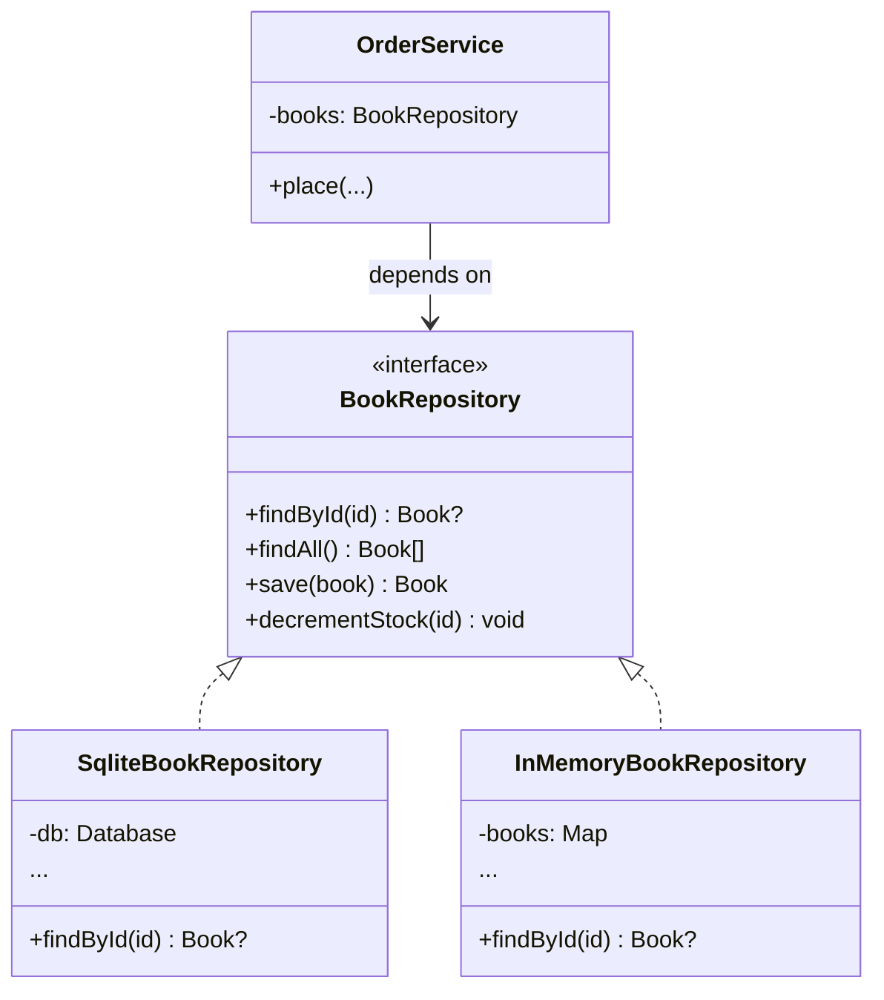

# Module 4 — The Repository Pattern

> **Goal:** Understand what a repository *is* (and isn't), why it beats calling the DB directly, and how to write one in TypeScript.

**Time:** 60 minutes.

---

## 4.1 The one-sentence definition

> A **repository** is an object that **looks like an in-memory collection** of domain objects, but is backed by some persistence mechanism.

Callers say `books.findById(3)` or `orders.save(newOrder)`. They *do not* say `SELECT` or `INSERT`.

---

## 4.2 The problem it solves

Without a repository, business code looks like this:

```ts
const book = db.prepare('SELECT * FROM books WHERE id = ?').get(id);
```

Every business file now:

1. Imports the SQL driver.
2. Knows the table name.
3. Knows the column names.
4. Handles `undefined` vs `null` the way `better-sqlite3` chose.
5. Cannot be tested without a real database.

With a repository:

```ts
const book = this.books.findById(id);   // returns Book | null
```

The business file:

1. Depends on an interface it *owns*.
2. Doesn't know the storage exists.
3. Can be tested with a 5-line fake.

---

## 4.3 Anatomy in TypeScript

Two files, always.

### The port (interface — lives in `domain/`)

```ts
// src/domain/ports/BookRepository.ts
import { Book } from '../Book';

export interface BookRepository {
  findById(id: number): Book | null;
  findAll(): Book[];
  save(book: Book): Book;
  decrementStock(id: number): void;
}
```

Notice:

- Uses **domain types only** (`Book`), no `RowDataPacket`, no `Prisma.Book`.
- Returns **plain domain objects or `null`**, not framework-specific error types.
- Methods speak the **business vocabulary** (`decrementStock`), not SQL (`updateColumn`).

### The adapter (implementation — lives in `infrastructure/`)

```ts
// src/infrastructure/persistence/SqliteBookRepository.ts
import Database from 'better-sqlite3';
import { Book } from '../../domain/Book';
import { BookRepository } from '../../domain/ports/BookRepository';

interface BookRow { id: number; title: string; price: number; stock: number }

export class SqliteBookRepository implements BookRepository {
  constructor(private readonly db: Database.Database) {}

  findById(id: number): Book | null {
    const row = this.db.prepare('SELECT * FROM books WHERE id = ?').get(id) as BookRow | undefined;
    return row ? this.toDomain(row) : null;
  }

  findAll(): Book[] {
    const rows = this.db.prepare('SELECT * FROM books').all() as BookRow[];
    return rows.map(r => this.toDomain(r));
  }

  save(book: Book): Book {
    const info = this.db.prepare(
      'INSERT INTO books (title, price, stock) VALUES (?, ?, ?)'
    ).run(book.title, book.price, book.stock);
    return { ...book, id: Number(info.lastInsertRowid) };
  }

  decrementStock(id: number): void {
    this.db.prepare('UPDATE books SET stock = stock - 1 WHERE id = ?').run(id);
  }

  private toDomain(row: BookRow): Book {
    return { id: row.id, title: row.title, price: row.price, stock: row.stock };
  }
}
```

The `toDomain` mapper is the *quarantine boundary* — SQL-flavored objects stop here.

### A fake for tests (also implements the port)

```ts
// tests/fakes/InMemoryBookRepository.ts
import { Book } from '../../src/domain/Book';
import { BookRepository } from '../../src/domain/ports/BookRepository';

export class InMemoryBookRepository implements BookRepository {
  private next = 1;
  private books = new Map<number, Book>();

  findById(id: number) { return this.books.get(id) ?? null; }
  findAll()            { return [...this.books.values()]; }
  save(b: Book): Book {
    const id = b.id ?? this.next++;
    const saved = { ...b, id };
    this.books.set(id, saved);
    return saved;
  }
  decrementStock(id: number) {
    const b = this.books.get(id);
    if (b) this.books.set(id, { ...b, stock: b.stock - 1 });
  }
}
```

The service can now be tested with zero database, zero HTTP, zero file I/O.

---

## 4.4 Diagram



`OrderService` doesn't know which implementation it's holding. That's the point.

---

## 4.5 What a repository is NOT

| Mistake | Why it's wrong |
|---|---|
| A thin wrapper that exposes `query(sql)` | You've just renamed the DB driver, gained nothing |
| Returning raw DB rows / `RowDataPacket` | Coupling leaks into the caller |
| Containing business rules (`if (order.total > 1000) …`) | That's the service's job |
| Making HTTP calls | That's an infrastructure client, not a repository |
| One "GenericRepository<T>" with `find(where)` | You've re-invented the ORM. Prefer named intention-revealing methods |

**Rule:** every repository method should read like a sentence a product manager would say.
✅ `orders.countByCustomer(id)`
❌ `orders.selectWhere({ column: 'customer_id', op: '=', value: id })`

---

## 4.6 Comparison: repository vs alternatives

| Approach | Pro | Con | When to use |
|---|---|---|---|
| **Raw DB calls in routes** | Zero indirection | Untestable, unswappable, business rules leak | Never in production |
| **Active Record** (`Book.find(3)`) | Familiar (Rails) | Domain object knows how to persist itself → couples domain to DB | Small scripts |
| **ORM entities used directly** (Prisma / TypeORM everywhere) | Fast to start | Business code depends on ORM shape; hard to swap | Prototypes; small teams |
| **Repository** | Domain code is pure; tests are trivial; swap DBs cheaply | More boilerplate | **Any app that outlives a prototype** |
| **CQRS + repositories** | Reads and writes optimized separately | Complexity | Large scale, read-heavy systems |

Each row is **better than the one above** for medium-to-large apps because it moves persistence knowledge *further away* from business rules.

---

## 4.7 A subtle rule: one repository per **aggregate**, not per **table**

An **aggregate** is a cluster of objects that change together. Example: `Order` + `OrderLine[]` change together — they form one aggregate.

- ✅ `OrderRepository` — loads/saves an `Order` *with* its lines.
- ❌ `OrderRepository` + `OrderLineRepository` — invites callers to save half an order.

For freshers the rule is simpler: **one repository per top-level concept the business talks about**. Tables are an implementation detail.

---

## 4.8 Activity — build one from scratch (30 minutes)

Requirement: *"Customers can be looked up by email or by id. Emails are unique."*

1. Design the `Customer` entity (id, name, email).
2. Design the `CustomerRepository` interface (**write the interface first, no implementation**).
3. Write an `InMemoryCustomerRepository`.
4. Write a `SqliteCustomerRepository`.
5. Write a 5-line test that uses the in-memory one to prove "duplicate email is rejected".

Show a partner. Ask them: *"Can you point to a single line of business logic in the SQLite class?"* The answer must be **no**.

---

## 4.9 Key takeaways

- Repository = collection-like façade over persistence.
- Interface in `domain/`, implementation in `infrastructure/`.
- Named methods > generic query API.
- One per aggregate, not per table.
- Cost: a bit of boilerplate. Payoff: testable, swappable business code.

Next: [Module 5 — The Service Layer](05-service-layer.md), where we decide *what* those repository methods should be called with.
