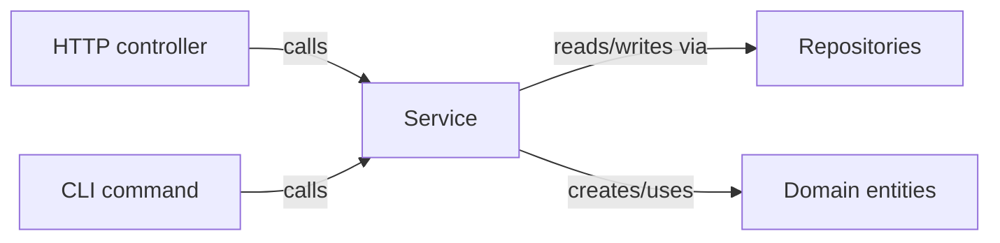

# Module 5 — The Service Layer

> **Goal:** Learn where business rules belong, how a service differs from a controller and from a repository, and how to name services so intent is obvious.

**Time:** 60 minutes.

---

## 5.1 One-sentence definition

> A **service** (a.k.a. **use case**, **interactor**, **application service**) is a class or function that **executes one business operation** by orchestrating domain objects and repositories.

If a product manager can say the sentence, it's probably a service method:

- "Place an order." → `OrderService.place`
- "Cancel an order and refund." → `OrderService.cancel`
- "Add a book to the catalog." → `CatalogService.addBook`

---

## 5.2 Where it sits



The service is the **only** place where business rules run. Controllers translate; repositories persist; the service **decides**.

---

## 5.3 A service, dissected

```ts
// src/application/OrderService.ts
import { BookRepository } from '../domain/ports/BookRepository';
import { OrderRepository } from '../domain/ports/OrderRepository';
import { Order } from '../domain/Order';
import { BookNotFoundError, OutOfStockError } from '../domain/errors';

export class OrderService {
  // 1. Dependencies via constructor. Interfaces, not classes.
  constructor(
    private readonly books: BookRepository,
    private readonly orders: OrderRepository,
  ) {}

  // 2. One public method per use case, named in business language.
  place(customerId: number, bookId: number): Order {
    // 3. Load
    const book = this.books.findById(bookId);
    if (!book) throw new BookNotFoundError(bookId);
    if (book.stock < 1) throw new OutOfStockError(bookId);

    // 4. Decide (the rule)
    const previous = this.orders.countByCustomer(customerId);
    const discount = previous >= 3 ? 0.1 : 0;
    const total = book.price * (1 - discount);

    // 5. Persist
    const saved = this.orders.save({ customerId, bookId, total });
    this.books.decrementStock(bookId);
    return saved;
  }
}
```

Each numbered comment is a rule the service *always* follows:

1. **Constructor injection of interfaces** — testability + swap-ability.
2. **One method = one use case** — cohesion; you can read the class as a menu.
3. **Load** — pull the state we need.
4. **Decide** — the actual business rule.
5. **Persist** — write the result.

This "**Load → Decide → Persist**" shape works for ~80% of services. When it doesn't, you probably have two use cases hiding in one method.

---

## 5.4 What a service is NOT

| Anti-pattern | Why it hurts | Fix |
|---|---|---|
| Service takes a `Request` / `Response` | Now the service can only be called over HTTP | Pass plain arguments |
| Service returns `res.status(404)` | Domain deciding transport = broken layering | Throw a domain error; controller maps it |
| Service opens the DB connection | Service knows about SQLite | Inject the repository |
| Service is 500 lines with 20 methods | Doing many jobs | Split by aggregate: `OrderService`, `RefundService`, … |
| "UtilService" / "HelperService" / "ManagerService" | Meaningless name = grab-bag = coupling magnet | Name after the *business capability* |
| Method returns `Promise<any>` | Type erasure defeats the whole exercise | Return a domain type or a DTO |

---

## 5.5 Error handling — where domain meets transport

Business errors are **thrown as typed exceptions**. Controllers translate them to HTTP.

```ts
// src/domain/errors.ts
export class BookNotFoundError extends Error {
  constructor(public readonly bookId: number) { super(`book ${bookId} not found`); }
}
export class OutOfStockError extends Error {
  constructor(public readonly bookId: number) { super(`book ${bookId} out of stock`); }
}
```

```ts
// src/presentation/http/orderController.ts
try {
  const order = svc.place(customerId, bookId);
  return res.status(201).json(order);
} catch (e) {
  if (e instanceof BookNotFoundError) return res.status(404).json({ error: e.message });
  if (e instanceof OutOfStockError)   return res.status(409).json({ error: e.message });
  throw e;   // let a global error middleware log & 500
}
```

**Payoff:** the same `OrderService.place` also works from a CLI, a queue worker, or a gRPC call — each *presentation* chooses how to render the error.

---

## 5.6 Comparison: rules-in-controller vs service layer

| Concern | Rules-in-controller | Service layer |
|---|---|---|
| Test the rule | Boot Express + DB | `new OrderService(fake, fake)` |
| Reuse rule from a CLI | Copy-paste route code | Call the service |
| Read all rules for "orders" | Grep across all route files | Open `OrderService.ts` |
| Add a new precondition | Insert `if` somewhere in a 200-line handler | Add one line inside `place()` |
| Onboarding | "Where's the loyalty logic?" → 20-minute hunt | "Search for `discount` in `application/`" → 5 seconds |

Every row is *strictly better* with a service layer. There is essentially no case where inlining business rules into a controller wins — except throwaway scripts.

---

## 5.7 Anemic domain vs rich domain — a fresher-friendly note

Two schools exist:

- **Anemic domain**: entities are dumb data bags; services contain all rules.
- **Rich domain**: entities own their own rules (`order.applyDiscount()`), services orchestrate.

For freshers we start **anemic**. It's simpler and covers 80% of apps. Once you're comfortable, refactor rules that belong to a single entity *onto* that entity:

```ts
// eventually…
class Order {
  applyLoyaltyDiscount(previousOrderCount: number) {
    if (previousOrderCount >= 3) this.total *= 0.9;
  }
}
```

The service still orchestrates ("load, ask entity to decide, save"), but the rule lives with the data it operates on. This is called moving from **transaction script** style to **domain model** style — you can look it up when curious.

---

## 5.8 Naming rules that pay for themselves

- Class: `<Aggregate>Service` — `OrderService`, `CatalogService`, `CustomerService`.
- Method: **verb phrase in business language** — `place`, `cancel`, `applyDiscount`.
- Parameters: **plain values or small DTOs**, never HTTP artifacts.
- Return: **domain object or a small DTO**, never a `Response`.
- Errors: **subclass `Error`** with names ending in `Error`.

---

## 5.9 Activity — service surgery (30 minutes)

Below is a bad `UserService`. Rewrite it applying every rule you learned.

```ts
export class UserService {
  constructor(private db: any, private req: any, private res: any) {}

  async doStuff(x: any) {
    const u = await this.db.query(`SELECT * FROM users WHERE id=${x}`);
    if (!u) this.res.status(404).send('no');
    if (u.banned) this.res.status(403).send('nope');
    u.loginCount++;
    await this.db.query(`UPDATE users SET login_count=${u.loginCount} WHERE id=${x}`);
    this.res.json(u);
  }
}
```

Deliverables:

1. A `UserRepository` interface.
2. A refactored `UserService` with a properly-named method and typed parameters.
3. A tiny controller that calls it and translates errors.
4. A one-line description of *what business capability* the method represents.

---

## 5.10 Key takeaways

- Service = one class per aggregate, one method per use case, business language.
- **Load → Decide → Persist** is your default shape.
- No `req` / `res` / SQL / `fs` inside a service — ever.
- Errors are typed domain exceptions; controllers translate.
- Start anemic; move rules onto entities when they belong there.

Next: [Module 6 — Dependency Injection in TypeScript](06-dependency-injection.md), where we stop calling `new` inside services.
