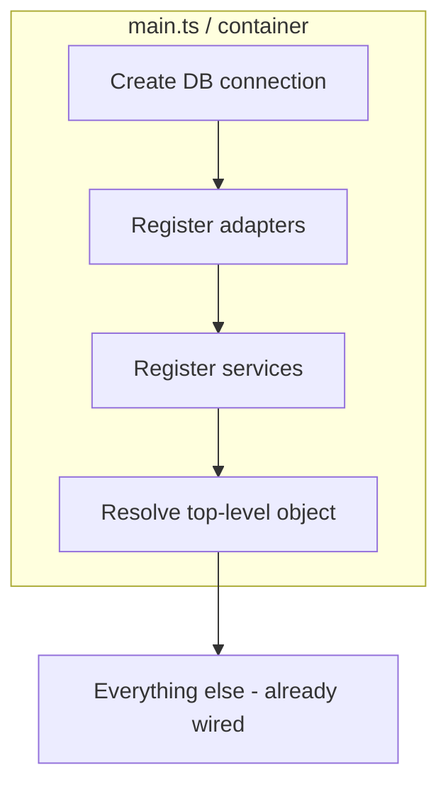

# Module 6 — Dependency Injection in TypeScript

> **Goal:** Understand DI as a *principle* (invert control of construction), then apply it two ways: manual composition root, and with `tsyringe`.

**Time:** 60 minutes.

---

## 6.1 What "dependency injection" actually means

**Not this** — the `OrderService` constructs its own dependencies:

```ts
class OrderService {
  private books = new SqliteBookRepository(new Database('bookstore.db'));  // ❌
  ...
}
```

**This** — the `OrderService` receives its dependencies:

```ts
class OrderService {
  constructor(
    private readonly books: BookRepository,   // ✅ interface
    private readonly orders: OrderRepository,
  ) {}
}
```

That's it. **DI = "someone else builds my collaborators and hands them to me."**

The "someone else" is called the **composition root** — one file, usually `main.ts`, where every `new` in the app lives.

---

## 6.2 Why it beats calling `new` yourself

| Without DI | With DI |
|---|---|
| Test needs a real SQLite file | Test passes an `InMemoryBookRepository` |
| To swap DBs, edit every service | Edit one line in `main.ts` |
| Circular constructors possible | Wiring is a straight line, easy to audit |
| Hidden coupling (imports of concretes) | Every dependency is a **constructor parameter** — visible in one place |

The core win: **construction is separated from use**.

---

## 6.3 Manual DI — the composition root

For an app with < ~30 classes, you don't need a framework. A single file does it:

```ts
// src/main.ts
import express from 'express';
import Database from 'better-sqlite3';

import { SqliteBookRepository }  from './infrastructure/persistence/SqliteBookRepository';
import { SqliteOrderRepository } from './infrastructure/persistence/SqliteOrderRepository';
import { OrderService }          from './application/OrderService';
import { CatalogService }        from './application/CatalogService';
import { makeOrderController }   from './presentation/http/orderController';
import { makeBookController }    from './presentation/http/bookController';

// --- 1. build outer world ---
const db = new Database('bookstore.db');

// --- 2. build adapters ---
const bookRepo  = new SqliteBookRepository(db);
const orderRepo = new SqliteOrderRepository(db);

// --- 3. build services ---
const orderService   = new OrderService(bookRepo, orderRepo);
const catalogService = new CatalogService(bookRepo);

// --- 4. build controllers ---
const orderController = makeOrderController(orderService);
const bookController  = makeBookController(catalogService);

// --- 5. build HTTP ---
const app = express();
app.use(express.json());
app.post('/orders', orderController.create);
app.get ('/books',  bookController.list);
app.listen(3000, () => console.log('listening on 3000'));
```

That file **is** your architecture diagram, expressed in code. If a new hire reads it top-to-bottom, they know the whole graph.

**Pros:** zero magic, zero dependencies, TypeScript checks every wire.
**Cons:** for 100+ classes, this file grows.

---

## 6.4 DI with a container — `tsyringe`

Once the composition root becomes unwieldy, a DI container lets you *declare* dependencies with decorators and have the container assemble the graph.

```ts
// src/application/OrderService.ts
import 'reflect-metadata';
import { injectable, inject } from 'tsyringe';
import type { BookRepository } from '../domain/ports/BookRepository';
import type { OrderRepository } from '../domain/ports/OrderRepository';

@injectable()
export class OrderService {
  constructor(
    @inject('BookRepository')  private readonly books:  BookRepository,
    @inject('OrderRepository') private readonly orders: OrderRepository,
  ) {}
  ...
}
```

```ts
// src/main.ts
import 'reflect-metadata';
import { container } from 'tsyringe';
import Database from 'better-sqlite3';
import { SqliteBookRepository }  from './infrastructure/persistence/SqliteBookRepository';
import { SqliteOrderRepository } from './infrastructure/persistence/SqliteOrderRepository';
import { OrderService } from './application/OrderService';

const db = new Database('bookstore.db');
container.register('Database', { useValue: db });
container.register('BookRepository',  { useClass: SqliteBookRepository });
container.register('OrderRepository', { useClass: SqliteOrderRepository });

// Resolve the top-level object — everything below is built automatically.
const orderService = container.resolve(OrderService);
```

**Pros:** less boilerplate as the app grows; easy to swap registrations per environment.
**Cons:** decorators + tokens = more machinery; another dependency; harder to trace for freshers.

> **Guidance for freshers:** start with **manual DI**. Move to `tsyringe` (or similar) only when the composition root exceeds ~150 lines.

---

## 6.5 Why interface tokens (not classes) as injection keys?

The whole point of DI is inverting the dependency direction (Module 3). So we inject **the interface**, not the class:

```ts
constructor(@inject('BookRepository') books: BookRepository)   // ✅
```

Not:

```ts
constructor(books: SqliteBookRepository)                       // ❌ concrete
```

TypeScript interfaces don't exist at runtime, so `tsyringe` uses a string (or `Symbol`) token. Some teams put tokens in a `tokens.ts` file for autocomplete:

```ts
// src/tokens.ts
export const TOKENS = {
  BookRepository:  'BookRepository',
  OrderRepository: 'OrderRepository',
} as const;
```

---

## 6.6 Diagram — where DI fits



DI collapses to a single fact: **all `new` calls live in one file (or one container config)**. Every other file just says *"I need one of these"* in its constructor.

---

## 6.7 Comparison table

| Style | Best for | Wins | Loses |
|---|---|---|---|
| **`new` inside constructors** | Throwaway scripts | Simple to write | Untestable, unswappable |
| **Service locator** (`Container.get('X')` called from inside a service) | Legacy migration | Slightly better than `new` | Hides dependencies; anti-pattern in the long run |
| **Manual constructor injection + composition root** | Small–medium TS apps | Zero magic; explicit; TS-checked | File grows over time |
| **DI container** (`tsyringe`, `Inversify`, `awilix`) | Medium–large apps | Concise; per-environment configs | Decorator magic; new concepts |

Each row above **strictly beats the previous** on maintainability at the cost of a bit more machinery. Match the tool to the app size.

---

## 6.8 Common fresher mistakes

- ❌ Declaring dependencies as *optional* (`books?: BookRepository`) — hides the wiring.
- ❌ Using `container.resolve` inside services (service locator anti-pattern).
- ❌ Making the container a global god-object.
- ❌ Registering the same class under two tokens by accident — you get two instances (fine or fatal, depending).
- ❌ Forgetting `import 'reflect-metadata'` at the very top of `main.ts` when using `tsyringe`.

---

## 6.9 Activity — refactor to DI (30 minutes)

Take this snippet:

```ts
// src/mailer.ts
import nodemailer from 'nodemailer';
export class Mailer {
  private transport = nodemailer.createTransport({ host: 'smtp.foo', port: 587 });
  send(to: string, body: string) { return this.transport.sendMail({ to, text: body }); }
}

// src/signup.ts
import { Mailer } from './mailer';
export class SignupService {
  private mailer = new Mailer();
  signup(email: string) { this.mailer.send(email, 'welcome'); }
}
```

Do the following:

1. Extract a `Notifier` interface (`send(to, body)`) into a `domain/ports` folder.
2. Make `Mailer` implement `Notifier` and move it to `infrastructure/`.
3. Make `SignupService` take `Notifier` via constructor.
4. Write a `main.ts` composition root.
5. Bonus: swap to a `ConsoleNotifier` in `main.ts` for local dev, without touching `SignupService`.

---

## 6.10 Key takeaways

- DI = **don't build your collaborators, receive them**.
- One file (the composition root) owns all `new` calls.
- Depend on **interfaces** (ports), not concrete classes.
- Start manual; adopt a container when the root gets big.
- Never call the container from inside a service (that's service locator, not DI).

Next: [Module 7 — Testing a layered app](07-testing-strategies.md), where DI finally pays for itself.
