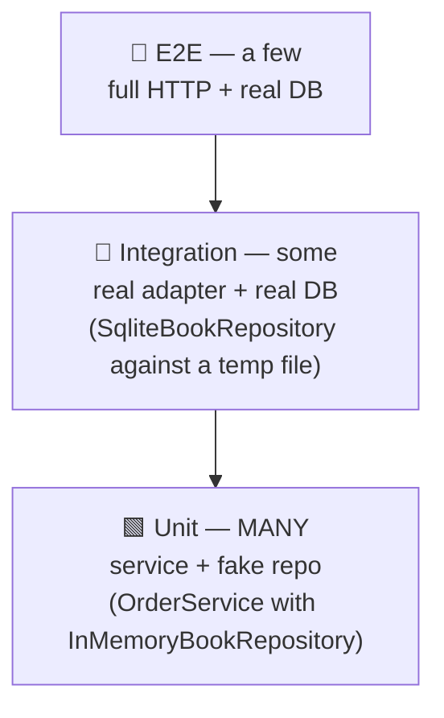

# Module 7 — Testing a Layered App

> **Goal:** Learn what to test at each layer, how the test pyramid maps to Clean Architecture, and write fast, focused tests using Vitest + in-memory repositories.

**Time:** 60 minutes.

---

## 7.1 The test pyramid, mapped to layers



| Test kind | What layer | How many | Speed | Why |
|---|---|---|---|---|
| **Unit** | Application (services) with fakes | Hundreds | ms | Business rules — the stuff that changes most |
| **Integration** | Infrastructure (real repo + real DB) | Dozens | ~100 ms each | Prove the SQL / mapping works |
| **E2E** | Presentation → all layers → DB | Few | seconds | Prove wiring & HTTP contract |

You want the pyramid, not an ice-cream cone. Freshers often invert this and write only E2E tests — slow, flaky, and they don't localize failures.

---

## 7.2 Unit-testing a service (the payoff of DI)

```ts
// tests/OrderService.spec.ts
import { describe, it, expect, beforeEach } from 'vitest';
import { OrderService } from '../src/application/OrderService';
import { BookNotFoundError, OutOfStockError } from '../src/domain/errors';
import { InMemoryBookRepository }  from './fakes/InMemoryBookRepository';
import { InMemoryOrderRepository } from './fakes/InMemoryOrderRepository';

describe('OrderService.place', () => {
  let books:  InMemoryBookRepository;
  let orders: InMemoryOrderRepository;
  let svc:    OrderService;

  beforeEach(() => {
    books  = new InMemoryBookRepository();
    orders = new InMemoryOrderRepository();
    svc    = new OrderService(books, orders);
  });

  it('places an order at full price when customer is new', () => {
    const book = books.save({ id: 0, title: 'Clean Code', price: 500, stock: 5 });
    const order = svc.place(1, book.id);
    expect(order.total).toBe(500);
  });

  it('applies 10% loyalty discount after 3 previous orders', () => {
    const book = books.save({ id: 0, title: 'DDD', price: 1000, stock: 5 });
    for (let i = 0; i < 3; i++) orders.save({ customerId: 1, bookId: book.id, total: 1000 });
    const order = svc.place(1, book.id);
    expect(order.total).toBe(900);
  });

  it('throws BookNotFoundError when book missing', () => {
    expect(() => svc.place(1, 999)).toThrow(BookNotFoundError);
  });

  it('throws OutOfStockError when stock is 0', () => {
    const book = books.save({ id: 0, title: 'Refactoring', price: 800, stock: 0 });
    expect(() => svc.place(1, book.id)).toThrow(OutOfStockError);
  });
});
```

Notice what is **absent**:

- No `import express`, no `supertest`, no HTTP.
- No `new Database()`, no `.sql` file, no temp file.
- No `beforeAll` setup taking 5 seconds.

The whole file runs in < 50 ms. Because rules change often, **fast feedback is architectural**.

---

## 7.3 Integration-testing a repository

Now prove the SQL adapter is correct — against a real, but disposable, SQLite DB:

```ts
// tests/SqliteBookRepository.int.spec.ts
import { describe, it, expect, beforeEach } from 'vitest';
import Database from 'better-sqlite3';
import { SqliteBookRepository } from '../src/infrastructure/persistence/SqliteBookRepository';

const SCHEMA = `
  CREATE TABLE books (
    id INTEGER PRIMARY KEY AUTOINCREMENT,
    title TEXT NOT NULL,
    price INTEGER NOT NULL,
    stock INTEGER NOT NULL
  );
`;

describe('SqliteBookRepository', () => {
  let repo: SqliteBookRepository;

  beforeEach(() => {
    const db = new Database(':memory:');   // <-- in-memory SQLite, no file
    db.exec(SCHEMA);
    repo = new SqliteBookRepository(db);
  });

  it('round-trips a book', () => {
    const saved = repo.save({ id: 0, title: 'x', price: 100, stock: 2 });
    expect(repo.findById(saved.id!)).toEqual(saved);
  });

  it('decrementStock reduces stock by 1', () => {
    const saved = repo.save({ id: 0, title: 'x', price: 100, stock: 3 });
    repo.decrementStock(saved.id!);
    expect(repo.findById(saved.id!)?.stock).toBe(2);
  });
});
```

**Trick:** `':memory:'` gives you a real SQLite in RAM. No filesystem, no cleanup, no race conditions. For Postgres, use [testcontainers](https://node.testcontainers.org/) — same idea, different runtime.

---

## 7.4 A single E2E smoke test

One or two of these are enough — they prove **wiring**, not rules.

```ts
// tests/e2e/orders.e2e.spec.ts
import { describe, it, expect, beforeAll } from 'vitest';
import request from 'supertest';
import { buildApp } from '../../src/main';   // exposes an app factory

describe('POST /orders', () => {
  const app = buildApp({ dbFile: ':memory:', seed: true });

  it('returns 201 with an order id', async () => {
    const res = await request(app).post('/orders').send({ customerId: 1, bookId: 1 });
    expect(res.status).toBe(201);
    expect(res.body.id).toBeGreaterThan(0);
  });
});
```

If you find yourself writing 30 of these, you're testing at the wrong layer.

---

## 7.5 What makes each layer's tests good

| Layer | Good test looks like | Bad test looks like |
|---|---|---|
| **Service (unit)** | 5–10 lines, one behavior, uses fakes | Sets up 3 mocks with `.mock.calls`, asserts internal method order |
| **Repository (integration)** | In-memory DB, real SQL, one round-trip | Mocks `db.prepare` — you're testing the mock |
| **Controller** | Prefer service tests; add one HTTP test per route | Business rules asserted through HTTP → slow, brittle |
| **E2E** | Golden-path smoke: "the app boots and responds" | 40 permutations covered here → 5-minute test suite |

---

## 7.6 Mocks, stubs, fakes — the fresher-friendly distinction

- **Fake** — a *working* alternative implementation. `InMemoryBookRepository` is a fake.
- **Stub** — returns canned data. Rarely needed if you have fakes.
- **Mock** — records calls and asserts they happened. Overusing mocks couples tests to implementation.

**Rule:** *prefer fakes over mocks.* Fakes test **behavior**; mocks test **interactions**. Behavior tests survive refactors.

---

## 7.7 Coverage — a fresher-safe goal

- **~90%** on `application/` (services). These are the rules.
- **~70%** on `infrastructure/` — cover the SQL/mapping edges.
- **Very low** on `main.ts` and thin controllers — one E2E covers them.
- **Ignore** trivial getters, DTOs, generated files.

Chasing 100% forces you to test uninteresting code. Aim for **confidence**, not a badge.

---

## 7.8 Comparison — testing an unlayered app vs a layered one

| | Unlayered (v1 messy) | Layered (v4+) |
|---|---|---|
| Test a business rule | Boot Express + DB, POST, assert JSON | `new Service(fake, fake)`, call method, assert |
| Test time | 2–5 s per test | 2–5 ms per test |
| Debug a failure | "Something in the stack broke" | The failing test names the class *and* the rule |
| CI cost | Minutes | Seconds |
| Confidence after refactor | Low — tests are brittle | High — behaviour-focused tests survive |

---

## 7.9 Activity — write three tests (30 minutes)

Using the [v4 case study](../case-study/v4-clean-architecture/) as your target:

1. Write a **service unit test** for a new rule: *"An order over ₹5000 gets free gift wrapping (add `giftWrap: true` to the order)."*
2. Write an **integration test** for `SqliteOrderRepository.countByCustomer`.
3. Write **one E2E test** for `POST /orders`.

Run them. Measure. Which took the longest to write? Which caught the most bugs?

---

## 7.10 Key takeaways

- Pyramid: many unit → some integration → few E2E.
- Services + fakes = fast, focused, refactor-friendly tests.
- Repositories test against `:memory:` SQLite (or testcontainers for real DBs).
- Prefer fakes over mocks — behavior over interactions.
- The clean layering **is** what makes fast tests possible. That's the payoff.

Next: [Module 8 — AI-assisted architecture review](08-ai-assisted-architecture-review.md), where we teach an AI to nag us about layer violations.
