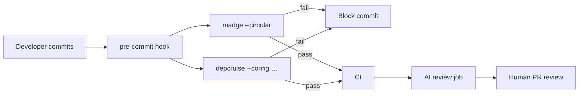

# Module 9 — Dependency Analysis with AI + Tools

> **Goal:** Combine two tools (`madge`, `dependency-cruiser`) with AI prompts to *automatically* detect circular dependencies, layer violations, and unused code — and to fail CI when they appear.

**Time:** 75 minutes.

---

## 9.1 Why tools beat eyeballs

An AI review (Module 8) is only as good as the files you paste. As the app grows:

- You forget to include the file that broke the rule.
- Circular dependencies are invisible in code-per-file review.
- New devs merge violations before anyone reviews.

Static analysis tools read **the whole graph**, every commit, deterministically. Combined with an AI interpreter, they give you both **completeness** and **explanation**.

---

## 9.2 The two tools

### `madge` — quick, visual dependency graphs

- Fast, minimal config.
- Great for **circular dependency** detection.
- Renders SVG/DOT graphs.

Install (once per project):

```powershell
npm install --save-dev madge
```

Common commands:

```powershell
# find circular dependencies
npx madge --circular --extensions ts src

# print the dependency tree of a file
npx madge --extensions ts src/main.ts

# render an SVG diagram
npx madge --extensions ts --image graph.svg src
```

### `dependency-cruiser` — rule-enforcing analyzer

- Config file where you **declare architectural rules**.
- Fails with a clear error on violation.
- Perfect for the pre-commit / CI gate.

Install + init:

```powershell
npm install --save-dev dependency-cruiser
npx depcruise --init
```

That creates `.dependency-cruiser.js`. Replace its rules with the ones below.

---

## 9.3 A `dependency-cruiser` config that enforces Clean Architecture

```js
// .dependency-cruiser.js
module.exports = {
  forbidden: [
    {
      name: 'no-circular',
      severity: 'error',
      comment: 'Circular dependencies indicate a design flaw.',
      from: {},
      to: { circular: true }
    },
    {
      name: 'domain-is-pure',
      severity: 'error',
      comment: 'Domain must not import from application/infrastructure/presentation or 3rd-party libs (except zod).',
      from: { path: '^src/domain' },
      to: {
        path: '^(src/(application|infrastructure|presentation)|node_modules/(?!zod))',
      }
    },
    {
      name: 'application-only-uses-domain',
      severity: 'error',
      comment: 'Application layer may only depend on domain.',
      from: { path: '^src/application' },
      to:   { path: '^src/(infrastructure|presentation)' }
    },
    {
      name: 'infrastructure-only-uses-domain',
      severity: 'error',
      comment: 'Infrastructure adapters may depend on domain (interfaces) only.',
      from: { path: '^src/infrastructure' },
      to:   { path: '^src/(application|presentation)' }
    },
    {
      name: 'presentation-uses-application-only',
      severity: 'error',
      comment: 'Controllers should call services, not repositories directly.',
      from: { path: '^src/presentation' },
      to:   { path: '^src/(infrastructure|domain/(?!ports|.*Error))' }
    },
    {
      name: 'main-can-wire-anything',
      severity: 'info',
      from: { path: '^src/main\\.ts$' },
      to:   {}
    }
  ],
  options: {
    tsPreCompilationDeps: true,
    tsConfig: { fileName: 'tsconfig.json' }
  }
};
```

Run:

```powershell
npx depcruise --config .dependency-cruiser.js src
```

Sample output when violations exist:

```
error no-circular: src/application/OrderService.ts →
  src/application/DiscountService.ts →
  src/application/OrderService.ts

error domain-is-pure: src/domain/Book.ts →
  src/infrastructure/persistence/SqliteBookRepository.ts
```

Exit code is non-zero. Wire it into CI and the merge is blocked.

Add npm scripts:

```json
"scripts": {
  "arch:check":  "depcruise --config .dependency-cruiser.js src",
  "arch:graph":  "depcruise --output-type dot src | dot -T svg -o dep-graph.svg",
  "arch:cycles": "madge --circular --extensions ts src"
}
```

---

## 9.4 A pipeline that reviews itself



The tools catch **deterministic** violations. The AI + human catch **judgment** issues.

---

## 9.5 Feeding tool output into AI — the killer combo

Tools produce facts; AI interprets them. Use this prompt:

### Prompt 5 — Interpret dependency-cruiser output

```
Below is the output of `npx depcruise --config .dependency-cruiser.js src`
on my Node.js + TypeScript project that follows Clean Architecture.

For each violation:
1. Restate it in one sentence a junior can understand.
2. Explain WHY the rule exists (what pain it prevents).
3. Give the minimum-change fix. Show a code diff if possible.
4. Suggest one test that would fail if the fix regresses.

Output:
<paste depcruise output>
```

And for circular dependencies:

### Prompt 6 — Explain and break a cycle

```
Here is a circular dependency reported by `madge --circular`:
A → B → C → A

Explain, step by step:
1. Why cycles are harmful in TypeScript (compilation, testing, reasoning).
2. Three standard techniques to break this specific cycle
   (extract interface, invert dependency, move shared code).
3. Which technique fits best given these three files (I'm pasting them below).

Files:
<paste A, B, C>
```

Now you have a **workflow**:

1. `npm run arch:check` — tool tells you *what*.
2. Paste output into AI with Prompt 5 — AI tells you *why* + *how*.
3. Fix. Re-run. Green? Commit.

---

## 9.6 Detecting the sneakier smells

Tools + AI can find things a human misses:

| Smell | How to detect |
|---|---|
| **Unused exports** | `depcruise --include-only "^src" --output-type err src` (with `no-orphans` rule enabled) |
| **God module** (imported everywhere) | `npx madge --extensions ts src --summary`, sort by fan-in |
| **Deep import** into another module's internals | `depcruise` rule: `from: {path: '^src/moduleA'}, to: {path: '^src/moduleB/(?!index)'}` |
| **Dev-only dep in prod code** | `depcruise` built-in rule `no-non-package-json` |
| **Two files that always change together** | Ask AI: *"given these git-log co-change stats, which files should probably merge or split?"* |

---

## 9.7 A minimal CI recipe

```yaml
# .github/workflows/architecture.yml
name: architecture
on: [pull_request]
jobs:
  arch:
    runs-on: ubuntu-latest
    steps:
      - uses: actions/checkout@v4
      - uses: actions/setup-node@v4
        with: { node-version: '20' }
      - run: npm ci
      - run: npm run arch:cycles
      - run: npm run arch:check
      - run: npm test
```

Three commands. That's the entire gate.

---

## 9.8 Comparison — enforcing architecture, three ways

| Approach | Catches violations | Speed | Junior-friendly | Sustainability |
|---|---|---|---|---|
| **Code review only** | Whatever the reviewer sees | Slow (hours/days) | Depends on reviewer | Fades as team grows |
| **AI review only** | Whatever you paste | Minutes | Good — AI explains | Requires discipline |
| **Static analysis only** | All layer + cycle violations | Seconds | Cryptic errors | Excellent |
| **Static analysis + AI interpretation** | All of the above, explained | Seconds + minutes | Excellent | Excellent |

The last row is the goal. Each row **strictly adds** on top of the previous.

---

## 9.9 Activity — enforce on the case study (45 minutes)

Working in [case-study/v6-ai-reviewed](../case-study/v6-ai-reviewed/):

1. Install `madge` and `dependency-cruiser`.
2. Copy the config from §9.3.
3. Deliberately **introduce a violation** in v6: add `import Database from 'better-sqlite3'` in a domain file.
4. Run `npm run arch:check`. Confirm it fails with the right rule name.
5. Paste the output into your AI chat with Prompt 5. Verify the explanation matches your understanding.
6. Revert. Confirm green.
7. Generate the SVG graph (`npm run arch:graph`). Open it and compare against the diagram in Module 3.

---

## 9.10 Key takeaways

- **Tools** for completeness; **AI** for explanation; **humans** for judgment.
- `madge --circular` finds cycles; `dependency-cruiser` enforces layer rules.
- Wire both into `pre-commit` and CI — violations become impossible to merge.
- The AI's best role is turning terse tool output into learnable lessons.
- A team without these gates re-learns the same violations forever.

Congratulations — you've reached the end of the concept modules. Now finish the [case study](../case-study/README.md) and start the [capstone](../capstone/README.md).
