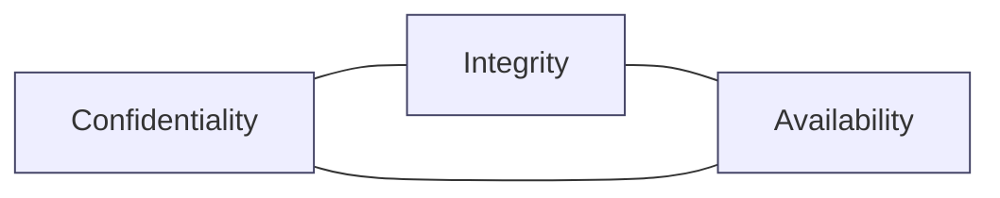
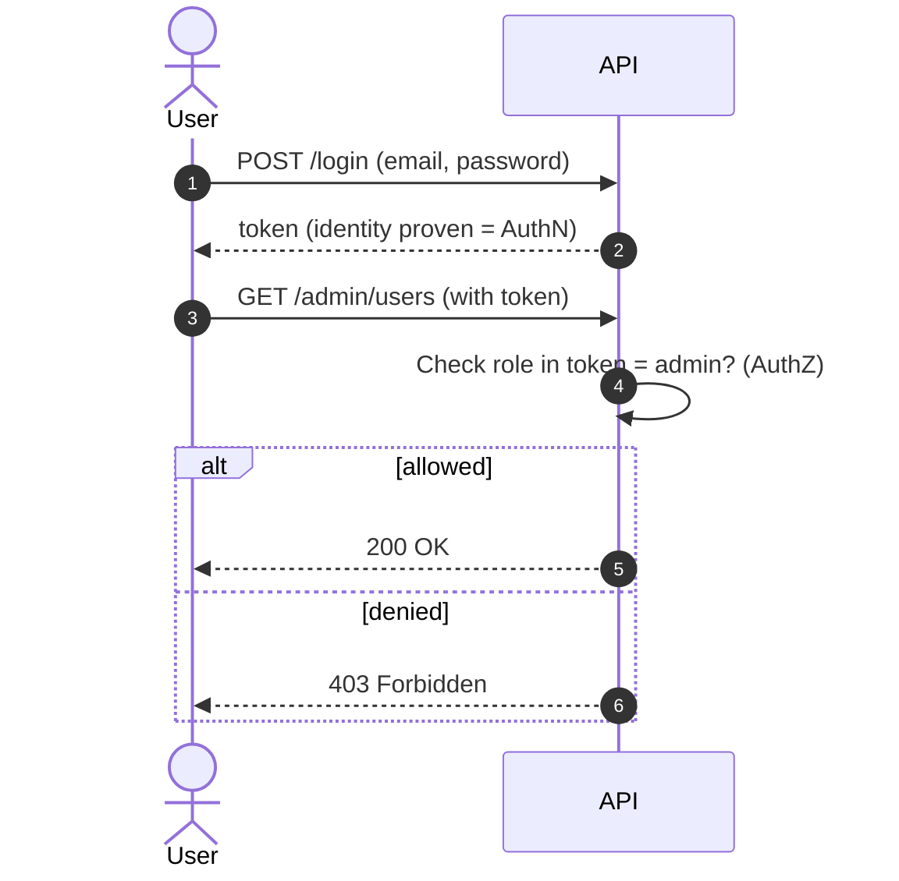
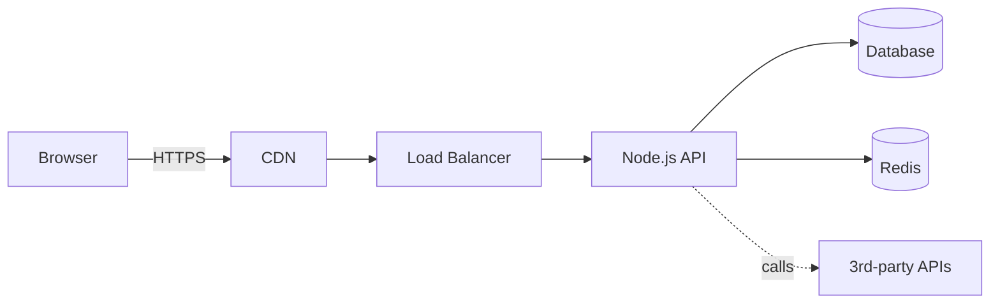

# Module 0 — Intro to Web Security (30 min)

## Learning objectives

By the end of this module you can:

1. Name the three pillars of the **CIA triad**.
2. Explain the difference between **authentication (AuthN)** and **authorization (AuthZ)**.
3. Build a simple **threat model** for a typical HTTP API.
4. Recognize the **OWASP API Security Top 10** by name.

---

## 1. CIA triad

Every security discussion boils down to three properties:

| Pillar | Question it answers | Example control |
|---|---|---|
| **Confidentiality** | Can only the right people read this? | TLS, encryption at rest, RBAC |
| **Integrity** | Has the data been tampered with? | JWT signatures, HMAC, checksums |
| **Availability** | Can legitimate users still use the service? | Rate limits, DDoS protection, autoscale |

## 2. AuthN vs AuthZ — do not confuse them

- **Authentication** = *"Who are you?"* → verify identity.
- **Authorization** = *"What are you allowed to do?"* → verify permissions.

You log in **once** (AuthN). Every request afterwards is **authorized** based on who you are and what role/permissions you hold.

## 3. Threat modelling: STRIDE (2 min tour)

A lightweight way to ask *"what can go wrong?"* per component.

| Letter | Threat | Property violated |
|---|---|---|
| **S** | Spoofing | Authentication |
| **T** | Tampering | Integrity |
| **R** | Repudiation | Non-repudiation |
| **I** | Information disclosure | Confidentiality |
| **D** | Denial of Service | Availability |
| **E** | Elevation of Privilege | Authorization |

## 4. Anatomy of a typical API request

Each arrow is a **trust boundary**. Ask: *what does the receiver trust about the sender?* Whenever the answer is "everything", you have a problem.

## 5. OWASP API Security Top 10 (2023) — memorize the names

| # | Name | 30-sec version |
|---|---|---|
| API1 | Broken Object Level Authorization (BOLA) | `/orders/42` — did you check that order 42 belongs to *this* user? |
| API2 | Broken Authentication | Weak login, guessable tokens, no lockout |
| API3 | Broken Object Property Level Authorization | User updates their own record but sneaks `role: "admin"` in the body |
| API4 | Unrestricted Resource Consumption | No rate limits, no size caps → bill shock, DoS |
| API5 | Broken Function Level Authorization | Regular user calls `DELETE /admin/users/1` and it works |
| API6 | Unrestricted Access to Sensitive Business Flows | Bots buy every ticket in seconds |
| API7 | Server Side Request Forgery (SSRF) | Server fetches URL provided by user → hits internal metadata endpoint |
| API8 | Security Misconfiguration | Default creds, verbose errors, no headers |
| API9 | Improper Inventory Management | Old `v1` API still up, undocumented |
| API10 | Unsafe Consumption of APIs | Blindly trust data from a 3rd-party API |

We will hit **API1, API2, API3, API4, API5, API8** hard during this course.

---

## Activity — Threat-storm your favourite app (15 min)

**Goal:** practice noticing where trust boundaries live.

Pick any app you use daily (Instagram, WhatsApp, Zomato, GitHub…). In pairs:

1. Sketch its main components on paper: client, API, DB, 3rd-party services.
2. Pick **one** feature (e.g. "post a photo").
3. For each STRIDE letter, propose **one** concrete attack.
4. For each attack, propose **one** control.
5. Share the scariest attack with the group.

## Discussion prompts (5 min)

- Where in the CIA triad does a **password leak** primarily hit?
- Where does a **DDoS attack** hit?
- Where does a **rogue admin quietly changing records** hit?
- Which is worse in your business: a 1-hour outage, or one leaked customer record? Why?

## Cheat-sheet

- **AuthN** = who. **AuthZ** = what.
- **Never trust the client.** Always re-check on the server.
- **BOLA** is the #1 API bug in production. Always check ownership.
- **Fail closed**, never fail open.

## Further reading

- OWASP API Security Top 10 (2023): https://owasp.org/API-Security/editions/2023/en/0x11-t10/
- Microsoft STRIDE overview: https://learn.microsoft.com/en-us/azure/security/develop/threat-modeling-tool-threats
- *Security Engineering* — Ross Anderson (free 3rd ed. online)
