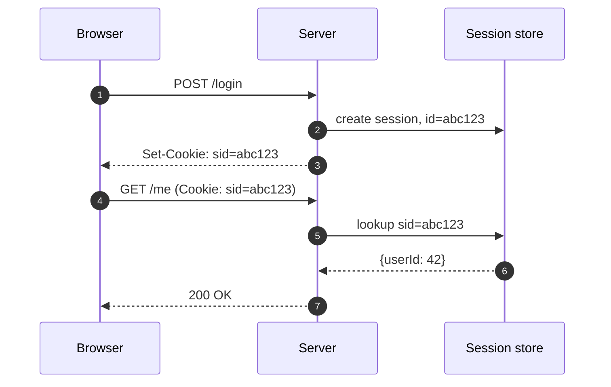
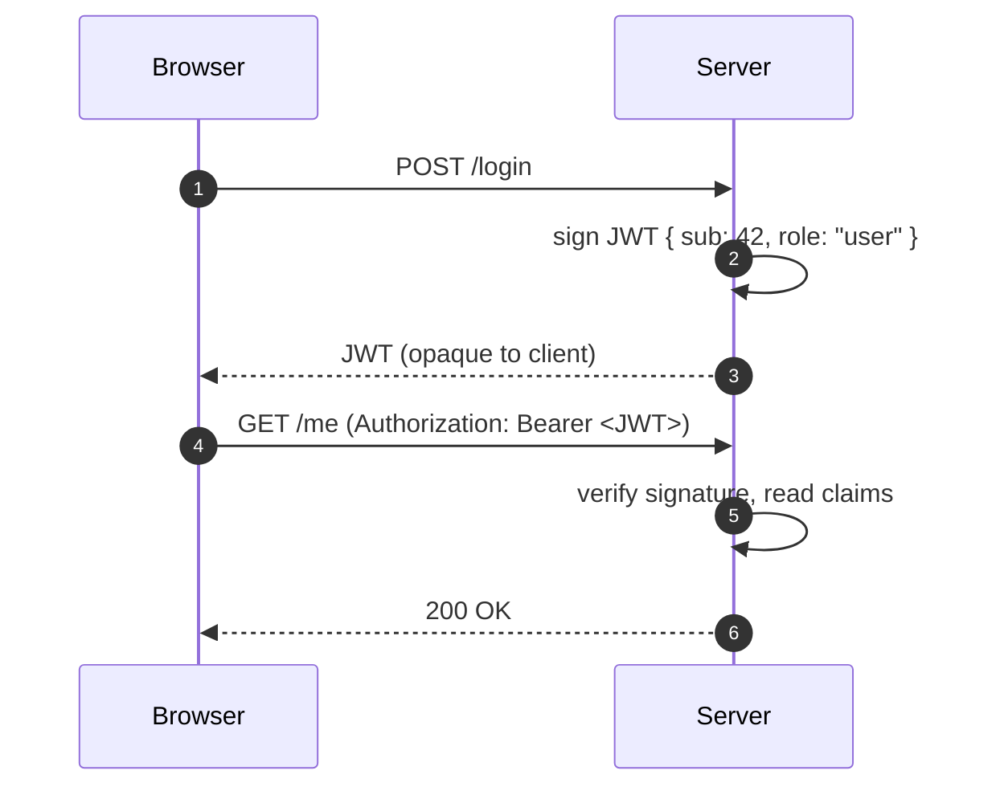
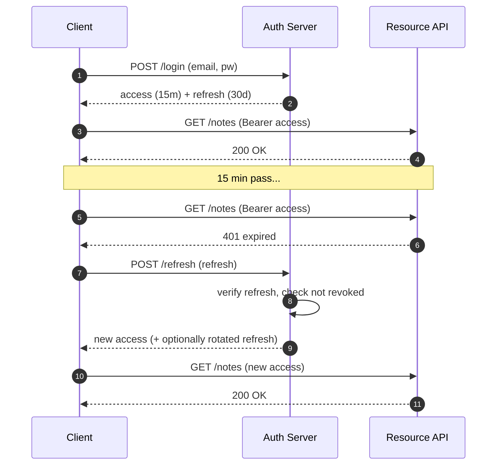

# Module 1 — JSON Web Tokens (JWT) (2 h)

## Learning objectives

1. Explain **why** stateless tokens exist (sessions vs tokens).
2. Read a JWT's three parts and know what belongs in each.
3. Sign and verify JWTs in TypeScript with `jsonwebtoken`.
4. Design an **access + refresh token** flow.
5. List at least **five** JWT footguns and how to avoid them.

---

## 1. From sessions to tokens

Traditional session auth stores state on the **server**:



That server-side lookup is fine for one server. Painful once you have **many** services, or need to authenticate against **someone else's** API.

**JWTs move state into the token itself** — signed by the server so it cannot be tampered with:



No DB call. Any service holding the **verification key** can trust the token.

## 2. Structure of a JWT

Three base64url segments joined by dots:

```
xxxxx.yyyyy.zzzzz
header . payload . signature
```

Try pasting one into https://jwt.io. Example:

```
eyJhbGciOiJIUzI1NiIsInR5cCI6IkpXVCJ9.
eyJzdWIiOiI0MiIsInJvbGUiOiJ1c2VyIiwiaWF0IjoxNzA0MDY3MjAwLCJleHAiOjE3MDQwNzA4MDB9.
Q9-signature-bytes
```

### Header
```json
{ "alg": "HS256", "typ": "JWT" }
```
- `alg` — signing algorithm. **Whitelist this on the verify side.**

### Payload (claims)

Standard "registered" claims (all optional but recommended):

| Claim | Meaning |
|---|---|
| `iss` | Issuer (who minted it) |
| `sub` | Subject (usually the user id) |
| `aud` | Audience (who it is for) |
| `exp` | Expiry (unix seconds) — **always set this** |
| `nbf` | Not before |
| `iat` | Issued at |
| `jti` | Unique JWT ID (useful for revocation) |

Plus your own custom claims (`role`, `email`, `tenant_id`…).

> **Payload is base64, NOT encryption.** Never put passwords, PII, tokens, or anything sensitive in a JWT.

### Signature

`HMACSHA256(base64url(header) + "." + base64url(payload), secret)`

If a single character in header or payload changes, the signature no longer matches → verify fails.

## 3. Symmetric vs asymmetric signing

| | `HS256` (symmetric) | `RS256` / `ES256` (asymmetric) |
|---|---|---|
| Keys | one shared secret | private key signs, public key verifies |
| Good for | single service | multiple services / 3rd parties verifying |
| Failure mode | leak the secret → attacker mints any token | leak private key → same, but public key is safe to share |

For a monolith or a single service group, **HS256 with a strong secret** is fine. For microservices or when your API is verified by others (e.g. clients), prefer **RS256/ES256**.

## 4. Access + refresh tokens

Short-lived access tokens minimize damage from a leak. Long-lived refresh tokens (stored securely) let users stay signed in.



- **Access token** — short (5–15 min), JWT, sent on every request.
- **Refresh token** — long (7–30 days), opaque random string stored server-side (hashed) OR a JWT with `jti` you can revoke. Sent only to `/refresh`, never to resource endpoints. Store in `httpOnly` cookie or secure storage.

## 5. Storage: where does the client keep the token?

| Location | Pros | Cons |
|---|---|---|
| `localStorage` | Easy | Readable by any XSS on your page — **avoid for sensitive apps** |
| `sessionStorage` | Cleared on tab close | Still XSS-readable |
| `httpOnly` Secure cookie | Not JS-readable → XSS safe | Needs CSRF protection (SameSite=Lax/Strict helps) |
| In-memory (JS variable) | XSS resistant if short-lived | Lost on refresh — pair with refresh cookie |

**Rule of thumb:** put the **refresh token in an `httpOnly; Secure; SameSite=Strict` cookie**. Keep the **access token in memory** and refresh silently.

## 6. JWT footguns (memorize these)

1. **`alg: "none"`** — some libs will accept an unsigned token if you forget to whitelist `alg`. Always pass `algorithms: ["HS256"]` (or your choice) to `verify`.
2. **Algorithm confusion** — attacker changes `alg` from `RS256` to `HS256` and signs with the public key as the HMAC secret. Whitelist the alg AND pin the key type.
3. **Weak secret** — `"secret"`, `"changeme"`. Use **32+ random bytes**: `openssl rand -base64 32`.
4. **No `exp`** — tokens live forever. Always set expiry.
5. **Trusting `role` in the token without re-checking on the server** — fine for a monolith you control; risky if the token comes from a 3rd-party IdP.
6. **Putting secrets in the payload** — passwords, credit cards, refresh tokens, API keys. Payload is readable by anyone with the token.
7. **No revocation strategy** — JWTs are valid until they expire. If you need instant revocation, keep a small `jti` deny-list or use short-lived tokens + refresh flow.
8. **Storing JWTs in `localStorage` for high-value apps** — XSS = full account takeover.

## 7. Code samples

See `examples/`:

- `01-sign-verify.ts` — sign & verify with `jsonwebtoken`.
- `02-express-auth.ts` — express middleware that reads `Authorization: Bearer`.
- `03-refresh-flow.ts` — access + refresh token pair with rotation.
- `04-attack-alg-none.ts` — demonstrates the `alg: none` attack (and how to block it).

Run any of them:

```powershell
cd modules/01-jwt/examples
npm install
npx tsx 01-sign-verify.ts
```

## 8. Exercises

See `exercises/README.md`. Summary:

- **Ex 1 (warm-up, 10 min):** Sign a token with `sub` and `role`, verify it. Change one letter of the payload and observe the failure.
- **Ex 2 (25 min):** Write an `authGuard` middleware that:
  - reads `Authorization: Bearer <token>`,
  - verifies with `HS256` only,
  - populates `req.user`,
  - returns `401` on any failure with a **generic** message.
- **Ex 3 (30 min):** Implement `/auth/login`, `/auth/refresh`, `/auth/logout` with a rotating refresh token strategy.
- **Ex 4 (stretch):** Migrate the example to `RS256` (generate an RSA keypair with `openssl`).

## 9. Activity — "Break my JWT" (10 min)

Facilitator distributes a JWT signed with a **weak secret** (e.g. `secret`). Participants must:

1. Decode the payload (no signing key needed).
2. Modify the `role` claim to `admin`.
3. Re-sign the token — either by cracking the weak secret with `hashcat`/online tool, or (educational only) by exploiting `alg: none` if the demo server accepts it.
4. Discuss: what single line in the verify code would have blocked their attack?

## Cheat-sheet

```ts
jwt.verify(token, SECRET, {
  algorithms: ['HS256'],   // whitelist alg
  issuer: 'notes-api',     // pin iss
  audience: 'notes-web',   // pin aud
  clockTolerance: 5,       // seconds
});
```

- Set `exp`. Whitelist `alg`. Pin `iss`/`aud`. Rotate secrets. Short access, long refresh.

## Further reading

- RFC 7519 — JWT: https://datatracker.ietf.org/doc/html/rfc7519
- RFC 8725 — JWT Best Current Practices: https://datatracker.ietf.org/doc/html/rfc8725
- `jsonwebtoken` npm: https://www.npmjs.com/package/jsonwebtoken
- Auth0 "JWT Handbook" (free PDF): https://auth0.com/resources/ebooks/jwt-handbook
