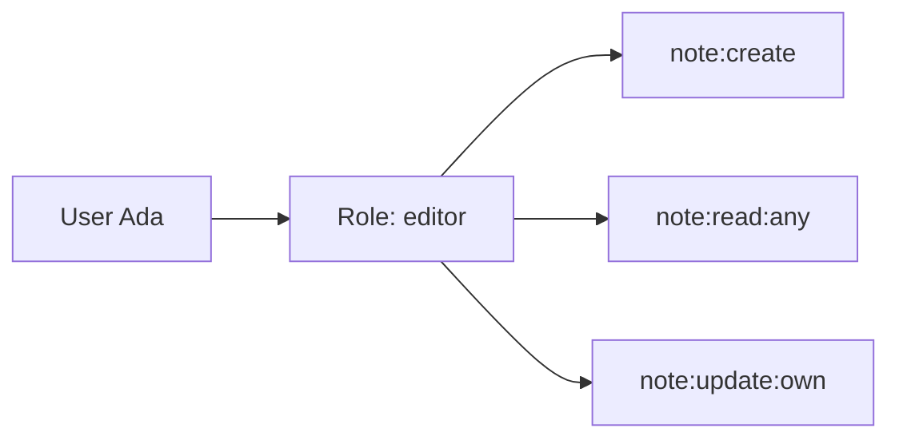
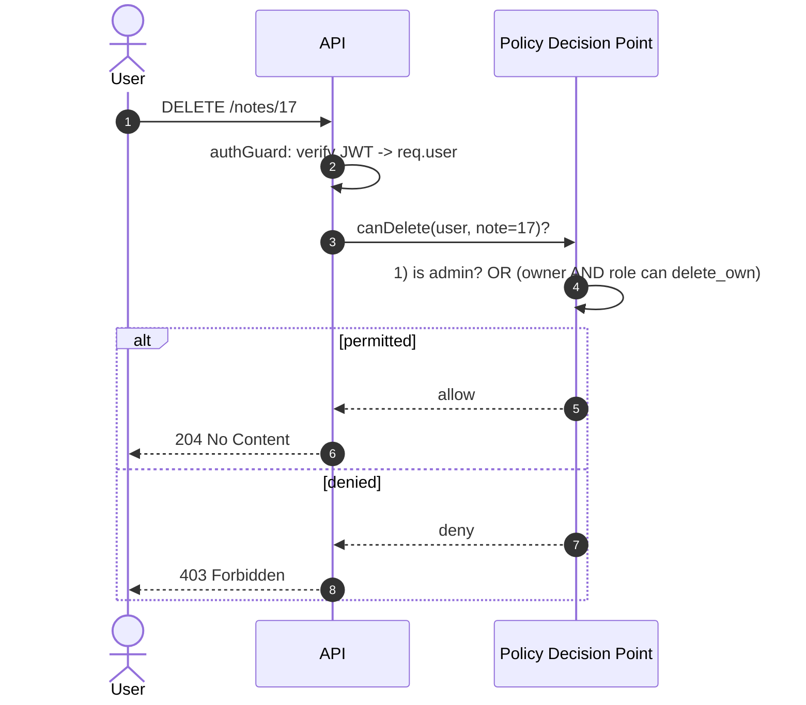

# Module 2 — Role-Based Access Control (RBAC) (1 h 15)

## Learning objectives

1. Distinguish **roles** from **permissions**.
2. Implement a `requireRole` and a `requirePermission` middleware.
3. Prevent **BOLA** (Broken Object Level Authorization) — the #1 API vuln.
4. Avoid **BFLA** (Broken Function Level Authorization) — admin routes accessible to users.
5. Choose between **RBAC**, **ABAC**, and **ReBAC** for a given problem.

---

## 1. Vocabulary

- **Subject** — the actor (a user, a service).
- **Action** — verb (`read`, `create`, `delete`).
- **Resource** — object (`note`, `user`, `invoice`).
- **Role** — a named bag of permissions (`admin`, `editor`, `user`).
- **Permission** — a fine-grained rule (`note:delete:any`, `note:delete:own`).



## 2. RBAC vs ABAC vs ReBAC

| Model | Decision based on | Good for |
|---|---|---|
| **RBAC** | Role assigned to the user | Simple apps, clear job functions |
| **ABAC** | Attributes (user attrs + resource attrs + env) | "Managers can approve if amount < 1000 and same region" |
| **ReBAC** | Relationships between entities (Google Zanzibar) | Docs sharing, collaborative apps |

For this course we use **RBAC** with a light dose of ownership checks (which is technically ABAC — "user is owner of resource").

## 3. Authorization request flow



In small apps the "PDP" is a couple of functions in your codebase. In bigger systems it might be OPA, Cerbos, or Zanzibar.

## 4. BOLA — the #1 API bug in the wild

Naive controller:

```ts
app.get('/notes/:id', authGuard, async (req, res) => {
  const note = await db.note.findUnique({ where: { id: req.params.id } });
  if (!note) return res.status(404).json({ error: 'not found' });
  res.json(note);            // ❌ returns ANY note, even if it belongs to someone else
});
```

Fix — check ownership OR admin role:

```ts
app.get('/notes/:id', authGuard, async (req, res) => {
  const note = await db.note.findUnique({ where: { id: req.params.id } });
  if (!note) return res.status(404).json({ error: 'not found' });
  if (note.userId !== req.user!.sub && req.user!.role !== 'admin') {
    return res.status(404).json({ error: 'not found' });   // 404 not 403 — don't leak existence
  }
  res.json(note);
});
```

> **Tip:** for BOLA, return **404** rather than 403 so attackers cannot use the endpoint to test which IDs exist.

## 5. BFLA — admin routes exposed to all users

```ts
// ❌ registered without any role check
app.delete('/admin/users/:id', authGuard, deleteUser);

// ✅
app.delete('/admin/users/:id', authGuard, requireRole('admin'), deleteUser);
```

Any endpoint under `/admin/*` should have a group-level guard. Better yet, mount an entire router with the guard baked in.

## 6. Middleware pattern

```ts
export const requireRole = (...allowed: string[]) => (req: AuthedRequest, res: Response, next: NextFunction) => {
  if (!req.user) return res.status(401).json({ error: 'unauthorized' });
  if (!allowed.includes(req.user.role)) return res.status(403).json({ error: 'forbidden' });
  next();
};

export const requirePermission = (perm: string) => (req: AuthedRequest, res: Response, next: NextFunction) => {
  if (!req.user) return res.status(401).json({ error: 'unauthorized' });
  const perms = rolePermissions[req.user.role] ?? [];
  if (!perms.includes(perm) && !perms.includes('*')) {
    return res.status(403).json({ error: 'forbidden' });
  }
  next();
};
```

`rolePermissions` is a plain table:

```ts
const rolePermissions: Record<string, string[]> = {
  admin: ['*'],
  editor: ['note:read:any', 'note:create', 'note:update:own', 'note:delete:own'],
  user:   ['note:read:own', 'note:create', 'note:update:own', 'note:delete:own'],
};
```

Ownership (`:own`) still needs a per-record check inside the handler — see the code samples in `examples/`.

## 7. Common mistakes

1. **Trusting `role` from the request body**  — always take role from the *verified* JWT or the DB, never from user input.
2. **Only checking role, not ownership** — leads to BOLA.
3. **Enforcing authorization only in the UI** — the API must re-check.
4. **Mass assignment** — `Object.assign(user, req.body)` lets a user set `role: "admin"`. Use a Zod schema that lists allowed fields explicitly.
5. **403 for a non-existent resource** — leaks existence. Prefer 404 in ambiguous cases.
6. **Hard-coding role strings everywhere** — use a `Role` enum / const object.

## 8. Code samples

`examples/01-rbac-middleware.ts` — express server showing `requireRole`, `requirePermission`, and per-record ownership.

`examples/02-mass-assignment.ts` — vulnerable vs safe update handler.

## 9. Exercises

See `exercises/README.md`. Highlights:

- Add an `admin` route that lists all notes; verify a `user` gets 403.
- Fix a BOLA vulnerability in the provided starter.
- Fix a mass assignment bug where a user can promote themselves.

## Activity — "Steal Bob's notes" (10 min)

Set up: instructor runs a demo server. Ada and Bob both have accounts. Bob writes note id `7`.

- Ada logs in, calls `GET /notes/7`.
- If the server returns Bob's note → BOLA. Discuss the fix.
- If it returns 403 → attacker learns id `7` exists. Discuss why 404 is better.

## Cheat-sheet

- **Role** from verified JWT only.
- **Route-level** guard (`requireRole`, `requirePermission`).
- **Record-level** guard (ownership) inside the handler.
- **Deny by default.** New routes should not compile unless you attach a policy.

## Further reading

- OWASP BOLA cheatsheet: https://owasp.org/API-Security/editions/2023/en/0xa1-broken-object-level-authorization/
- Cerbos (policy-as-code): https://cerbos.dev
- Google Zanzibar paper: https://research.google/pubs/zanzibar-googles-consistent-global-authorization-system/
