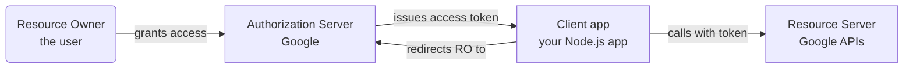
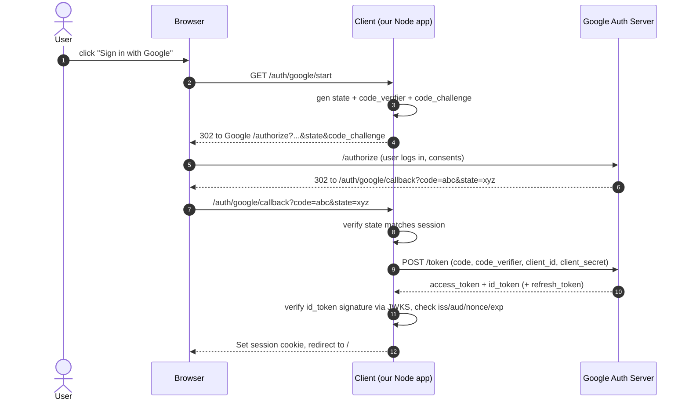

# Module 3 — OAuth 2.0 & OpenID Connect with Google (2 h)

## Learning objectives

1. Explain **OAuth2** (authorization) vs **OpenID Connect** (authentication on top of OAuth2).
2. Identify the four OAuth2 actors: **Resource Owner, Client, Authorization Server, Resource Server**.
3. Understand why **Authorization Code + PKCE** is the modern default.
4. Implement Google Sign-In in an Express + TypeScript app.
5. Recognize common OAuth2 attacks: **CSRF on redirect, open redirect, implicit-flow token leak, missing PKCE**.

---

## 1. Why OAuth2 exists

Before OAuth2, if an app wanted to read your Gmail contacts, you'd have to give it your **Google password**. Terrible.

OAuth2 lets you say: *"Google, please give this app a temporary token with only these permissions, without ever sharing my password."*

## 2. The four actors



For **login only** (no calling Google APIs afterwards), your client is also the "consumer" of the ID token from OIDC — no separate Resource Server needed.

## 3. OAuth2 vs OpenID Connect (OIDC)

| | OAuth2 | OIDC |
|---|---|---|
| Purpose | Authorization: "give this app access to X" | Authentication: "who is this user?" |
| Token | Access token (opaque or JWT, for calling APIs) | ID token (always a JWT, describes the user) |
| Endpoint | `/authorize`, `/token` | Same + `/userinfo`, `.well-known/openid-configuration` |
| Analogy | Valet key | Passport photo |

If you just want "Sign in with Google", you want **OIDC**. If you also want to read the user's calendar, you additionally need OAuth2 scopes.

## 4. The Authorization Code + PKCE flow

The modern default for web and mobile clients.



Key ideas:

- **`state`** — CSRF protection on the redirect back. If the returned `state` doesn't match what you stored, reject.
- **`code_verifier` / `code_challenge` (PKCE)** — proves the token exchange is coming from the same client that started the flow. Blocks intercepted-code attacks.
- **`nonce`** — inside the ID token; you generate it in `/authorize` and verify it in `/token`. Blocks token replay.
- **ID token verification** — validate `iss`, `aud`, `exp`, `nonce`, and signature against Google's **JWKS** (`https://www.googleapis.com/oauth2/v3/certs`).

## 5. What NOT to use

- **Implicit flow** (`response_type=token`) — access token in the URL fragment. Deprecated; replaced by Auth Code + PKCE.
- **Resource Owner Password Credentials** — user types their Google password into your app. Effectively defeats OAuth2. Only used in legacy migrations.
- **Client Credentials flow** — machine-to-machine only (no user), do not use for user login.

## 6. Google-specific quick facts

- Discovery doc: https://accounts.google.com/.well-known/openid-configuration
- Authorize endpoint: `https://accounts.google.com/o/oauth2/v2/auth`
- Token endpoint: `https://oauth2.googleapis.com/token`
- Userinfo: `https://openidconnect.googleapis.com/v1/userinfo`
- JWKS: `https://www.googleapis.com/oauth2/v3/certs`
- Scopes for basic login: `openid email profile`

## 7. Recommended libraries

- **`openid-client`** by Filip Skokan — the canonical Node.js OIDC client. Handles discovery, PKCE, ID-token verification, JWKS caching.
- Alternatives: `passport-google-oauth20` (older, less strict), Auth.js (`@auth/express`) (higher-level).

For learning we use `openid-client` because it exposes each step and validates everything correctly by default.

## 8. Code sample walkthrough (`examples/`)

`01-google-oidc.ts` implements:

- `/auth/google/start` — creates state + PKCE, redirects to Google.
- `/auth/google/callback` — verifies state, exchanges code, verifies ID token, sets session, redirects.
- `/me` — reads the session and returns the user.
- `/logout` — clears the session.

Run:

```powershell
cd modules/03-oauth2-oidc/examples
npm install
cp .env.example .env    # then paste your Google client id/secret
npx tsx 01-google-oidc.ts
```

Then open http://localhost:3000 and click **Sign in with Google**.

## 9. Common attacks & mitigations

| Attack | Mitigation |
|---|---|
| CSRF on callback | Cryptographic `state`, checked server-side |
| Authorization code interception | **PKCE** (`code_verifier` known only to client) |
| Open redirect via `redirect_uri` | Only allow **exact** pre-registered redirect URIs |
| Token replay | `nonce` in ID token; short `exp` on access tokens |
| Mixing up flows | Never use implicit flow. Never use ROPC. |
| Leaked client secret | Public clients (SPA, mobile) must use **PKCE only** (no secret) |

## 10. Exercises

See `exercises/README.md`:

- **Ex 1:** wire the demo end-to-end with your own Google credentials.
- **Ex 2:** intentionally break `state` handling; observe the attack window.
- **Ex 3:** issue your OWN JWT after Google sign-in (create/find local user in DB, mint a `notes-api` JWT for that user). This bridges OIDC → your app's session model.
- **Ex 4 (stretch):** verify the ID token manually using the JWKS endpoint and `jose`.

## Activity — "Draw the flow" (15 min)

In pairs, on paper: without looking at the diagram above, draw the Auth Code + PKCE flow from click to session cookie. Then swap and grade each other. Missing state or PKCE = -2 points each.

## Cheat-sheet

- Always **Auth Code + PKCE** for interactive login.
- Always validate `state`, `nonce`, `iss`, `aud`, signature, and `exp` on ID tokens.
- Redirect URI is a **fixed allow-list**, never templated from user input.
- Never accept an access token as proof of identity — that's what the **ID token** is for.

## Further reading

- OAuth 2.0 Simplified — Aaron Parecki (free): https://www.oauth.com
- RFC 6749 (OAuth2), RFC 7636 (PKCE), OIDC Core: https://openid.net/specs/openid-connect-core-1_0.html
- `openid-client` docs: https://github.com/panva/node-openid-client
- Google OpenID Connect: https://developers.google.com/identity/protocols/oauth2/openid-connect
