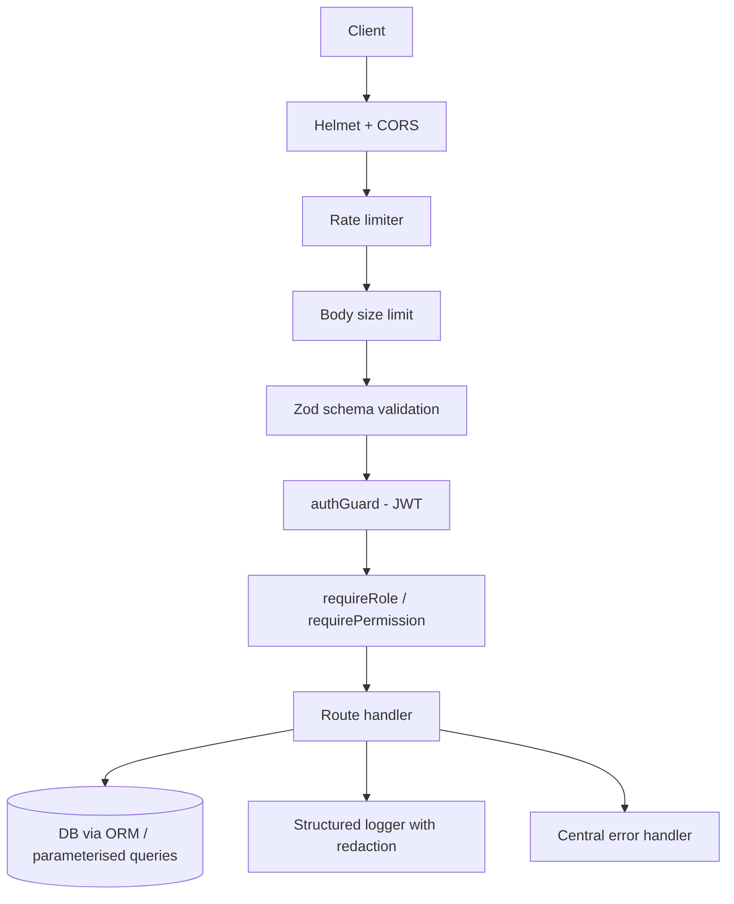

# Module 4 — Secure API Design (2 h)

## Learning objectives

By the end you can:

1. Apply the **OWASP API Top 10 (2023)** as a design checklist.
2. Validate every input with **Zod** (schema at the boundary).
3. Add security headers with **helmet** and configure **CORS** correctly.
4. Add **rate limiting** and **body size limits** (API4 defence).
5. Store passwords with **argon2**; never with plain SHA / MD5.
6. Design **error responses** that don't leak stack traces or secrets.
7. Add **structured, safe logging** that redacts sensitive fields.

---

## 1. The design mindset

Design the API assuming:

- Every input is hostile.
- Every internal service can eventually be compromised.
- Every log line will eventually be pasted into a support ticket.
- Every error path will be triggered — a lot.

Then design **layers**:



Break one layer → the next still stops the attack.

## 2. Validate at the boundary (Zod)

Rule: **the shape of `req.body`, `req.params`, `req.query` is unknown until you validate it.** Anything else is trust-by-typing.

```ts
import { z } from 'zod';

const CreateNote = z.object({
  title: z.string().min(1).max(200),
  body:  z.string().max(10_000),
}).strict();       // rejects extra keys

app.post('/notes', authGuard, (req, res) => {
  const parsed = CreateNote.safeParse(req.body);
  if (!parsed.success) return res.status(400).json({ error: 'invalid_body' });
  // parsed.data is typed AND safe
});
```

Package the pattern as a middleware:

```ts
const validate = (schema: z.ZodTypeAny) => (req, res, next) => {
  const parsed = schema.safeParse(req.body);
  if (!parsed.success) return res.status(400).json({ error: 'invalid_body' });
  req.body = parsed.data;
  next();
};
```

## 3. HTTP hardening

### helmet
```ts
import helmet from 'helmet';
app.use(helmet());     // sensible defaults: HSTS, X-Content-Type-Options, etc.
```

### CORS
```ts
import cors from 'cors';
app.use(cors({
  origin: ['https://app.example.com'],   // never "*" for authenticated APIs
  credentials: true,
}));
```

### Body size
```ts
app.use(express.json({ limit: '100kb' }));    // no more 100MB JSON DoS
```

### Rate limits
```ts
import rateLimit from 'express-rate-limit';
const authLimiter = rateLimit({ windowMs: 15 * 60_000, max: 10 }); // 10 login attempts / 15 min / IP
app.use('/auth', authLimiter);
```

## 4. Passwords: **argon2**, not SHA / MD5 / bcrypt-of-2010

```ts
import argon2 from 'argon2';

const hash = await argon2.hash(password, { type: argon2.argon2id, memoryCost: 19_456, timeCost: 2, parallelism: 1 });

// on login:
const ok = await argon2.verify(hash, submittedPassword);
```

Rules:

- Never store the plain password.
- Never log the plain password (or the hash).
- Use `argon2id` (or a modern `bcrypt` with cost ≥ 12 as a fallback).
- **Constant-time comparison** — the library's `verify` handles this for you.
- Return the **same** error and **same** timing for "no such user" vs "wrong password", to avoid user enumeration.

## 5. Error handling — fail closed, don't leak

Bad:
```ts
app.use((err, req, res, next) => {
  res.status(500).send(err.stack);   // ❌ leaks paths, versions, secrets
});
```

Good:
```ts
type AppError = Error & { status?: number; code?: string; expose?: boolean };

app.use((err: AppError, _req, res, _next) => {
  const status = err.status ?? 500;
  const body = {
    error: err.expose && err.code ? err.code : 'internal_error',
    // include a correlation id so support can find the full details in logs
    correlationId: (_req as any).correlationId,
  };
  logger.error({ err, status }, 'request failed');
  res.status(status).json(body);
});
```

Rules:

- Only leak error details for **4xx** (client-caused) responses, and only from a curated allow-list.
- All 5xx say "internal_error" — details live in the logs.
- Attach a **correlation id** to every request so support can trace incidents.

## 6. Logging: helpful, never revealing

Use `pino` with redaction:

```ts
import pino from 'pino';
export const logger = pino({
  redact: {
    paths: [
      'req.headers.authorization',
      'req.headers.cookie',
      'password',
      '*.password',
      'req.body.password',
    ],
    censor: '[REDACTED]',
  },
});
```

Never log:
- passwords, hashes, tokens (JWTs, refresh tokens, OAuth codes),
- API keys, DB URLs with credentials,
- full credit card / Aadhaar / PII payloads,
- session cookies.

## 7. Query safety — never string-concatenate

Bad:
```ts
db.$queryRawUnsafe(`SELECT * FROM notes WHERE title = '${title}'`); // ❌ SQLi
```

Good:
```ts
db.note.findMany({ where: { title } });                             // ✅ parameterised
```

If you must write raw SQL, use parameters:
```ts
db.$queryRaw`SELECT * FROM notes WHERE title = ${title}`;
```

## 8. IDs — prefer opaque, unguessable

- Auto-increment integers make BOLA easier (attacker iterates 1..N).
- Prefer **UUID v4** or **CUID**. Not a security control on its own — you still need ownership checks — but it stops trivial enumeration.

## 9. TLS, secrets, config

- **TLS** everywhere. Behind a reverse proxy: set `app.set('trust proxy', 1)` so `req.secure` and IP-based rate limits work.
- Secrets → env vars in dev, secret manager (Azure Key Vault, AWS Secrets Manager) in prod.
- Rotate secrets on a schedule; support **key IDs** (`kid`) in JWTs so rotation is graceful.
- Store no secrets in git. Add a **pre-commit hook** with `gitleaks` (Module 5).

## 10. OWASP API Top 10 — mapping to our stack

| # | Threat | Where we address it |
|---|---|---|
| API1 BOLA | Ownership check in every handler that reads a resource by id |
| API2 Broken authN | argon2 + JWT with whitelisted alg + refresh rotation |
| API3 Broken prop-level authZ | Zod `.strict()` schemas prevent role/permissions injection |
| API4 Unrestricted consumption | `express-rate-limit`, body size limit, pagination caps |
| API5 BFLA | `requireRole('admin')` on `/admin/*` routers |
| API6 Sensitive business flows | Rate-limit `/auth/register`, `/auth/login`, `/refresh` |
| API7 SSRF | No user-supplied URLs fetched server-side (validate allow-list if you must) |
| API8 Misconfig | `helmet`, tight CORS, prod error handler, no debug endpoints |
| API9 Inventory | Version APIs (`/v1/...`), retire old versions; document with OpenAPI |
| API10 3rd-party APIs | Timeouts, retries, schema-validate responses too |

## 11. Exercises

`exercises/README.md`. Highlights:

- Add a validation middleware.
- Add rate limits and body size limits.
- Refactor a password-store from SHA-256 to argon2.
- Replace a stack-trace-leaking error handler with a safe one.
- Add redacted structured logging with pino.

## Activity — Threat-model the Notes API (15 min)

Grab a whiteboard. Draw:
1. Client → Node.js API → Prisma → SQLite.
2. `/auth/*` (public), `/notes/*` (authed), `/admin/*` (admin-only).
3. For each of API1–API10, mark on the diagram where the mitigation lives. Any that don't map? Discuss why they don't apply (or where we're weak).

## Cheat-sheet

- **Every route** = validation + auth + authorization + rate limit.
- **Every input** = schema-parsed at the boundary.
- **Every error** = generic to client, detailed to logs, correlated by id.
- **Every log** = redacted for secrets.
- **Every secret** = env var, never code, never repo.

## Further reading

- OWASP API Security Top 10: https://owasp.org/API-Security/
- Zod: https://zod.dev
- Helmet defaults: https://helmetjs.github.io
- OWASP Password Storage Cheat Sheet: https://cheatsheetseries.owasp.org/cheatsheets/Password_Storage_Cheat_Sheet.html
- Pino redaction: https://getpino.io/#/docs/redaction
