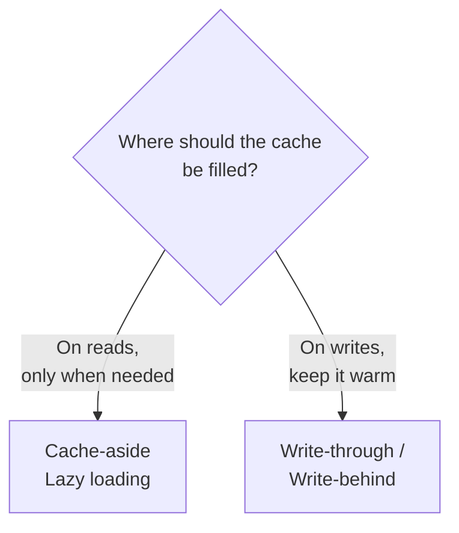
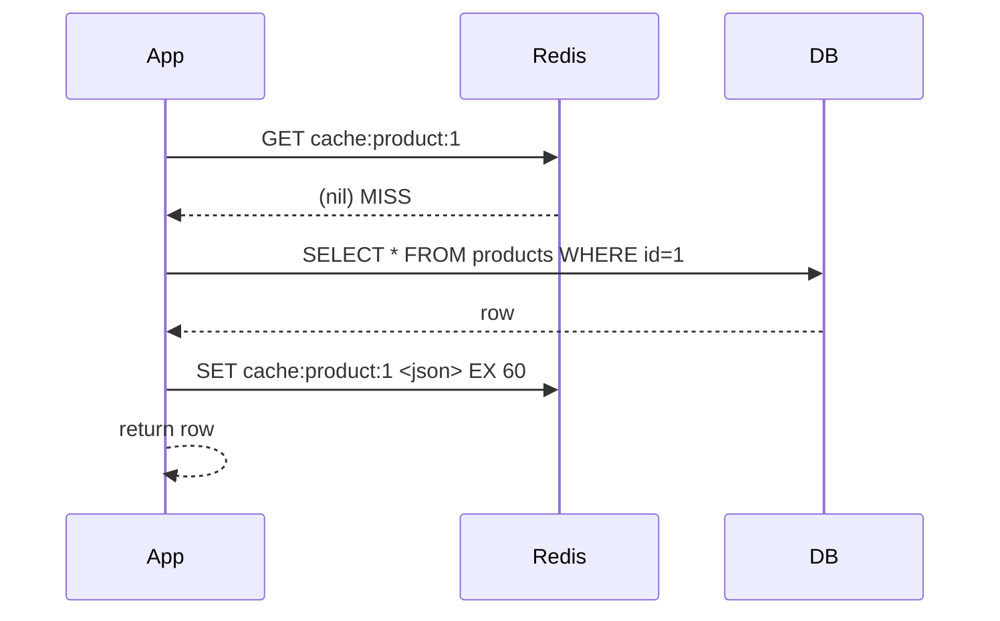
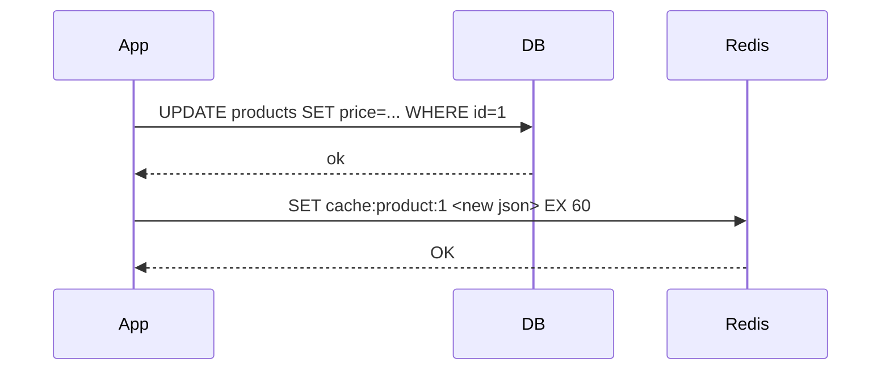
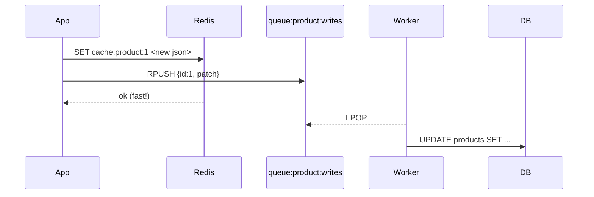

# Module 02 — Caching Strategies

**Duration:** 75 minutes
**Prereq:** Module 01 complete.
**Goal:** Pick the right cache strategy for a given endpoint and prove the speed-up with numbers.

---

## 2.1 The one question every cache decision starts with

> **Where does "fresh" come from — the read path or the write path?**

That question splits every caching pattern in two:



Add two more decisions and you've covered 95% of real systems:

- **When does data expire?** → TTL / stale-while-revalidate.
- **When something changes, who cleans up?** → invalidation.

---

## 2.2 The four patterns you must know

### Pattern A — Cache-aside (lazy loading)



- **Reads:** cache first; on miss, load from DB and warm the cache.
- **Writes:** update DB, then **delete** the cache key. Do not rewrite it.
- **Best for:** most read-heavy endpoints. This is the default. Start here.

Code: [`src/strategies/cacheAside.ts`](src/strategies/cacheAside.ts)

### Pattern B — Write-through



- **Writes:** write to DB **and** cache in the same request.
- **Best for:** "edit-then-view" flows where the next screen must show fresh data.
- **Cost:** writes are slower. Cache holds unread data.

Code: [`src/strategies/writeThrough.ts`](src/strategies/writeThrough.ts)

### Pattern C — Write-behind (write-back)



- **Writes:** write cache immediately, queue the DB write for later.
- **Best for:** counters, likes, view counts, analytics — where "eventually persisted" is fine.
- **Cost:** if the process dies before the queue drains, you lose writes. Use a real queue (BullMQ) in prod.

Code: [`src/strategies/writeBehind.ts`](src/strategies/writeBehind.ts)

### Pattern D — Read-through (aside for completeness)

Read-through is the same as cache-aside, but the cache library (not your app) fetches from the DB on miss. Node has fewer batteries-included read-through caches than Java/.NET — most Node teams just wrap it themselves. **Mentally, treat it as cache-aside.**

---

## 2.3 TTL — pick a number and defend it

```mermaid
flowchart LR
    S["How stale is 'too stale'<br/>for this endpoint?"] --> D{seconds?<br/>minutes?<br/>hours?}
    D -->|Prices, inventory| T1[10–60 s]
    D -->|Product name/description| T2[5–15 min]
    D -->|Categories / taxonomies| T3[1–24 h]
    D -->|Truly immutable<br/>(hash-of-content URL)| T4[No TTL]
```

Rules of thumb:

- **Never store without a TTL** unless the key is content-addressed (hash of the payload).
- **Randomize slightly** (`ttl + random(0, ttl/10)`) to avoid **thundering herd** when many keys expire at the same second.
- **Short TTL beats complex invalidation** — if unsure, use 60 s and move on.

---

## 2.4 Invalidation — the second hard thing in computer science

Two safe patterns:

1. **Delete on write** (cache-aside default). Simple, cheap, always correct.
2. **Version-tagged keys** — bump a version number instead of hunting keys.

```ts
// version-tagged key
const v = await redis.get("v:product") ?? "1";
const key = `cache:product:${id}:v${v}`;

// invalidate the entire family in one command
await redis.incr("v:product");
```

**Never** try to `KEYS cache:product:*` + delete in production — `KEYS` is O(N) and blocks the server.
Use version bumps or a dedicated set of active keys.

---

## 2.5 Install & run the demo

```powershell
cd 02-caching-strategies
npm install
npm run dev
```

You'll see:

```
caching demo on http://localhost:3002
```

Now open [`requests.http`](requests.http) in VS Code and click **Send Request** on each block.

**Observe:**

- First `GET /aside/products/1` → ~200 ms (a DB "sleep").
- Second → ~1–5 ms (cache hit).
- `PATCH /aside/products/1` → cache invalidated → next `GET` is slow again.
- Compare with `/through` — after a PATCH, `GET` is still fast.

Then run the bench:

```powershell
npm run bench
```

Sample output (yours will vary):

```
round 1 (miss)     : 205 ms
rounds 2..20 avg   : 2.1 ms
speed-up           : ~97.6x
```

---

## 2.6 Exercises (30 min)

### Exercise 2.6.1 — Add a "list products" endpoint with TTL 30s

Already stubbed at `GET /products` (see `src/server.ts`). Do this:

1. Confirm the first call is slow (~200 ms), subsequent calls are fast.
2. Wait 30 s. Confirm it goes slow again (TTL expired).
3. Add cache **invalidation** to `PATCH /aside/products/:id` for the list key so the list reflects the price change immediately. (Look at what `cacheAside.updateProduct` already does — extend it or add a note in `notes.md`.)

### Exercise 2.6.2 — Add TTL jitter

Open `src/cache.ts`. Add a helper:

```ts
export function ttlWithJitter(baseSeconds: number): number {
  return baseSeconds + Math.floor(Math.random() * (baseSeconds / 10));
}
```

Replace `EX TTL.product` uses with `EX ttlWithJitter(TTL.product)` in `cacheAside.ts` and `writeThrough.ts`. Restart, hit `GET /_cache/cache:product:1` twice fresh — TTL should differ slightly.

### Exercise 2.6.3 — Break cache-aside on purpose (thundering herd)

1. Set `DB_LATENCY_MS=1000` in your terminal and restart the server:
   ```powershell
   $env:DB_LATENCY_MS="1000"; npm run dev
   ```
2. Clear the cache: `docker exec redis-training redis-cli DEL cache:product:1`.
3. Fire 20 concurrent `GET /aside/products/1` (use `autocannon`, see Module 04, or just copy the RC block 20 times).
4. Observe: all 20 requests miss the cache and hit the DB → 20 × 1 s waits.
5. **Fix idea:** use a per-key mutex with `SET NX EX` so only one request loads while the others wait. Sketch the code in `notes.md` — we'll implement in Module 06.

---

## 2.7 Activity — "pick the strategy" quiz (10 min)

Trainer reads each row, participants shout the answer. No wrong answers if the reasoning holds.

| Endpoint                                | Reasonable choice + TTL          |
|-----------------------------------------|----------------------------------|
| `GET /products/:id` (public catalog)    | Cache-aside, TTL 5 min           |
| `GET /me` (current user, hits every page) | Cache-aside, TTL 30 s, keyed by userId |
| `POST /like` (bump a like count)        | Write-behind (counter in Redis)  |
| `GET /admin/inventory` (staff, must be fresh) | No cache, or TTL 5 s        |
| `PUT /profile` then redirect to `/profile`  | Write-through                |
| `GET /categories` (rarely changes)      | Cache-aside, TTL 24 h + version bump on edit |
| `GET /orders/:id` (contains price at time of order) | Cache-aside, long TTL, invalidate on refund |

---

## 2.8 AI reflection prompt

Paste into ChatGPT / Claude and save the answer:

> "Here are three endpoints from an Express app:
> 1. `GET /products/:id` — read 10k/min, price changes rarely.
> 2. `POST /orders/:id/like` — write-heavy, exact count not critical.
> 3. `PUT /users/:id` — user edits their profile and redirects to `/me`.
>
> For each, recommend a caching strategy (cache-aside / write-through / write-behind), a TTL, an exact Redis key pattern, and one gotcha to watch for. Reply as a 3-row markdown table."

Keep the answer — you'll compare it against your own choices in Module 05.

---

## Done? ✅

- Server runs, all three prefixes respond, cache hits are visibly faster.
- `npm run bench` prints a ≥ 10× speed-up.
- You added TTL jitter and reproduced (and understand the fix for) the thundering herd.

➡ Next: [../03-rate-limiting/README.md](../03-rate-limiting/README.md)
