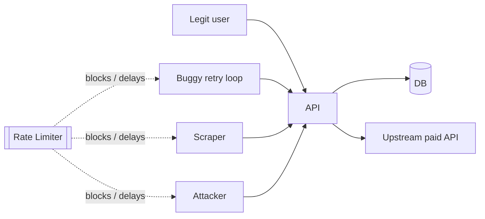
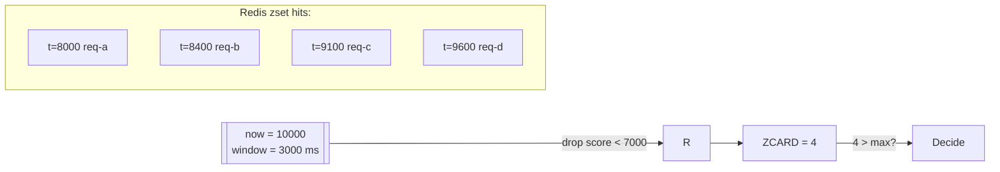

# Module 03 — Rate Limiting Basics

**Duration:** 45 minutes
**Prereq:** Module 01 (you know sorted sets), Module 02 (Express + Redis + middleware).
**Goal:** Protect an endpoint with a Redis-backed limiter, understand fixed vs sliding windows, apply per-user tiers.

---

## 3.1 Why rate limit?



You rate-limit to:

- **Protect your dependencies** — DB, third-party APIs (SMS, LLMs, payment).
- **Enforce business tiers** — free vs paid users get different budgets.
- **Slow abuse** — brute-force logins, scraping, DoS.

---

## 3.2 The two algorithms you'll actually use

### Fixed window

```mermaid
gantt
    dateFormat  X
    axisFormat  %S
    title Fixed window (5 requests / 10s) — burst problem at boundary
    section Window A (0-10s)
    5 requests at t=9s   :done, a, 9, 1
    section Window B (10-20s)
    5 requests at t=10s  :done, b, 10, 1
```



- **Idea:** counter per key + TTL = window size.
- **Pro:** 1 Redis command, dirt cheap.
- **Con:** up to **2× the limit** can pass in ~1 second at the boundary (last second of window A + first second of window B).

### Sliding window



- **Idea:** store timestamps in a sorted set, drop old ones, count what's left.
- **Pro:** truly rolling, no boundary burst.
- **Con:** a few more Redis ops per request (still cheap in a pipeline).

### Others you'll hear about (skip for today)

- **Token bucket / leaky bucket** — smooths bursty traffic. Great for outbound calls to paid APIs.
- **Distributed with Lua** — fully atomic under contention. Needed for hyper-strict billing limits.

We stick to fixed + sliding today.

---

## 3.3 The library — `rate-limiter-flexible`

`rate-limiter-flexible` is the de-facto Node library. It ships a `RateLimiterRedis` class that stores counters in Redis for you.

Key config:

| Option     | Meaning                                             |
|------------|-----------------------------------------------------|
| `keyPrefix`| Redis key namespace (e.g. `"rl:login"`)             |
| `points`   | Max requests per window                             |
| `duration` | Window size in **seconds**                          |
| `blockDuration` | Optional cooldown once limit hit               |

Basic usage:

```ts
const limiter = new RateLimiterRedis({
  storeClient: redis,
  keyPrefix: "rl:login",
  points: 5,
  duration: 60,
});

try {
  await limiter.consume(req.ip, 1);
  // allowed
} catch (r) {
  // r is RateLimiterRes — includes msBeforeNext
  res.status(429).json({ retryAfterSeconds: Math.ceil(r.msBeforeNext / 1000) });
}
```

**Note:** `rate-limiter-flexible`'s Redis limiter is fixed-window. For sliding, we roll our own with a sorted set (see `slidingWindow.ts`) — it's ~15 lines and reinforces Module 01.

---

## 3.4 Install & run

```powershell
cd 03-rate-limiting
npm install
npm run dev
```

Try each endpoint from [`requests.http`](requests.http) or with the hammer script:

```powershell
# 20 requests, fixed window 5/10s -> expect ~5 200s and ~15 429s
npx ts-node src/hammer.ts http://localhost:3003/fixed 20

# Same for sliding
npx ts-node src/hammer.ts http://localhost:3003/sliding 20
```

Sample output:

```
Firing 20 concurrent requests at http://localhost:3003/fixed...
in 122 ms:  200=5   429=15   other=0
```

Wait 10 s, run again — you get a fresh 5 allowed.

---

## 3.5 Response headers (do this, always)

The middleware sets these standard headers:

```
RateLimit-Limit: 5
RateLimit-Remaining: 3
RateLimit-Reset: 7
Retry-After: 7      (only on 429)
```

- Follow the IETF draft header names — clients / SDKs read them.
- Return **HTTP 429 Too Many Requests** (not 403, not 503).
- Include `retryAfterSeconds` in the JSON body for humans.

---

## 3.6 Choosing the key

The **key** decides who gets throttled together. Pick carefully.

| Key strategy       | Use when                                       |
|--------------------|------------------------------------------------|
| `req.ip`           | Public unauthenticated endpoints               |
| `userId`           | Authenticated endpoints (fairest)              |
| `apiKey`           | Third-party integrations                       |
| `userId + endpoint`| Different budgets per endpoint (login vs read) |
| `tenantId`         | Multi-tenant SaaS — protect noisy neighbours   |

**Anti-patterns**:
- Global single key — one bad user blocks everyone.
- `req.ip` alone behind a load balancer — everyone shares the LB IP → set `app.set('trust proxy', true)` and let Express read `X-Forwarded-For`.

---

## 3.7 Exercises (25 min)

### Exercise 3.7.1 — Login brute-force protection

Create `src/middleware/login.ts`:

- 5 attempts per IP per 15 minutes.
- On the 6th attempt, block for 30 minutes (`blockDuration: 30 * 60`).
- Return `{ error: "too_many_attempts", retryAfterSeconds }`.

Wire it as `POST /login`. Verify with 6 fast requests in `requests.http`.

### Exercise 3.7.2 — Per-endpoint budget

Add two endpoints:

- `GET /search` — 30/min per IP (cheap).
- `POST /generate` — 5/min per IP (expensive; imagine it calls an LLM).

Use one `RateLimiterRedis` per endpoint, each with its own `keyPrefix`.

### Exercise 3.7.3 — Prove the boundary burst

1. Warm the fixed limiter with 5 requests at second 9 (of a 10-s window). They all succeed.
2. Wait 1 second. Fire 5 more at second 10. They also all succeed.
3. That's **10 requests in ~1 second**, twice the intended limit.
4. Repeat on `/sliding`. You'll only ever get 5 through in any 10-s span.

Record the numbers in `notes.md`.

---

## 3.8 Activity — design 3 real limiters (10 min)

In pairs, design (don't code) `points`, `duration`, and `key` for:

1. **Password reset request** — sends an email. Abused = spam.
2. **Public product search** — high traffic, hate false positives.
3. **Payment webhook receiver** — trusted signed callers, but retry storms happen.

Then check answers against Copilot: highlight your row, `Ctrl+I` in chat: *"Review this rate-limit config for a Node/Express endpoint. What am I missing?"*

Reasonable answers to compare against:

| Endpoint             | points | duration | key                         | Notes                              |
|----------------------|-------:|---------:|-----------------------------|------------------------------------|
| Password reset       |      3 |   3600 s | `email` (not IP)            | Also add captcha at 2nd attempt.   |
| Public search        |    120 |     60 s | `req.ip`                    | Serve stale results on 429.        |
| Payment webhook      |    500 |     60 s | `senderId` from signature   | Whitelist known IPs, then limit.   |

---

## 3.9 AI reflection prompt

Save the answer in `notes.md`:

> "I'm building a URL shortener API in Node/Express with Redis. I need to rate-limit:
> 1. `POST /shorten` — anonymous and authenticated.
> 2. `GET /:code` — the public redirect. Millions/day.
> 3. `GET /analytics/:code` — the owner reads click stats.
>
> For each, recommend algorithm (fixed / sliding), points, duration, key, and one attack it prevents. Reply as a markdown table."

Keep this — you'll wire these limits into the Module 06 capstone.

---

## Done? ✅

- Server runs, all four endpoints respond, `/fixed` and `/sliding` return 429 correctly.
- `hammer.ts` shows the expected number of 200s / 429s.
- You explained (in your own words) the boundary-burst problem.

➡ Next: [../04-performance-profiling-ai/README.md](../04-performance-profiling-ai/README.md)
