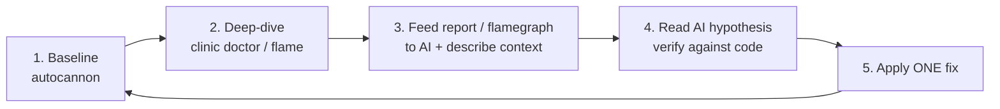

# Module 04 — Performance Profiling with AI

**Duration:** 60 minutes
**Prereq:** Modules 01–03. Redis running.
**Goal:** Measure a live Node.js service, produce an artefact (autocannon report, flamegraph), and let an AI point out the bottlenecks.

---

## 4.1 The profiling loop



Rules:

- **Measure before and after** every change. Never "optimize" from feelings.
- **Change one thing at a time**, or you won't know which change helped.
- **AI accelerates step 3 & 4** — it will guess wrong sometimes; you verify against code.

---

## 4.2 The two tools you'll use today

| Tool          | What it does                                          | When                                    |
|---------------|-------------------------------------------------------|-----------------------------------------|
| `autocannon`  | HTTP load generator. Prints RPS, latency p50/p99, errors | Every time — quick, no setup           |
| `clinic doctor` | Runs your app under a probe, detects the type of bottleneck (event loop / GC / I/O) | When autocannon shows slow p99 |
| `clinic flame`  | CPU flamegraph — where time is spent in JS          | When `doctor` says "CPU-bound"          |

You'll also see `clinic bubbleprof` (async wait graph) — mention it, don't use it today.

---

## 4.3 Install & start the "slow" server

```powershell
cd 04-performance-profiling-ai
npm install
npm run dev
```

It exposes 6 endpoints. **Do not open the source yet** — try to find the smells with tools, not by reading.

Hit each once with [`requests.http`](requests.http) to sanity-check. You'll notice `/hot`, `/cpu`, `/n-plus-1`, `/all`, `/broken-cache/1` all feel slow.

---

## 4.4 Step 1 — Baseline with autocannon

Leave the server running in one terminal. In a **second** terminal:

```powershell
cd 04-performance-profiling-ai
npm run load:small       # 10 concurrent, 10 seconds
```

`autocannon` prints something like:

```
┌─────────┬──────┬──────┬───────┬───────┬─────────┬─────────┬───────────┐
│ Stat    │ 2.5% │ 50%  │ 97.5% │ 99%   │ Avg     │ Stdev   │ Max       │
├─────────┼──────┼──────┼───────┼───────┼─────────┼─────────┼───────────┤
│ Latency │ 55 ms│ 82 ms│ 156 ms│ 190 ms│ 88.7 ms │ 24.5 ms │ 342 ms    │
└─────────┴──────┴──────┴───────┴───────┴─────────┴─────────┴───────────┘
...
125 requests in 10.03s
```

**Copy the whole output** into `notes.md`. This is your baseline.

Now try the more painful endpoints (edit the URL in `package.json` or use the raw command):

```powershell
npx autocannon -c 20 -d 10 http://localhost:3004/cpu
npx autocannon -c 20 -d 10 http://localhost:3004/n-plus-1
npx autocannon -c 20 -d 10 http://localhost:3004/broken-cache/1
```

Record each in `notes.md`.

---

## 4.5 Step 2 — Deep-dive with clinic doctor

Stop the server (`Ctrl+C`). Run:

```powershell
npm run clinic:doctor
```

Clinic starts the server; **from a second terminal**, drive load:

```powershell
npx autocannon -c 20 -d 15 http://localhost:3004/cpu
```

Then `Ctrl+C` the clinic terminal. It generates an HTML report and opens it in your browser.

The report headline will be one of:

- **"Detected potential I/O issue"** → time waiting on DB / network
- **"Detected potential CPU issue"** → synchronous work on the event loop
- **"Detected potential event-loop delay"** → any blocking work

For `/cpu`, expect a CPU-issue verdict.

If you see a CPU verdict, follow up with a flamegraph:

```powershell
npm run clinic:flame
# in second terminal:
npx autocannon -c 20 -d 15 http://localhost:3004/cpu
```

The flamegraph shows **wider = more time**. The `sha256` frame in `/cpu` should be a fat plateau near the top.

---

## 4.6 Step 3 — Let the AI read the report

You now have two artefacts:
1. Autocannon numbers (text)
2. Clinic doctor verdict + flamegraph screenshot (or the top functions text)

**Copilot Chat prompt (in VS Code):**

Open `src/slowServer.ts`, then in Copilot Chat:

> Attach the file. Ask:
>
> "Here is my Express app. I load-tested `/hot`, `/cpu`, `/n-plus-1`, `/broken-cache/1` with autocannon at 20 concurrency for 10s. Latencies (p50 / p99): /hot 88/190 ms, /cpu 900/1400 ms, /n-plus-1 620/1100 ms, /broken-cache/1 95/210 ms. Clinic Doctor flagged CPU for /cpu. For each endpoint, list the specific line(s) that are the bottleneck, name the anti-pattern, and propose the smallest fix. Reply as a markdown table with columns: endpoint | anti-pattern | fix | expected improvement."

**ChatGPT / Claude prompt** (for the flamegraph screenshot):

> "Attached is a Node.js CPU flamegraph. My hot function is `sha256` in a loop inside an HTTP handler. What are my 3 options to fix this without changing the CPU work itself?"
>
> (Expected answer: worker_threads / offload to a queue / cache the result.)

**Save both AI outputs into `notes.md`** — you will grade them in Module 05.

---

## 4.7 Step 4 — Apply ONE fix, remeasure

Pick the easiest fix from the AI's list. Sample fixes for each endpoint:

| Endpoint         | One-line fix                                                     |
|------------------|------------------------------------------------------------------|
| `/hot`           | Wrap DB call with cache-aside (Module 02 pattern)                |
| `/cpu`           | Move sha256 loop to `worker_threads` or memoize by input         |
| `/n-plus-1`      | Replace loop with `redis.mget(keys)` or a `redis.pipeline()`     |
| `/all`           | Add `?page=&limit=`; default `limit=20`                          |
| `/broken-cache`  | Remove `Date.now()` from the key                                 |

Apply **one** fix in `slowServer.ts`. Rerun the same `autocannon` command. Compare latency and RPS.

**Record before/after in `notes.md`** — this is proof-of-work.

---

## 4.8 Exercises (30 min)

### Exercise 4.8.1 — Fix `/n-plus-1` two ways

1. First fix with `redis.pipeline()`. Measure.
2. Then fix with `redis.mget(...keys)`. Measure.
3. Which is faster? Why? (Hint: MGET is one command, pipeline is many commands in one round-trip. Both are ~1 round-trip; MGET is slightly cheaper because Redis parses one command.)

Record both numbers.

### Exercise 4.8.2 — Cache `/hot` correctly

Add cache-aside with `EX 30`. Rerun `npm run load:big`.

Expected improvement: **~10× RPS**, p99 down to <10 ms.

### Exercise 4.8.3 — Diagnose without seeing code

A teammate says:

> "Our `/reports` endpoint is fast when I hit it alone (~50 ms) but under load p99 explodes to 3 s."

Write, in `notes.md`, **three hypotheses** with one Redis / clinic experiment to test each. Sample answers:

1. Sync CPU work blocking event loop → `clinic doctor`, look for event-loop delay.
2. External API rate-limiting or slow → check timing; add per-call log.
3. DB connection pool exhaustion → check pool size + queue wait.

---

## 4.9 Activity — "read this flamegraph" quiz (5 min)

Trainer shows a mystery flamegraph (screenshot from any real project) and asks the room:

- Which frame is the widest?
- Is it inside your code or a library?
- Is it CPU-bound (deep stacks, wide leaves) or GC / event-loop (rectangular gaps)?
- What's your first hypothesis?

No wrong answers — build the reading habit.

---

## 4.10 AI reflection prompt

> "Summarise, in one paragraph a fresher can memorise, the difference between:
> 1. Latency p50 vs p99
> 2. Throughput (RPS) vs concurrency
> 3. CPU-bound vs I/O-bound bottleneck
>
> Then give me one 'first thing to check' for each of the three, using Node.js tools."

Paste the answer into `notes.md`. This becomes vocabulary for Module 05.

---

## Done? ✅

- Autocannon numbers captured for `/hot`, `/cpu`, `/n-plus-1`, `/broken-cache/1`.
- Clinic Doctor report generated at least once.
- Applied one fix, measured a real improvement, recorded before/after.
- AI produced a bottleneck table and a flamegraph interpretation.

➡ Next: [../05-ai-caching-recommendations/README.md](../05-ai-caching-recommendations/README.md)
