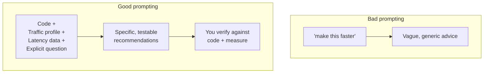

# Module 05 — AI-Driven Caching & Bottleneck Recommendations

**Duration:** 45 minutes
**Prereq:** Module 04 (you have a `notes.md` full of load-test numbers + Copilot outputs).
**Goal:** Use AI **as a code reviewer for performance**, not just a search engine. Learn a repeatable review workflow you can run on any codebase next week.

---

## 5.1 What "AI-assisted review" actually is



Three ingredients turn AI from a chat toy into a review tool:

1. **The code** — attach the file or paste the function.
2. **The context** — request rate, endpoint hotness, latency numbers, what infra is available (Redis? worker threads?).
3. **The explicit question** — "recommend cache key + TTL + invalidation strategy" beats "review my code".

---

## 5.2 The 5-prompt review workflow

Run this for every hot endpoint you own. Each prompt is a reusable template — a copy is in [`prompts.md`](prompts.md).

### Prompt 1 — Endpoint classification

> "Here is my endpoint code and its traffic profile:
> ```
> <paste code>
> ```
> Traffic: **{reads/min}** reads, **{writes/min}** writes. Response shape: **{JSON, size ~X KB}**. Freshness tolerance: **{seconds/minutes}**.
>
> Classify it as: **read-heavy / write-heavy / mixed / real-time**. Justify in one sentence."

### Prompt 2 — Cache key + TTL recommendation

> "Given the classification above and that I have Redis available, recommend:
> 1. Cache key pattern (exact string).
> 2. Value shape (raw JSON / hash / compressed).
> 3. TTL in seconds, with a jitter range.
> 4. Invalidation trigger (which write invalidates which key).
> 5. One failure mode this **doesn't** protect against.
>
> Reply as a 5-row markdown table. Be specific — no 'depends on your case'."

### Prompt 3 — Bottleneck identification

> "Here is an autocannon report at concurrency **{N}** for **{D}s**:
> ```
> <paste autocannon output>
> ```
> Here is the endpoint code:
> ```
> <paste code>
> ```
> Rank the top 3 bottlenecks by expected impact, with:
> - Line number(s)
> - Anti-pattern name
> - Smallest possible fix
> - How I'd verify the fix worked (one sentence)"

### Prompt 4 — Rate-limit recommendation

> "Recommend a rate limiter for this endpoint:
> - Users: **{authenticated / anon / mixed}**
> - Business tiers: **{list them}**
> - Threat model: **{brute force? scraping? cost control?}**
> - Downstream cost per request: **{cheap / DB / external paid API}**
>
> Give: algorithm (fixed / sliding / token-bucket), points, duration, key, response body, and one edge case to test."

### Prompt 5 — Verification checklist

> "Before I ship these changes, list 5 things I should measure or log **in production** to catch regressions. Focus on: cache hit ratio, p99 latency, 429 rate, Redis memory usage, and one 'silent failure' signal I would otherwise miss."

---

## 5.3 The sample review — do it now

Open the file [`sample-code.ts`](sample-code.ts). It's a short "product detail" endpoint with obvious and non-obvious problems.

**Do all 5 prompts on this file** using Copilot Chat or ChatGPT. Timebox 20 minutes.

Fill in the traffic profile as: **500 reads/min, 5 writes/min, JSON ~2 KB, product price can be stale up to 30 s**.

Paste every AI response into `review.md` in this folder.

---

## 5.4 Grading the AI — what to accept, reject, verify

For each recommendation the AI gives, tick one:

- ✅ **Accept** — matches your Module 02/03 mental model.
- 🔍 **Verify** — plausible, but I need to test.
- ❌ **Reject** — wrong or misleading. Write down why.

Common AI mistakes to watch for:

| AI often says…                             | Reality check                                        |
|--------------------------------------------|------------------------------------------------------|
| "Use `KEYS pattern` to invalidate"         | Never in production — use version tag or explicit del |
| "Cache forever"                            | Almost always needs a TTL — set one                  |
| "Increase pool size"                       | First check if you're blocking the event loop        |
| "Use `EVAL` with Lua"                      | Overkill for basics — try MULTI/pipeline first       |
| "Add a message queue"                      | Fine for write-behind; overkill for a slow SELECT    |
| Suggests a specific TTL with no reasoning  | Ask "why that number?"                               |

---

## 5.5 Comparing Copilot Chat vs ChatGPT / Claude

You'll notice each is better at different things:

| Task                                       | Best tool                                     |
|--------------------------------------------|-----------------------------------------------|
| "What's wrong with this file open in VS Code?" | Copilot Chat (has file context automatically) |
| "Analyze this flamegraph screenshot"       | ChatGPT / Claude (image reasoning)            |
| "Refactor to add cache-aside"              | Copilot Chat + `Ctrl+I` inline edit           |
| "Explain this architecture"                | Either; longer context = ChatGPT/Claude       |
| "Grade my design against production best practice" | ChatGPT / Claude (no file bias)      |

Rule: **Copilot for writing code, ChatGPT/Claude for reasoning about it.**

---

## 5.6 Exercise — review your capstone plan (10 min)

You already know the capstone is a URL shortener. Before you build it (Module 06):

1. Write down 3 endpoints you know it needs. E.g.:
   - `POST /shorten`
   - `GET /:code` (public redirect)
   - `GET /analytics/:code`
2. Fill in a traffic profile for each (guess reasonably).
3. Run **Prompt 2 (cache) + Prompt 4 (rate limit)** on each.
4. Save all 6 outputs into `capstone-plan.md`.

You will follow these recommendations in Module 06.

---

## 5.7 Activity — spot the bad advice (5 min)

Below is a real answer an LLM once gave. Find at least 3 problems.

> "For your URL shortener, cache every short code in Redis forever with `SET code target`. On lookup, if not found in Redis, generate a new code. Rate limit by using `MULTI` around every request. Store analytics as a JSON blob keyed by day."

<details>
<summary>Answers (peek only after trying)</summary>

- **"Cache forever"** — leaks memory. Add TTL or bound the working set.
- **"If not found in Redis, generate a new code"** — treats cache as source of truth; a cache eviction breaks existing short URLs. DB is the source of truth.
- **"`MULTI` around every request"** — MULTI is not a rate limiter, it's a transaction. Wrong tool.
- **"Store analytics as JSON blob per day"** — every click has to read-modify-write the whole blob. Use `INCR` counters or a stream/zset per day.

</details>

---

## 5.8 Wrap — the personal AI-review checklist

Copy this into your permanent notes.

```markdown
When reviewing perf with AI:
1. Attach code (not description).
2. Include: RPS, latency p50/p99, endpoint hotness, freshness tolerance, infra available.
3. Ask ONE explicit question at a time.
4. Demand: exact key, exact TTL, exact invalidation trigger, one failure mode.
5. Grade every recommendation ✅ / 🔍 / ❌.
6. Verify by measuring, not by feelings.
```

---

## Done? ✅

- `review.md` has 5 prompt outputs for the sample code.
- `capstone-plan.md` has cache + rate-limit plans for 3 shortener endpoints.
- You spotted at least 3 problems in the "bad advice" example.

➡ Next (the fun part): [../06-capstone-url-shortener/README.md](../06-capstone-url-shortener/README.md)
