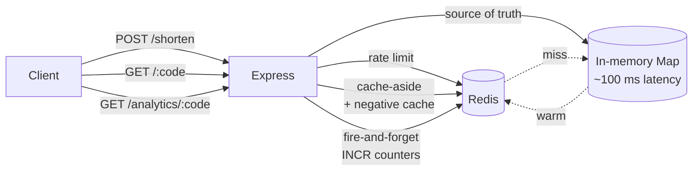
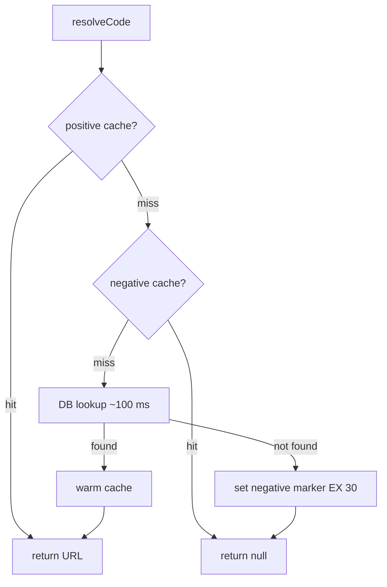

# Module 06 — Capstone: URL Shortener End-to-End

**Duration:** 120 minutes (60 min guided build + 30 min AI review + 30 min ship & show)
**Prereq:** Modules 00–05.
**Goal:** A production-shaped URL shortener that applies **every** idea from the day and comes with an **AI-authored performance review** you can commit to your repo.

---

## 6.1 What you're building



Features:

- `POST /shorten` — creates a short code, rate-limited per IP.
- `GET /:code` — the **hot path**: cache-aside + negative cache + write-behind analytics.
- `GET /analytics/:code` — owner-only, rate-limited per user.
- `GET /me/urls`, `DELETE /:code` — owner ops.
- `/_stats` — live cache & Redis stats you can screenshot.

The tech is exactly what we learned: Express, `ioredis`, `rate-limiter-flexible`, `nanoid`, TypeScript strict mode.

---

## 6.2 The design decisions (from Module 05 outputs)

You already produced a `capstone-plan.md` in Module 05. Compare against these choices:

| Concern              | Choice                                        | Why                                    |
|----------------------|-----------------------------------------------|----------------------------------------|
| Cache key            | `s:cache:url:<code>`                          | Short, greppable, namespaced           |
| Value                | Raw target URL (a string)                     | Redirect only needs the URL            |
| TTL                  | 1 h + up to 5 min jitter                      | Codes are ~immutable; jitter avoids stampede |
| Missing codes        | Negative cache 30 s (`s:neg:<code>`)          | Protects DB from 404-flood attackers   |
| Invalidation         | On DELETE only (create is write-through)      | Simplest correct model                 |
| Analytics writes     | Fire-and-forget `INCR` pipeline               | Redirect must never wait               |
| Rate-limit /shorten  | 20 req / min / IP (fixed)                     | Cheap ops; abuse = spam                |
| Rate-limit /:code    | 300 req / min / IP (fixed)                    | Public hot path; loose but real cap    |
| Rate-limit analytics | 60 req / min / owner                          | Owner-only; per-user, not IP           |

If your plan differed, **that's fine** — talk it through with a neighbour before starting.

---

## 6.3 Step-by-step build (60 min, prompt-driven)

Do each step **in order**. After each step, run `npm run dev` and hit the corresponding endpoint from `requests.http`.

### Step 0 — Bootstrap

```powershell
cd 06-capstone-url-shortener
copy .env.example .env
npm install
```

Start Redis (if you didn't already):

```powershell
docker compose up -d          # or use your Module 00 container
docker ps
```

Sanity check:

```powershell
npm run dev
# open http://localhost:3006 in a browser -> see the JSON directory
```

Stop the server (`Ctrl+C`) — we'll walk through the code.

### Step 1 — Config & Redis client

Open [`src/config.ts`](src/config.ts) and [`src/redis.ts`](src/redis.ts).

**Copilot Chat prompt:** open `src/config.ts` and ask:

> "Explain what each TTL and rate-limit number in this file means for a URL shortener with 100k redirects/day. Flag any number that feels wrong for that scale."

Notice how `K` (the key builder) forces a consistent prefix.

### Step 2 — In-memory "database"

Open [`src/db.ts`](src/db.ts). It's a `Map` with sleep-simulated latency.

**Trainer note:** the `dbLatencyMs=100` means every miss costs 100 ms. That's what makes the cache visibly worth it — same pattern you saw in Module 02.

### Step 3 — Shortener logic (cache-aside + negative cache + write-through create)

Open [`src/shortener.ts`](src/shortener.ts). Read `resolveCode()` carefully — it has 4 tiers:



**Copilot prompt** to reinforce learning:

> Highlight `resolveCode`. Ask: "Explain why the negative cache line is here. What real-world attack does it defend against?"

### Step 4 — Analytics (write-behind pattern)

Open [`src/analytics.ts`](src/analytics.ts) and see `recordClickFireAndForget` in `shortener.ts`.

Notice: the redirect handler **does not `await`** the click record. That's write-behind.

### Step 5 — Rate limiting

Open [`src/middleware/rateLimit.ts`](src/middleware/rateLimit.ts). One factory, three limiters.

**Copilot prompt:** highlight the file, ask:

> "For each of the three limiters, name a specific attack this configuration blocks and one it doesn't."

### Step 6 — Toy auth

Open [`src/middleware/auth.ts`](src/middleware/auth.ts). The `x-user-id` header **is** the identity. Ugly on purpose — the point of the day is caching, not OAuth.

### Step 7 — Wire the server

Open [`src/server.ts`](src/server.ts). Note the order:

1. Body parser + `trust proxy`.
2. `fakeAuth` for every request.
3. Meta routes first.
4. Owner routes.
5. **`/:code` LAST** — otherwise it would swallow `/analytics/...`, `/me/urls`, `/_stats`.

### Step 8 — Run it end-to-end

```powershell
npm run dev
```

Then in [`requests.http`](requests.http) walk through the 10 blocks in order.

**Observe:**

- First redirect after a create → cache hit (write-through warmed it).
- After you `DELETE`, redirect returns 404.
- Second call to `/nope123` returns 404 without a DB latency (~100 ms → ~2 ms) — negative cache in action.
- Analytics increases as you hit the redirect.

### Step 9 — Load test the hot path

Create a code (say `abc1234`) manually. Then:

```powershell
npx autocannon -c 50 -d 20 http://localhost:3006/abc1234
```

Sample expectation (your numbers will vary):

```
Latency  p50 ~3 ms   p99 ~15 ms   RPS ~9k
```

Then **cold** the cache and try again:

```powershell
docker exec shortener-redis redis-cli FLUSHALL
npx autocannon -c 50 -d 20 http://localhost:3006/abc1234
```

- First few hundred requests will hit the DB (100 ms each) — expect a big p99 spike.
- Once warm, latency returns to hot-path numbers.

**Save both numbers.** They're the input for the AI review below.

### Step 10 — Tests (optional but recommended)

```powershell
npm test
```

Should pass 3 tests. If not, read the errors — it's usually Redis connectivity.

---

## 6.4 AI performance review (30 min)

Now use Module 05's workflow to review your own capstone.

1. In VS Code, open `src/server.ts`, `src/shortener.ts`, `src/analytics.ts`.
2. In Copilot Chat, attach all three files and run **Prompt 3** (bottleneck identification) from `../05-ai-caching-recommendations/prompts.md`. Paste your load-test numbers.
3. Then run **Prompt 6** (grade my fix) — use `src/shortener.ts` as the "fix" for the naive version described in `sample-code.ts` (Module 05).
4. Save the answers in `AI-REVIEW.md`.

Also, ask ChatGPT / Claude the "big picture" question:

> "I built a URL shortener in Node.js + Express + Redis + ioredis. The hot path is cache-aside for `code -> target`. Analytics is a fire-and-forget INCR pipeline. Rate limits are per-IP (fixed window) via rate-limiter-flexible. What are the top 3 things I'd hit at 100 RPS that I'm not prepared for? Reply as a numbered list with expected symptom and mitigation."

Expected answers usually include:

- **Cache stampede on a hot code that just expired** → mitigation: probabilistic early refresh, or `SET NX` mutex.
- **Redis single-point-of-failure** → mitigation: Redis Sentinel or cluster; fall back to DB read.
- **`nanoid` collision at scale** → mitigation: longer code, or check-and-retry (we already do).

Paste all of it into `AI-REVIEW.md`.

---

## 6.5 Ship & show (30 min)

In your `AI-REVIEW.md`, write **3 concrete improvements** you'd make in a next iteration. Examples:

1. Replace the in-memory Map with SQLite via `better-sqlite3`.
2. Add a `SET NX EX` mutex around the DB read to prevent stampede.
3. Move click counters into Redis Streams for retention and per-hour rollups.

Then, in groups of 2–3:

- Screen-share `/_stats` after 200+ redirects.
- Share your autocannon numbers.
- Read out your AI review's top finding.

Everyone leaves with a runnable repo, a load-test report, and an AI-authored review — the exact deliverables a senior engineer expects from a perf ticket.

---

## 6.6 What to commit

Push (or zip) this folder. Include:

```
06-capstone-url-shortener/
├── src/
├── tests/
├── requests.http
├── docker-compose.yml
├── package.json
├── tsconfig.json
├── AI-REVIEW.md      <- your Module 05 + capstone AI answers
├── LOAD-REPORT.md    <- autocannon numbers, before/after
└── README.md
```

---

## 6.7 Stretch goals (only if time left)

Pick one:

- **Stampede protection** — implement a `SET NX EX 5` mutex around `dbGet` inside `resolveCode`. Prove with 100 concurrent requests on a cold code.
- **Per-tier rate limits** — split `/shorten` into `free=20/min`, `pro=200/min` (add an `x-tier` header, mirror Module 03 `perUser.ts`).
- **Analytics rollup** — every minute, take the last 60 seconds of clicks and push into a sorted set with hourly buckets. (Hint: `setInterval` + `ZINCRBY`.)
- **Persistence** — swap the `Map` for `better-sqlite3`. Only the `db.ts` file should change.

---

## Done? ✅

- `POST /shorten` → `GET /:code` → `GET /analytics/:code` all work end-to-end.
- `autocannon -c 50 -d 20 /<code>` shows sub-10ms p50 on warm cache.
- `AI-REVIEW.md` exists, references your load numbers, and lists 3 concrete next steps.
- You can explain, in 60 seconds, why each Redis key exists in your app.

---

## Congratulations 🎉

You've just built and reviewed something with the same architectural shape as bit.ly's read path. Take a screenshot of `/_stats` — you earned it.
