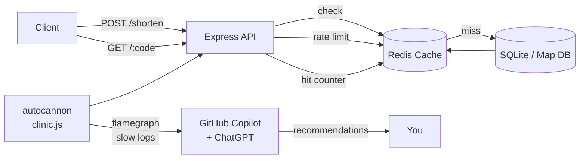

# Redis Caching, Rate Limiting & AI-Assisted Performance Profiling

> **Audience:** Freshers comfortable with TypeScript basics.
> **Stack:** Node.js 20+, TypeScript 5, Express 4, Redis 7 (Docker or Redis Cloud), `ioredis`.
> **Duration:** 1 full day (~7 hours + breaks).
> **Format:** Concept → demo → hands-on exercise → mini activity.

---

## What you will build

By the end of the day, every participant will have:

1. A running local Redis (in Docker) and a working `ioredis` TypeScript client.
2. A small Express API demonstrating four caching strategies with measurable speed-ups.
3. Rate-limited endpoints using `rate-limiter-flexible` backed by Redis.
4. A profiled Node.js service with an AI-generated bottleneck report.
5. **Capstone:** an end-to-end **URL Shortener** with caching, analytics, rate limiting, and a written AI-driven performance review.



---

## Day schedule

| Time            | Module | Topic                                                  | Format          |
|-----------------|--------|--------------------------------------------------------|-----------------|
| 09:00 – 09:30   | 00     | Setup & prerequisites verification                     | Guided          |
| 09:30 – 10:15   | 01     | Redis fundamentals from Node.js/TypeScript             | Demo + lab      |
| 10:15 – 10:30   | —      | Break                                                  | —               |
| 10:30 – 11:45   | 02     | Caching strategies (cache-aside, write-through, TTL)   | Demo + lab      |
| 11:45 – 12:30   | 03     | Rate limiting basics with `rate-limiter-flexible`      | Demo + lab      |
| 12:30 – 13:30   | —      | Lunch                                                  | —               |
| 13:30 – 14:30   | 04     | Performance profiling with AI (autocannon + clinic.js) | Lab             |
| 14:30 – 15:15   | 05     | AI-driven caching & bottleneck recommendations         | Prompted lab    |
| 15:15 – 15:30   | —      | Break                                                  | —               |
| 15:30 – 17:30   | 06     | **Capstone:** URL shortener end-to-end                 | Guided build    |
| 17:30 – 18:00   | —      | Show & tell + AI review of everyone's code             | Group           |

---

## Prerequisites (install before Module 00)

- **Node.js 20 LTS+** — [nodejs.org/en/download](https://nodejs.org/en/download)
- **VS Code** with these extensions:
  - GitHub Copilot + Copilot Chat
  - REST Client (`humao.rest-client`) — used to hit APIs from `.http` files
  - ESLint, Prettier
- **Docker Desktop** (Windows/macOS) or Docker Engine (Linux) — for local Redis
- Free account on **[chat.openai.com](https://chat.openai.com)** or **[claude.ai](https://claude.ai)** — for the AI analysis modules
- Optional: free **[Redis Cloud](https://redis.io/try-free/)** account (30 MB free tier) as a backup if Docker won't run

Verify:

```powershell
node -v      # v20.x or newer
npm -v       # 10.x or newer
docker -v    # 24.x or newer
code --version
```

---

## Repository layout

```
Caching,performance/
├── README.md                  <- you are here
├── 00-setup/                  Prereqs + first Redis ping
├── 01-redis-fundamentals/     Strings, hashes, lists, sets, TTL
├── 02-caching-strategies/     Cache-aside, write-through, write-behind
├── 03-rate-limiting/          Fixed + sliding window with rate-limiter-flexible
├── 04-performance-profiling-ai/  autocannon, clinic.js, AI analysis
├── 05-ai-caching-recommendations/  Prompt library + review workflow
└── 06-capstone-url-shortener/ End-to-end project
```

Each module folder contains:
- `README.md` — teaching notes, diagrams, exercises, activities
- `package.json`, `tsconfig.json` — runnable code
- `src/` — code samples the trainer walks through
- `exercises/` — starter files + solutions

---

## How to run any module

```powershell
cd 01-redis-fundamentals   # or any module
npm install
npm run dev
```

If a module needs Redis, start it once at the top of the day (see [00-setup/README.md](00-setup/README.md#start-redis)) and leave it running.

---

## Learning outcomes checklist

Participants can tick these off at the end of the day:

- [ ] I can start Redis locally and connect from a TypeScript app.
- [ ] I can explain **cache-aside** vs **write-through** and when to use each.
- [ ] I can set a sensible **TTL** and invalidate a key on update.
- [ ] I can protect an endpoint with a Redis-backed rate limiter.
- [ ] I can run a load test with `autocannon` and read a `clinic.js` flamegraph.
- [ ] I can prompt an AI to identify bottlenecks and suggest cache keys/TTL.
- [ ] I have shipped the URL-shortener capstone with all of the above.

---

## Trainer notes

- Encourage participants to **type the code**, not paste, for at least Modules 01–03.
- Have participants keep a scratch `notes.md` per module — they will paste snippets from it into ChatGPT in Modules 04–05.
- Every module ends with an **AI reflection prompt** — do not skip these; they are the connective tissue for Modules 04–05.

Good luck. Start with [00-setup/README.md](00-setup/README.md).
